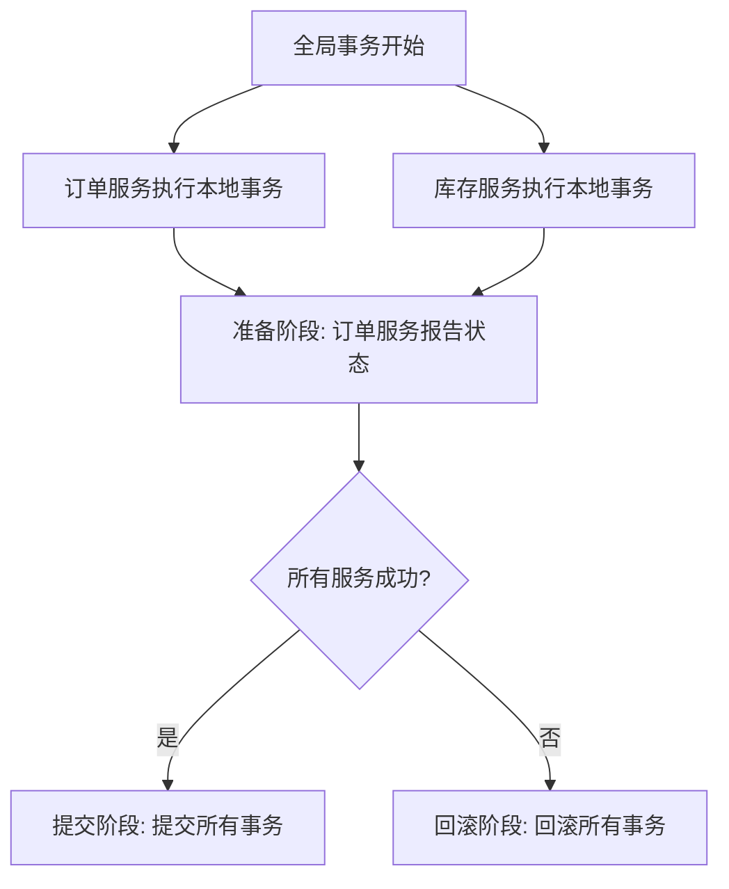

# Seata 术语解释

Seata（Simple Extensible Autonomous Transaction Architecture）是一款开源的分布式事务解决方案，旨在解决微服务架构下的数据一致性问题。为了更好地理解Seata的工作原理，我们需要先了解其核心术语。本文将逐步介绍这些术语，并通过实际案例帮助你更好地掌握它们。

## 1. 事务（Transaction）

事务是数据库操作的基本单元，它包含一组操作，这些操作要么全部成功，要么全部失败。在分布式系统中，事务可能跨越多个服务，因此需要一种机制来保证这些操作的一致性。

## 2. 分布式事务（Distributed Transaction）

分布式事务是指跨越多个服务或数据库的事务。由于每个服务可能使用不同的数据库，因此需要一种机制来协调这些事务，以确保它们的一致性。

## 3. 全局事务（Global Transaction）

全局事务是Seata中的一个核心概念，它表示一个跨越多个服务的事务。全局事务由事务管理器（Transaction Manager）协调，确保所有参与的服务都能正确地提交或回滚。

## 4. 分支事务（Branch Transaction）

分支事务是全局事务的一部分，每个分支事务对应一个服务或数据库的本地事务。分支事务由资源管理器（Resource Manager）管理，负责与本地数据库交互。

## 5. 事务管理器（Transaction Manager, TM）

事务管理器是Seata的核心组件之一，负责协调全局事务的提交或回滚。它与资源管理器（RM）通信，确保所有分支事务都能正确地执行。

## 6. 资源管理器（Resource Manager, RM）

资源管理器负责管理分支事务，与本地数据库交互。它向事务管理器报告分支事务的状态，并根据事务管理器的指令执行提交或回滚操作。

## 7. 事务日志（Transaction Log）

事务日志记录了全局事务和分支事务的状态信息。Seata使用事务日志来恢复事务状态，确保在系统崩溃或网络故障时能够正确地恢复事务。

## 8. 事务ID（Transaction ID, XID）

事务ID是全局事务的唯一标识符。每个全局事务都有一个唯一的XID，用于在分布式系统中跟踪事务的状态。

## 9. 两阶段提交（Two-Phase Commit, 2PC）

两阶段提交是Seata中用于协调分布式事务的协议。它包括两个阶段：
1. **准备阶段**：事务管理器向所有资源管理器发送准备请求，资源管理器执行本地事务并报告状态。
2. **提交/回滚阶段**：事务管理器根据资源管理器的状态决定提交或回滚全局事务。

## 10. 补偿事务（Compensating Transaction）

补偿事务用于在事务失败时回滚已经执行的操作。Seata使用补偿事务来确保事务的一致性，即使在部分操作失败的情况下也能恢复到一致的状态。

## 实际案例

假设我们有一个电商系统，用户下单时需要同时更新订单服务和库存服务。这两个服务分别使用不同的数据库，因此需要使用分布式事务来保证数据一致性。

1. **全局事务开始**：事务管理器生成一个全局事务ID（XID），并开始协调订单服务和库存服务的事务。
2. **分支事务执行**：
   - 订单服务执行本地事务，生成订单记录。
   - 库存服务执行本地事务，减少库存数量。
3. **两阶段提交**：
   - **准备阶段**：事务管理器向订单服务和库存服务发送准备请求，两个服务分别执行本地事务并报告状态。
   - **提交阶段**：如果两个服务都报告成功，事务管理器发送提交请求，两个服务提交本地事务。如果任何一个服务报告失败，事务管理器发送回滚请求，两个服务回滚本地事务。

## 总结

通过本文，我们详细介绍了Seata中的核心术语，包括事务、分布式事务、全局事务、分支事务、事务管理器、资源管理器、事务日志、事务ID、两阶段提交和补偿事务。这些术语是理解Seata工作原理的基础，掌握它们将帮助你更好地应用Seata解决分布式事务问题。

## 附加资源

- [Seata官方文档](https://seata.io/zh-cn/docs/overview/what-is-seata.html)
- [分布式事务解决方案比较](https://www.alibabacloud.com/zh/product/seata)

## 练习

1. 尝试在一个简单的微服务项目中集成Seata，并模拟一个分布式事务场景。
2. 阅读Seata的源码，理解事务管理器和资源管理器的工作原理。
