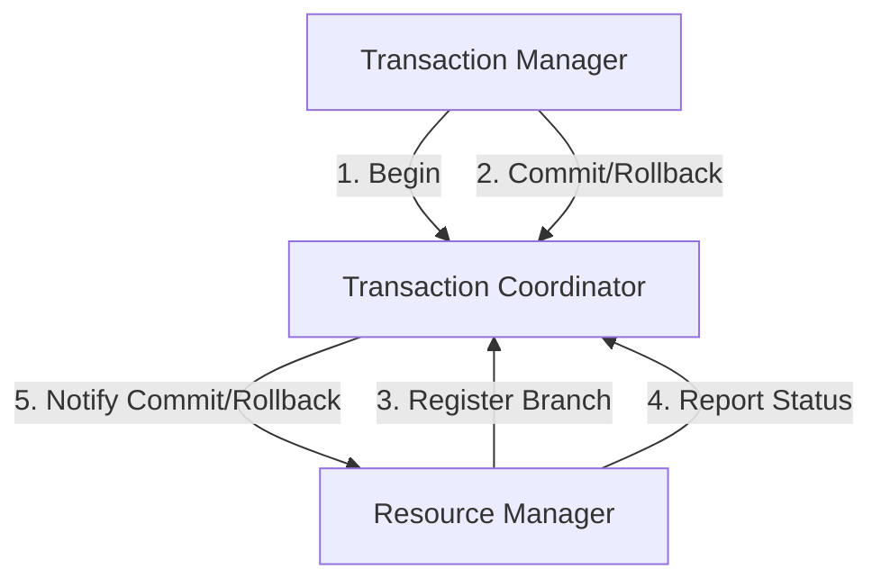

# Seata 架构概述

Seata（Simple Extensible Autonomous Transaction Architecture）是一款开源的分布式事务解决方案，旨在简化微服务架构下的分布式事务管理。它通过提供高性能、易用性和可扩展性，帮助开发者在复杂的分布式系统中实现事务一致性。本文将详细介绍Seata的架构设计及其核心组件。

## 什么是Seata？

Seata是一个分布式事务框架，支持AT（自动补偿事务）、TCC（Try-Confirm-Cancel）、Saga和XA模式。它的核心目标是解决微服务架构中跨服务的事务一致性问题。通过Seata，开发者可以像管理本地事务一样管理分布式事务，从而降低开发复杂度。

## Seata 架构设计

Seata的架构主要由三个核心组件组成：

1. **Transaction Coordinator (TC)**：事务协调器，负责全局事务的提交和回滚。
2. **Transaction Manager (TM)**：事务管理器，负责定义全局事务的边界（开始、提交或回滚）。
3. **Resource Manager (RM)**：资源管理器，负责管理分支事务的资源（如数据库连接）。

以下是Seata架构的示意图：



### 1. Transaction Coordinator (TC)

TC是Seata的核心组件，负责协调全局事务的提交和回滚。它维护了全局事务的状态，并与TM和RM进行通信。TC的主要职责包括：

- 接收TM的全局事务请求（开始、提交或回滚）。
- 管理分支事务的注册和状态报告。
- 通知RM执行分支事务的提交或回滚。

### 2. Transaction Manager (TM)

TM是全局事务的发起者，负责定义事务的边界。它通过调用TC的接口来开始、提交或回滚全局事务。TM的主要职责包括：

- 开始全局事务。
- 提交或回滚全局事务。
- 处理事务超时和异常。

### 3. Resource Manager (RM)

RM负责管理分支事务的资源，如数据库连接。它与TC通信，注册分支事务并报告其状态。RM的主要职责包括：

- 注册分支事务到TC。
- 报告分支事务的状态（成功或失败）。
- 执行TC下发的提交或回滚指令。

## Seata 的工作流程

以下是一个典型的Seata工作流程示例：

1. **开始全局事务**：TM向TC发送开始全局事务的请求，TC生成全局事务ID（XID）。
2. **注册分支事务**：RM向TC注册分支事务，并绑定到全局事务ID。
3. **执行分支事务**：RM执行本地事务，并将结果报告给TC。
4. **提交或回滚全局事务**：TM根据所有分支事务的状态，向TC发送提交或回滚请求。
5. **通知分支事务**：TC通知所有RM执行提交或回滚操作。

## 实际应用场景

假设你正在开发一个电商系统，用户下单时需要同时扣减库存和创建订单。这两个操作分别由库存服务和订单服务处理。使用Seata，你可以确保这两个操作要么同时成功，要么同时失败，从而保证数据的一致性。

以下是一个简单的代码示例：

```java
// TM端：开始全局事务
GlobalTransaction tx = GlobalTransactionContext.getCurrentOrCreate();
tx.begin();

try {
    // 调用库存服务扣减库存
    inventoryService.deductStock(productId, quantity);

    // 调用订单服务创建订单
    orderService.createOrder(userId, productId, quantity);

    // 提交全局事务
    tx.commit();
} catch (Exception e) {
    // 回滚全局事务
    tx.rollback();
    throw e;
}
```

在这个示例中，如果库存服务或订单服务中的任何一个操作失败，Seata会自动回滚全局事务，确保数据的一致性。

## 总结

Seata通过其简洁的架构设计和强大的功能，为分布式事务管理提供了高效的解决方案。它的核心组件（TC、TM和RM）协同工作，确保全局事务的一致性和可靠性。通过本文的学习，你应该对Seata的架构有了初步的了解，并能够在实际项目中应用它。

## 附加资源

- [Seata官方文档](https://seata.io/zh-cn/docs/overview/what-is-seata.html)
- [Seata GitHub仓库](https://github.com/seata/seata)
- [分布式事务模式详解](https://dubbo.apache.org/zh/docs/v2.7/user/examples/transaction/)

## 练习

1. 尝试在本地搭建一个Seata环境，并运行一个简单的分布式事务示例。
2. 阅读Seata的源码，深入理解TC、TM和RM的实现细节。
3. 在你的项目中引入Seata，并解决一个实际的分布式事务问题。