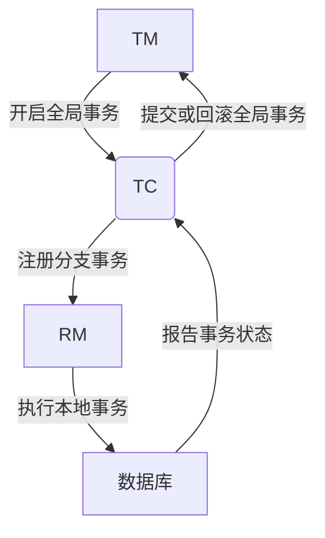

## 介绍

Seata（Simple Extensible Autonomous Transaction Architecture）是一款开源的分布式事务解决方案，旨在解决微服务架构下的分布式事务问题。Seata通过提供简单易用的API和强大的事务管理能力，帮助开发者在分布式系统中实现数据一致性。

在本文中，我们将深入探讨Seata的核心概念，包括分布式事务、事务模式、事务协调器等，并通过实际案例展示Seata的应用场景。

## 分布式事务

在微服务架构中，一个业务操作可能涉及多个服务，每个服务都有自己的数据库。为了保证数据的一致性，我们需要确保这些服务要么全部成功提交，要么全部回滚。这种跨多个服务的事务称为**分布式事务**。

:::note
分布式事务的核心挑战是如何在多个独立的服务之间协调事务的提交和回滚。
:::

## Seata 的事务模式

Seata支持多种事务模式，主要包括：

1. **AT模式（Auto Transaction Mode）**：自动事务模式，Seata会自动管理事务的提交和回滚。
2. **TCC模式（Try-Confirm-Cancel）**：通过业务代码实现事务的提交和回滚。
3. **Saga模式**：通过长事务的方式处理分布式事务，适用于业务流程较长的场景。

### AT模式

AT模式是Seata的默认事务模式，它通过代理数据源的方式自动管理事务。开发者只需在业务代码中开启事务，Seata会自动处理事务的提交和回滚。

```java
@GlobalTransactional
public void purchase(String userId, String commodityCode, int orderCount) {
    // 业务逻辑
}
```

在上面的代码中，`@GlobalTransactional`注解表示该方法是一个全局事务，Seata会自动管理事务的提交和回滚。

### TCC模式

TCC模式要求开发者手动实现事务的提交和回滚逻辑。TCC模式分为三个阶段：

1. **Try**：尝试执行业务逻辑，预留资源。
2. **Confirm**：确认执行业务逻辑，提交资源。
3. **Cancel**：取消执行业务逻辑，释放资源。

```java
public interface TccAction {
    @TwoPhaseBusinessAction(name = "prepare", commitMethod = "commit", rollbackMethod = "rollback")
    boolean prepare(BusinessActionContext actionContext, int amount);

    boolean commit(BusinessActionContext actionContext);

    boolean rollback(BusinessActionContext actionContext);
}
```

在上面的代码中，`@TwoPhaseBusinessAction`注解表示该方法是一个TCC事务，开发者需要实现`commit`和`rollback`方法。

## 事务协调器（TC）

事务协调器（Transaction Coordinator, TC）是Seata的核心组件之一，负责协调分布式事务的提交和回滚。TC与事务管理器（TM）和资源管理器（RM）协同工作，确保事务的一致性。



在上面的流程图中，TM（事务管理器）负责开启全局事务，TC（事务协调器）负责协调事务的提交和回滚，RM（资源管理器）负责执行本地事务。

## 实际案例

假设我们有一个电商系统，用户下单时需要扣减库存、创建订单和扣减账户余额。这三个操作分别由库存服务、订单服务和账户服务处理。为了保证数据的一致性，我们可以使用Seata来管理这个分布式事务。

```java
@GlobalTransactional
public void placeOrder(String userId, String commodityCode, int orderCount) {
    // 扣减库存
    inventoryService.deduct(commodityCode, orderCount);
    // 创建订单
    orderService.create(userId, commodityCode, orderCount);
    // 扣减账户余额
    accountService.debit(userId, orderCount * price);
}
```

在上面的代码中，`@GlobalTransactional`注解表示该方法是一个全局事务，Seata会自动管理事务的提交和回滚。

## 总结

Seata通过提供简单易用的API和强大的事务管理能力，帮助开发者在分布式系统中实现数据一致性。本文介绍了Seata的核心概念，包括分布式事务、事务模式、事务协调器等，并通过实际案例展示了Seata的应用场景。

## 附加资源

- [Seata官方文档](https://seata.io/zh-cn/docs/overview/what-is-seata.html)
- [Seata GitHub仓库](https://github.com/seata/seata)

## 练习

1. 尝试在本地环境中搭建一个Seata的分布式事务示例。
2. 使用TCC模式实现一个简单的分布式事务。
3. 阅读Seata的源码，了解事务协调器的工作原理。
