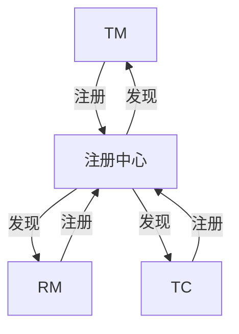

## 什么是 Seata 注册中心？

Seata 是一个开源的分布式事务解决方案，旨在简化微服务架构下的分布式事务管理。在 Seata 中，**注册中心**是一个核心组件，用于管理服务实例的注册与发现。通过注册中心，Seata 的各个组件（如 TC、TM、RM）能够相互通信，确保分布式事务的协调与一致性。

注册中心的作用类似于微服务架构中的服务发现机制，它为 Seata 提供了服务实例的动态管理能力。常见的注册中心包括 Nacos、Eureka、Zookeeper 等。

:::note
注册中心是 Seata 分布式事务框架的基础设施之一，确保事务管理器（TM）、资源管理器（RM）和事务协调器（TC）能够高效协作。
:::

---

## Seata 注册中心的工作原理

在 Seata 中，注册中心的主要功能包括：

1. **服务注册**：Seata 的各个组件（如 TC、TM、RM）启动时，会将自己的地址信息注册到注册中心。
2. **服务发现**：当某个组件需要与其他组件通信时，会从注册中心获取目标组件的地址信息。
3. **健康检查**：注册中心会定期检查注册的服务实例是否可用，并移除不可用的实例。

以下是一个简化的 Seata 注册中心工作流程图：



---

## 如何配置 Seata 注册中心

Seata 支持多种注册中心，下面以 **Nacos** 为例，展示如何配置 Seata 注册中心。

### 1. 安装 Nacos
首先，确保你已经安装并启动了 Nacos 服务。你可以从 [Nacos 官网](https://nacos.io/) 下载并安装。

### 2. 配置 Seata 使用 Nacos
在 Seata 的配置文件 `registry.conf` 中，添加以下内容：

```plaintext
registry {
  type = "nacos"
  nacos {
    serverAddr = "127.0.0.1:8848"
    namespace = ""
    cluster = "default"
  }
}

config {
  type = "nacos"
  nacos {
    serverAddr = "127.0.0.1:8848"
    namespace = ""
    group = "SEATA_GROUP"
  }
}
```

:::tip
- `serverAddr`：Nacos 服务器的地址。
- `namespace`：Nacos 的命名空间，默认为空。
- `cluster`：Nacos 的集群名称，默认为 `default`。
- `group`：Seata 配置的分组名称，默认为 `SEATA_GROUP`。
:::

### 3. 启动 Seata 服务
配置完成后，启动 Seata 服务。Seata 的各个组件会自动注册到 Nacos 中。

---

## 实际应用场景

假设我们有一个电商系统，包含订单服务、库存服务和支付服务。这些服务分别部署在不同的微服务中，需要通过 Seata 实现分布式事务。

1. **订单服务**（TM）创建订单时，会调用库存服务和支付服务。
2. **库存服务**（RM）和 **支付服务**（RM）分别处理库存扣减和支付操作。
3. **事务协调器**（TC）通过注册中心获取各个服务的地址，并协调事务的提交或回滚。

通过注册中心，Seata 能够动态管理这些服务的地址信息，确保事务的顺利进行。

---

## 总结

Seata 注册中心是分布式事务管理的关键组件，它通过服务注册与发现机制，确保 Seata 的各个组件能够高效协作。本文介绍了 Seata 注册中心的工作原理、配置方法以及实际应用场景，帮助你快速掌握这一核心概念。

:::caution
在实际生产环境中，注册中心的稳定性和性能至关重要。建议选择高可用的注册中心（如 Nacos 集群）并定期监控其运行状态。
:::

---

## 附加资源与练习

1. **练习**：尝试在本地环境中配置 Seata 使用 Zookeeper 作为注册中心。
2. **深入学习**：阅读 Seata 官方文档，了解更多关于注册中心的高级配置选项。
3. **扩展阅读**：了解其他注册中心（如 Eureka、Consul）的配置方式，并比较它们的优缺点。

希望本文能帮助你更好地理解 Seata 注册中心的概念与应用！如果你有任何问题，欢迎在评论区留言讨论。