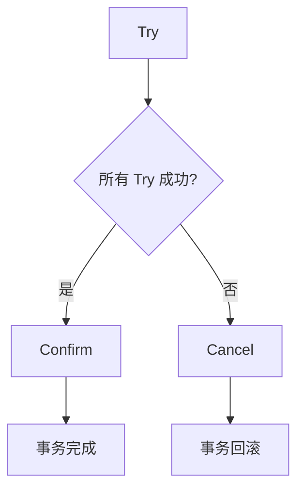

# Seata TCC 模式

## 介绍

在分布式系统中，事务管理是一个复杂的问题。Seata 是一个开源的分布式事务解决方案，提供了多种事务模式，其中 TCC（Try-Confirm-Cancel）模式是一种基于补偿机制的事务模式。TCC 模式通过将事务分为三个阶段（Try、Confirm、Cancel）来实现分布式事务的一致性。

### TCC 模式的三个阶段

1. **Try 阶段**：尝试执行业务逻辑，预留资源。如果所有参与者都成功执行了 Try 阶段，事务进入 Confirm 阶段。
2. **Confirm 阶段**：确认执行业务逻辑，提交资源。如果 Confirm 阶段成功，事务完成。
3. **Cancel 阶段**：取消执行业务逻辑，释放资源。如果 Try 阶段失败，事务进入 Cancel 阶段。

## TCC 模式的工作原理

TCC 模式的核心思想是通过补偿机制来保证事务的一致性。每个参与者都需要实现 Try、Confirm 和 Cancel 三个方法。



### 代码示例

以下是一个简单的 TCC 模式示例，假设我们有一个订单服务和一个库存服务。

```java
// 订单服务
public interface OrderService {
    boolean tryCreateOrder(Order order);
    boolean confirmCreateOrder(Order order);
    boolean cancelCreateOrder(Order order);
}

// 库存服务
public interface InventoryService {
    boolean tryReduceStock(Product product, int quantity);
    boolean confirmReduceStock(Product product, int quantity);
    boolean cancelReduceStock(Product product, int quantity);
}
```

在 Try 阶段，订单服务和库存服务分别尝试创建订单和减少库存：

```java
// Try 阶段
boolean orderTrySuccess = orderService.tryCreateOrder(order);
boolean inventoryTrySuccess = inventoryService.tryReduceStock(product, quantity);

if (orderTrySuccess && inventoryTrySuccess) {
    // 进入 Confirm 阶段
    boolean orderConfirmSuccess = orderService.confirmCreateOrder(order);
    boolean inventoryConfirmSuccess = inventoryService.confirmReduceStock(product, quantity);

    if (orderConfirmSuccess && inventoryConfirmSuccess) {
        // 事务完成
    } else {
        // 进入 Cancel 阶段
        orderService.cancelCreateOrder(order);
        inventoryService.cancelReduceStock(product, quantity);
    }
} else {
    // 进入 Cancel 阶段
    orderService.cancelCreateOrder(order);
    inventoryService.cancelReduceStock(product, quantity);
}
```

## 实际应用场景

TCC 模式适用于需要强一致性保证的分布式事务场景，例如电商系统中的订单创建和库存扣减。通过 TCC 模式，可以确保在订单创建失败时，库存能够被正确恢复，避免数据不一致的问题。

## 总结

Seata 的 TCC 模式通过 Try-Confirm-Cancel 机制实现了分布式事务的一致性。它适用于需要强一致性保证的场景，并且通过补偿机制确保了事务的最终一致性。

## 附加资源

- [Seata 官方文档](https://seata.io/zh-cn/docs/overview/what-is-seata.html)
- [分布式事务解决方案](https://dubbo.apache.org/zh/docs/advanced/distributed-transaction/)

## 练习

1. 实现一个简单的 TCC 模式示例，包含订单服务和库存服务。
2. 在 Try 阶段模拟失败，观察 Cancel 阶段的执行情况。
3. 扩展示例，添加更多的服务参与者，例如支付服务。

:::tip
在实际开发中，TCC 模式需要仔细设计 Try、Confirm 和 Cancel 方法，确保它们能够正确处理各种异常情况。
:::