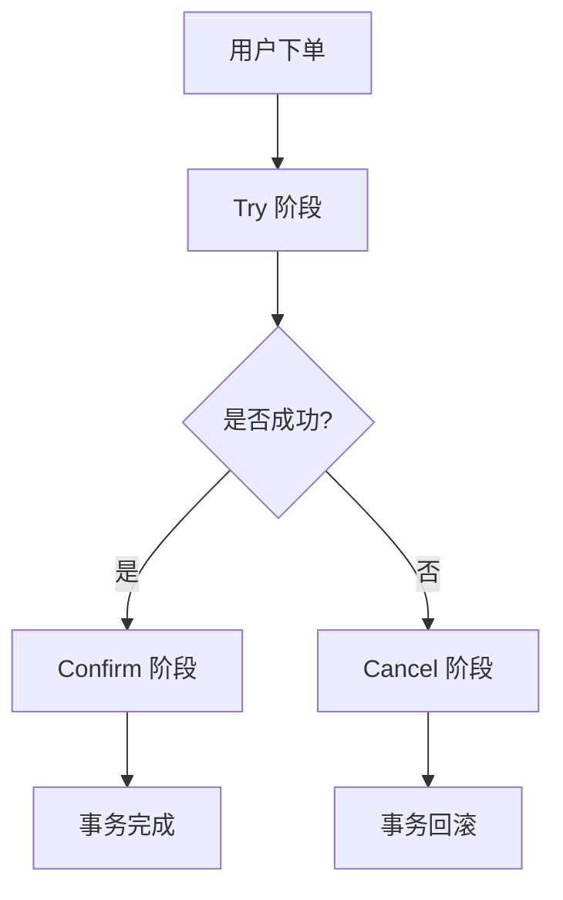

# Seata TCC 实现

## 介绍

在分布式系统中，事务管理是一个复杂且关键的问题。Seata 是一个开源的分布式事务解决方案，支持多种事务模式，其中 TCC（Try-Confirm-Cancel）模式是一种基于补偿机制的事务模式。TCC 模式通过将事务分为三个阶段（Try、Confirm、Cancel）来保证分布式事务的一致性。

TCC 模式的核心思想是：
- **Try**：尝试执行业务逻辑，预留资源。
- **Confirm**：确认执行业务逻辑，提交资源。
- **Cancel**：取消执行业务逻辑，释放资源。

TCC 模式适用于需要高一致性保证的场景，例如电商系统中的订单、库存和支付等模块。

## TCC 模式的三个阶段

### 1. Try 阶段
在 Try 阶段，系统会尝试执行业务逻辑，并预留必要的资源。如果所有参与方都成功执行了 Try 阶段，事务将进入 Confirm 阶段。

### 2. Confirm 阶段
在 Confirm 阶段，系统会确认执行业务逻辑，并提交资源。如果 Confirm 阶段成功，事务将完成。

### 3. Cancel 阶段
如果在 Try 阶段或 Confirm 阶段发生错误，系统将进入 Cancel 阶段，取消执行业务逻辑，并释放预留的资源。

## TCC 模式的实现

### 代码示例

以下是一个简单的 TCC 模式实现示例，假设我们有一个订单服务和一个库存服务。

#### 订单服务接口

```java
public interface OrderService {
    @TwoPhaseBusinessAction(name = "createOrder", commitMethod = "confirm", rollbackMethod = "cancel")
    boolean tryCreateOrder(BusinessActionContext context, Order order);

    boolean confirm(BusinessActionContext context);

    boolean cancel(BusinessActionContext context);
}
```

#### 库存服务接口

```java
public interface StockService {
    @TwoPhaseBusinessAction(name = "deductStock", commitMethod = "confirm", rollbackMethod = "cancel")
    boolean tryDeductStock(BusinessActionContext context, String productId, int quantity);

    boolean confirm(BusinessActionContext context);

    boolean cancel(BusinessActionContext context);
}
```

#### 订单服务实现

```java
@Service
public class OrderServiceImpl implements OrderService {

    @Override
    public boolean tryCreateOrder(BusinessActionContext context, Order order) {
        // 尝试创建订单，预留资源
        // 例如：插入订单记录到数据库
        return true;
    }

    @Override
    public boolean confirm(BusinessActionContext context) {
        // 确认创建订单，提交资源
        // 例如：更新订单状态为已确认
        return true;
    }

    @Override
    public boolean cancel(BusinessActionContext context) {
        // 取消创建订单，释放资源
        // 例如：删除订单记录
        return true;
    }
}
```

#### 库存服务实现

```java
@Service
public class StockServiceImpl implements StockService {

    @Override
    public boolean tryDeductStock(BusinessActionContext context, String productId, int quantity) {
        // 尝试扣减库存，预留资源
        // 例如：减少库存数量
        return true;
    }

    @Override
    public boolean confirm(BusinessActionContext context) {
        // 确认扣减库存，提交资源
        // 例如：更新库存状态为已确认
        return true;
    }

    @Override
    public boolean cancel(BusinessActionContext context) {
        // 取消扣减库存，释放资源
        // 例如：恢复库存数量
        return true;
    }
}
```

### 事务管理器

在 Seata 中，事务管理器会自动协调 Try、Confirm 和 Cancel 阶段的执行。开发者只需关注业务逻辑的实现。

## 实际案例

假设我们有一个电商系统，用户下单时需要同时创建订单和扣减库存。使用 TCC 模式可以确保这两个操作要么同时成功，要么同时失败。

### 场景描述
1. 用户下单，系统尝试创建订单并扣减库存（Try 阶段）。
2. 如果创建订单和扣减库存都成功，系统确认订单和库存扣减（Confirm 阶段）。
3. 如果创建订单或扣减库存失败，系统取消订单和库存扣减（Cancel 阶段）。

### 流程图



## 总结

TCC 模式是 Seata 中一种重要的分布式事务解决方案，适用于需要高一致性保证的场景。通过将事务分为 Try、Confirm 和 Cancel 三个阶段，TCC 模式能够有效地管理分布式事务，确保数据的一致性。

## 附加资源

- [Seata 官方文档](https://seata.io/zh-cn/docs/overview/what-is-seata.html)
- [分布式事务解决方案](https://dubbo.apache.org/zh/docs/advanced/distributed-transaction/)

## 练习

1. 尝试在本地环境中实现一个简单的 TCC 事务，模拟订单和库存的分布式事务管理。
2. 修改代码，模拟在 Try 阶段失败的情况，观察 Cancel 阶段的执行情况。
