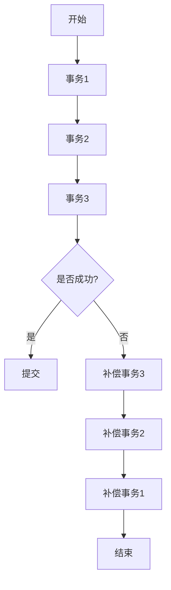

# Seata SAGA 模式

## 介绍

Seata 是一个开源的分布式事务解决方案，旨在简化微服务架构中的事务管理。Seata 提供了多种事务模式，其中 **SAGA 模式** 是一种基于长事务的解决方案，适用于需要处理长时间运行事务的场景。

SAGA 模式的核心思想是将一个长事务拆分为多个本地事务，每个本地事务都有对应的补偿操作。如果某个本地事务失败，系统会通过执行补偿操作来回滚之前已经提交的事务，从而保证数据的一致性。

:::note
SAGA 模式特别适合处理跨多个服务的复杂业务流程，例如订单处理、库存管理等。
:::

## SAGA 模式的工作原理

SAGA 模式的工作流程可以分为以下几个步骤：

1. **事务拆分**：将一个长事务拆分为多个本地事务。
2. **事务执行**：依次执行每个本地事务。
3. **补偿机制**：如果某个本地事务失败，系统会依次执行之前已经提交的本地事务的补偿操作。



## 代码示例

假设我们有一个订单处理系统，包含以下服务：

1. **订单服务**：创建订单。
2. **库存服务**：扣减库存。
3. **支付服务**：处理支付。

我们可以使用 SAGA 模式来管理这些服务之间的分布式事务。

```java
// 订单服务
public class OrderService {
    public void createOrder() {
        // 创建订单逻辑
    }

    public void compensateOrder() {
        // 补偿逻辑：取消订单
    }
}

// 库存服务
public class InventoryService {
    public void deductInventory() {
        // 扣减库存逻辑
    }

    public void compensateInventory() {
        // 补偿逻辑：恢复库存
    }
}

// 支付服务
public class PaymentService {
    public void processPayment() {
        // 处理支付逻辑
    }

    public void compensatePayment() {
        // 补偿逻辑：退款
    }
}
```

在执行过程中，如果某个服务失败，系统会依次执行补偿操作：

```java
public class SagaOrchestrator {
    public void executeSaga() {
        try {
            orderService.createOrder();
            inventoryService.deductInventory();
            paymentService.processPayment();
        } catch (Exception e) {
            paymentService.compensatePayment();
            inventoryService.compensateInventory();
            orderService.compensateOrder();
        }
    }
}
```

## 实际应用场景

### 电商订单处理

在电商系统中，用户下单后，系统需要依次执行以下操作：

1. 创建订单。
2. 扣减库存。
3. 处理支付。

如果支付失败，系统需要回滚之前的操作，即取消订单并恢复库存。SAGA 模式非常适合这种场景。

### 旅行预订系统

在旅行预订系统中，用户预订酒店和机票时，系统需要依次执行以下操作：

1. 预订酒店。
2. 预订机票。

如果预订机票失败，系统需要取消酒店预订。SAGA 模式可以确保数据的一致性。

## 总结

Seata SAGA 模式是一种强大的分布式事务解决方案，特别适合处理跨多个服务的复杂业务流程。通过将长事务拆分为多个本地事务，并结合补偿机制，SAGA 模式能够有效保证数据的一致性。

:::tip
在实际项目中，建议结合业务场景仔细设计每个本地事务及其补偿操作，以确保系统的可靠性和可维护性。
:::

## 附加资源

- [Seata 官方文档](https://seata.io/zh-cn/docs/overview/what-is-seata.html)
- [分布式事务模式详解](https://microservices.io/patterns/data/saga.html)

## 练习

1. 尝试在一个简单的微服务项目中实现 SAGA 模式。
2. 设计一个包含三个服务的业务流程，并为每个服务编写补偿操作。
3. 思考在什么情况下 SAGA 模式可能不适合使用，并讨论替代方案。