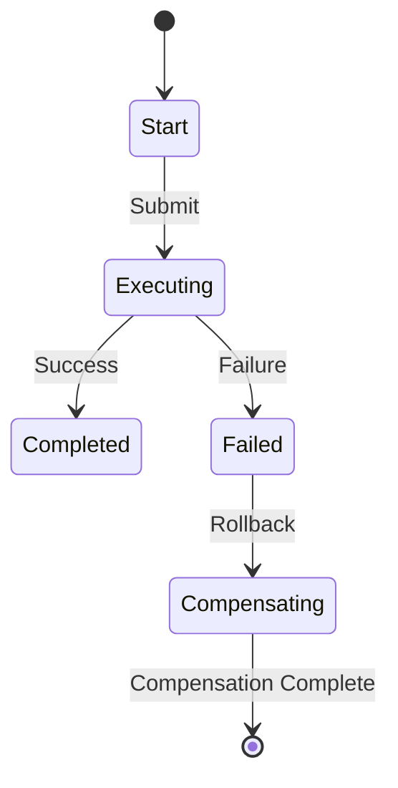
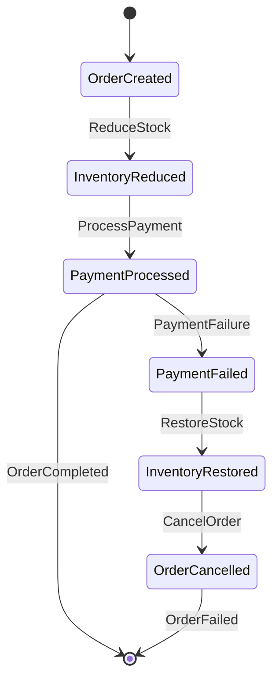

# Seata SAGA状态机

## 介绍

Seata 是一个开源的分布式事务解决方案，支持多种事务模式，包括 AT、TCC 和 SAGA。SAGA 模式是一种长事务解决方案，适用于需要长时间运行且可能涉及多个服务的分布式事务场景。SAGA 状态机是 SAGA 模式的核心组件，用于定义和管理事务的执行流程。

在 SAGA 模式中，事务被分解为多个子事务，每个子事务都有一个对应的补偿操作。SAGA 状态机负责协调这些子事务的执行顺序，并在出现异常时触发补偿操作，以确保事务的最终一致性。

## SAGA 状态机的工作原理

SAGA 状态机通过定义一组状态和状态之间的转换规则来管理事务的执行流程。每个状态代表事务的一个阶段，状态之间的转换由事件触发。SAGA 状态机的主要组成部分包括：

- **状态（State）**：事务的某个阶段，例如“开始”、“执行中”、“完成”等。
- **事件（Event）**：触发状态转换的操作，例如“提交”、“回滚”等。
- **动作（Action）**：在状态转换时执行的操作，例如调用服务、更新数据库等。
- **补偿动作（Compensation Action）**：在事务失败时执行的回滚操作。

### 状态机示例

以下是一个简单的 SAGA 状态机示例，展示了如何定义状态和状态转换：



在这个示例中，事务从“Start”状态开始，当接收到“Submit”事件时，状态转换为“Executing”。如果执行成功，状态转换为“Completed”；如果执行失败，状态转换为“Failed”，并触发补偿操作“Rollback”，最终回到初始状态。

## 代码示例

以下是一个使用 Seata SAGA 状态机的简单代码示例。假设我们有一个订单服务和一个库存服务，订单服务需要调用库存服务来减少库存。

```java
// 定义 SAGA 状态机
StateMachineBuilder<State, Event, Context> builder = StateMachineBuilderFactory.create();
builder.externalTransition()
    .from(State.START)
    .to(State.EXECUTING)
    .on(Event.SUBMIT)
    .perform(new Action() {
        @Override
        public void execute(State from, State to, Event event, Context context) {
            // 调用订单服务
            orderService.createOrder(context.getOrder());
            // 调用库存服务
            inventoryService.reduceStock(context.getOrder().getProductId(), context.getOrder().getQuantity());
        }
    });

builder.externalTransition()
    .from(State.EXECUTING)
    .to(State.COMPLETED)
    .on(Event.SUCCESS)
    .perform(new Action() {
        @Override
        public void execute(State from, State to, Event event, Context context) {
            // 订单创建成功
            orderService.confirmOrder(context.getOrder().getId());
        }
    });

builder.externalTransition()
    .from(State.EXECUTING)
    .to(State.FAILED)
    .on(Event.FAILURE)
    .perform(new Action() {
        @Override
        public void execute(State from, State to, Event event, Context context) {
            // 订单创建失败，触发补偿操作
            orderService.cancelOrder(context.getOrder().getId());
            inventoryService.restoreStock(context.getOrder().getProductId(), context.getOrder().getQuantity());
        }
    });

StateMachine<State, Event, Context> stateMachine = builder.build();
```

在这个示例中，我们定义了一个 SAGA 状态机，它包含了订单创建和库存减少的操作。如果订单创建成功，状态机会将状态转换为“Completed”；如果失败，状态机会触发补偿操作，将状态转换为“Failed”。

## 实际案例

假设我们有一个电商平台，用户下单后需要调用多个服务来完成订单处理，包括订单服务、库存服务和支付服务。使用 SAGA 状态机可以确保这些服务之间的操作是原子性的，即使某个服务失败，也可以通过补偿操作回滚之前的操作，确保数据的一致性。

### 场景描述

1. 用户下单，订单服务创建订单。
2. 库存服务减少库存。
3. 支付服务处理支付。
4. 如果支付失败，订单服务和库存服务需要回滚之前的操作。

### 状态机设计



在这个场景中，SAGA 状态机确保了订单处理的原子性。如果支付失败，状态机会触发补偿操作，恢复库存并取消订单。

## 总结

Seata SAGA 状态机是管理分布式事务的强大工具，特别适用于长时间运行且涉及多个服务的场景。通过定义状态和状态转换规则，SAGA 状态机可以确保事务的原子性和最终一致性。在实际应用中，SAGA 状态机可以帮助开发者简化复杂的事务管理，提高系统的可靠性和可维护性。

## 附加资源

- [Seata 官方文档](https://seata.io/zh-cn/docs/overview/what-is-seata.html)
- [分布式事务模式详解](https://dzone.com/articles/distributed-transaction-patterns)
- [SAGA 模式实战](https://microservices.io/patterns/data/saga.html)

:::tip
建议初学者通过实际项目练习 SAGA 状态机的使用，以加深对其工作原理的理解。
:::