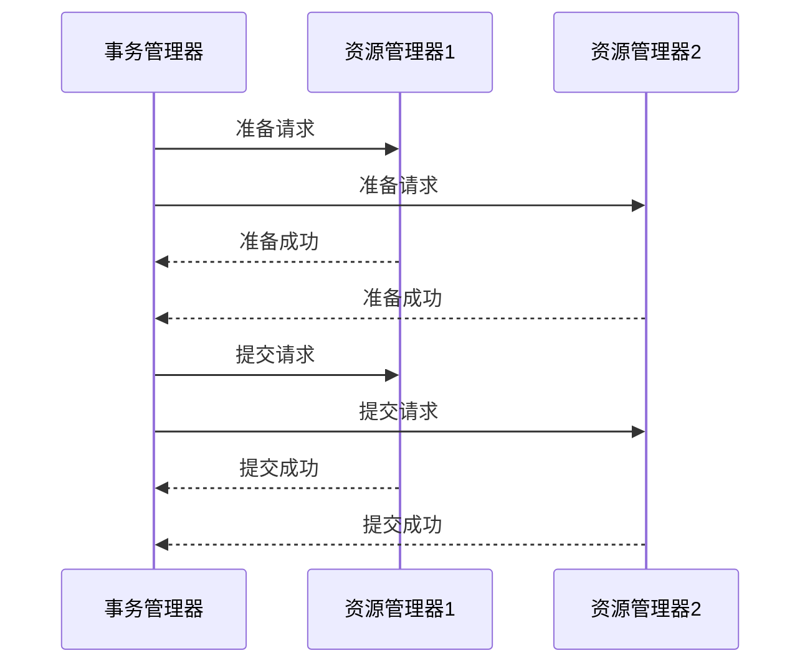

# Seata XA模式

## 介绍

Seata XA模式是Seata框架中支持的一种分布式事务解决方案，基于XA协议实现。XA协议是由X/Open组织提出的分布式事务处理标准，主要用于协调多个资源管理器（如数据库）的事务。Seata XA模式通过两阶段提交（2PC）协议来保证分布式事务的原子性和一致性。

在XA模式中，事务管理器（TM）负责协调多个资源管理器（RM），确保所有参与事务的资源要么全部提交，要么全部回滚。这种模式适用于需要强一致性的场景，例如金融交易、订单处理等。

## XA模式的工作原理

Seata XA模式的核心是两阶段提交（2PC）协议。以下是XA模式的工作流程：

1. **准备阶段（Prepare Phase）**：事务管理器（TM）向所有资源管理器（RM）发送准备请求，询问它们是否可以提交事务。每个资源管理器会执行事务操作，并将结果（成功或失败）返回给事务管理器。

2. **提交阶段（Commit Phase）**：如果所有资源管理器都返回成功，事务管理器会向所有资源管理器发送提交请求，要求它们提交事务。如果有任何一个资源管理器返回失败，事务管理器会向所有资源管理器发送回滚请求，要求它们回滚事务。



## 代码示例

以下是一个使用Seata XA模式的简单示例。假设我们有两个数据库，分别存储用户信息和订单信息。我们需要在一个事务中同时更新这两个数据库。

```java
import io.seata.core.context.RootContext;
import io.seata.spring.annotation.GlobalTransactional;
import org.springframework.beans.factory.annotation.Autowired;
import org.springframework.jdbc.core.JdbcTemplate;
import org.springframework.stereotype.Service;

@Service
public class OrderService {

    @Autowired
    private JdbcTemplate userJdbcTemplate;

    @Autowired
    private JdbcTemplate orderJdbcTemplate;

    @GlobalTransactional
    public void createOrder(String userId, String orderId) {
        // 绑定全局事务ID
        RootContext.bind(RootContext.getXID());

        // 更新用户信息
        userJdbcTemplate.update("UPDATE user SET balance = balance - 100 WHERE id = ?", userId);

        // 创建订单
        orderJdbcTemplate.update("INSERT INTO orders (id, user_id, amount) VALUES (?, ?, 100)", orderId, userId);

        // 模拟异常
        if (orderId.equals("error")) {
            throw new RuntimeException("模拟异常");
        }
    }
}
```

在这个示例中，`@GlobalTransactional`注解用于标记一个全局事务。如果`createOrder`方法中的任何一步操作失败，整个事务将回滚，确保数据的一致性。

## 实际应用场景

Seata XA模式适用于需要强一致性的分布式事务场景。以下是一些常见的应用场景：

1. **金融交易**：在金融系统中，转账操作通常涉及多个账户的更新。使用XA模式可以确保所有账户的更新要么全部成功，要么全部回滚。

2. **订单处理**：在电商系统中，创建订单通常涉及库存扣减、订单创建等多个操作。使用XA模式可以确保这些操作的一致性。

3. **库存管理**：在库存管理系统中，库存的增减操作通常涉及多个仓库的更新。使用XA模式可以确保所有仓库的库存更新一致。

## 总结

Seata XA模式通过两阶段提交协议实现了分布式事务的强一致性。它适用于需要严格保证数据一致性的场景，如金融交易、订单处理等。通过Seata框架，开发者可以轻松地在分布式系统中实现XA模式，确保事务的原子性和一致性。

## 附加资源

- [Seata官方文档](https://seata.io/zh-cn/docs/overview/what-is-seata.html)
- [XA协议详解](https://en.wikipedia.org/wiki/X/Open_XA)
- [分布式事务处理](https://www.infoq.cn/article/distributed-transaction-handling)

## 练习

1. 尝试在本地环境中配置Seata XA模式，并运行上述代码示例。
2. 修改代码示例，模拟一个资源管理器失败的情况，观察事务的回滚行为。
3. 阅读Seata官方文档，了解更多关于XA模式的配置和优化技巧。