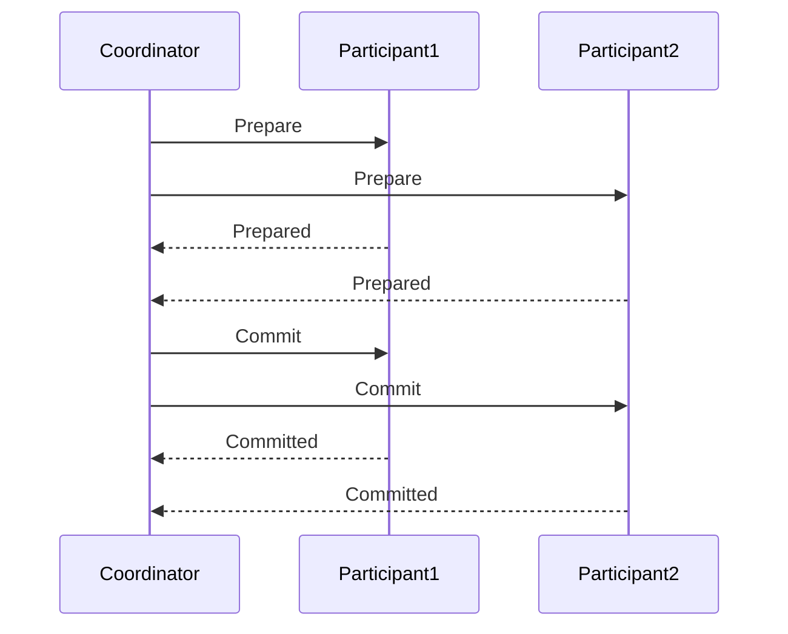

# Seata XA事务

## 介绍

Seata是一个开源的分布式事务解决方案，旨在简化分布式事务的管理。Seata支持多种事务模式，其中XA事务模式是一种基于XA协议的分布式事务实现。XA事务模式通过两阶段提交（2PC）协议来确保分布式事务的原子性和一致性。

在分布式系统中，多个服务可能涉及不同的数据库或资源管理器。XA事务模式通过协调这些资源管理器，确保所有操作要么全部提交，要么全部回滚，从而保证数据的一致性。

## XA事务的工作原理

XA事务模式的核心是两阶段提交（2PC）协议。它分为两个阶段：

1. **准备阶段（Prepare Phase）**：事务协调器（Transaction Coordinator）向所有参与者（Participants）发送准备请求，参与者执行事务操作并将结果返回给协调器。
2. **提交阶段（Commit Phase）**：如果所有参与者都成功准备，协调器发送提交请求，参与者提交事务。如果有任何一个参与者失败，协调器发送回滚请求，参与者回滚事务。



## 代码示例

以下是一个简单的Seata XA事务的代码示例。假设我们有两个服务：`OrderService`和`InventoryService`，它们分别管理订单和库存。

```java
// OrderService.java
@GlobalTransactional
public void createOrder(Order order) {
    // 创建订单
    orderRepository.save(order);
    // 调用库存服务
    inventoryService.deductStock(order.getProductId(), order.getQuantity());
}

// InventoryService.java
public void deductStock(String productId, int quantity) {
    // 扣除库存
    inventoryRepository.deductStock(productId, quantity);
}
```

在这个示例中，`@GlobalTransactional`注解表示这是一个全局事务。当`createOrder`方法被调用时，Seata会协调`OrderService`和`InventoryService`的事务，确保它们要么全部提交，要么全部回滚。

## 实际应用场景

假设你正在开发一个电商平台，用户下单时需要同时更新订单和库存。如果订单创建成功但库存扣除失败，或者库存扣除成功但订单创建失败，都会导致数据不一致。使用Seata XA事务模式可以确保这两个操作要么全部成功，要么全部失败，从而避免数据不一致的问题。

## 总结

Seata XA事务模式通过两阶段提交协议确保了分布式事务的原子性和一致性。它适用于需要跨多个服务或数据库的事务场景，能够有效避免数据不一致的问题。

:::tip
在实际项目中，使用Seata XA事务模式时，建议仔细设计事务边界，避免长时间占用资源，以提高系统的性能和可靠性。
:::

## 附加资源

- [Seata官方文档](https://seata.io/zh-cn/docs/overview/what-is-seata.html)
- [XA协议详解](https://en.wikipedia.org/wiki/X/Open_XA)

## 练习

1. 尝试在一个简单的Spring Boot项目中集成Seata XA事务模式，模拟订单和库存的分布式事务。
2. 修改代码，模拟一个事务失败的情况，观察Seata如何处理事务回滚。

通过以上内容，你应该对Seata XA事务模式有了初步的了解，并能够在实际项目中应用它。