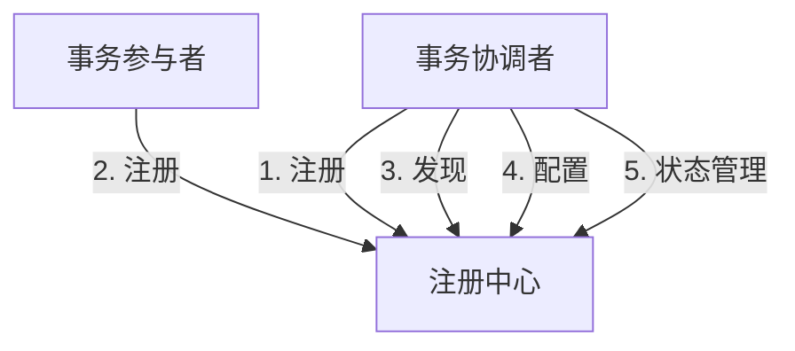

# Seata 注册中心概述

## 介绍

Seata（Simple Extensible Autonomous Transaction Architecture）是一个开源的分布式事务解决方案，旨在简化分布式事务的管理。在分布式系统中，事务的参与者可能分布在不同的服务中，因此需要一个中心化的组件来协调这些事务。Seata的注册中心（Registry）就是这样一个组件，它负责管理和协调分布式事务中的各个参与者。

注册中心的主要功能包括：
- **服务发现**：帮助事务参与者找到彼此。
- **配置管理**：存储和分发事务相关的配置信息。
- **状态管理**：记录事务的当前状态，以便在需要时进行恢复。

## Seata 注册中心的工作原理

Seata的注册中心通常与微服务架构中的服务注册中心（如Nacos、Eureka、Zookeeper等）集成。它通过注册中心来发现和管理事务参与者。以下是Seata注册中心的基本工作流程：

1. **服务注册**：事务参与者在启动时向注册中心注册自己。
2. **服务发现**：当事务协调者需要与参与者通信时，它通过注册中心查找参与者的地址。
3. **配置管理**：注册中心存储事务相关的配置信息，如超时时间、重试次数等。
4. **状态管理**：注册中心记录事务的当前状态，以便在发生故障时进行恢复。



## 代码示例

以下是一个简单的Seata注册中心配置示例，使用Nacos作为注册中心：

```java
// 配置Seata使用Nacos作为注册中心
@Configuration
public class SeataConfig {

    @Bean
    public RegistryService registryService() {
        return new NacosRegistryServiceImpl();
    }

    @Bean
    public ConfigService configService() {
        return new NacosConfigServiceImpl();
    }
}
```

在这个示例中，我们配置了Seata使用Nacos作为注册中心。`RegistryService`负责服务注册和发现，`ConfigService`负责配置管理。

## 实际应用场景

假设我们有一个电商系统，用户下单时需要同时更新订单服务和库存服务。这两个服务分布在不同的微服务中，因此需要使用分布式事务来确保数据的一致性。

1. **订单服务**：负责创建订单。
2. **库存服务**：负责扣减库存。

在Seata的帮助下，我们可以通过注册中心来协调这两个服务的事务：

1. 订单服务和库存服务在启动时向注册中心注册自己。
2. 当事务协调者（如订单服务）需要扣减库存时，它通过注册中心找到库存服务的地址。
3. 事务协调者通过Seata的全局事务管理功能，确保订单创建和库存扣减要么同时成功，要么同时失败。

## 总结

Seata的注册中心在分布式事务管理中扮演着至关重要的角色。它不仅帮助事务参与者发现彼此，还负责配置管理和状态管理，确保分布式事务的一致性和可靠性。通过集成常见的服务注册中心（如Nacos、Eureka、Zookeeper等），Seata能够轻松地与现有的微服务架构集成。

## 附加资源

- [Seata官方文档](https://seata.io/zh-cn/docs/overview/what-is-seata.html)
- [Nacos官方文档](https://nacos.io/zh-cn/docs/what-is-nacos.html)
- [分布式事务概述](https://en.wikipedia.org/wiki/Distributed_transaction)

## 练习

1. 尝试在你的本地环境中配置Seata并使用Nacos作为注册中心。
2. 编写一个简单的分布式事务示例，模拟订单创建和库存扣减的场景。
3. 探索Seata的其他功能，如全局锁、事务日志等。

:::tip
在配置Seata时，确保你的注册中心和配置中心（如Nacos）已经正确启动并运行。
:::