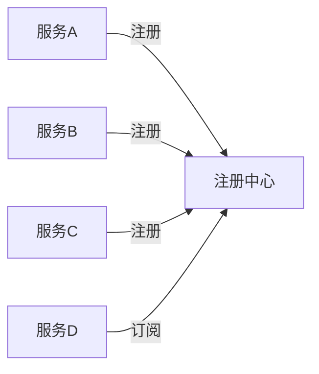

# Seata 服务订阅机制

## 介绍

Seata（Simple Extensible Autonomous Transaction Architecture）是一个开源的分布式事务解决方案，旨在解决微服务架构中的分布式事务问题。在Seata中，**服务订阅机制**是一个关键组件，它允许服务动态发现和订阅其他服务，从而实现事务的协调和管理。

服务订阅机制的核心思想是：当一个服务需要参与分布式事务时，它会向Seata的注册中心订阅相关服务，以便在事务执行过程中能够与其他服务进行通信和协调。这种机制确保了事务的全局一致性和可靠性。

## 服务订阅机制的工作原理

### 1. 服务注册与发现

在Seata中，服务订阅机制依赖于服务注册与发现。每个服务在启动时，会将自己的信息（如服务名称、IP地址、端口等）注册到Seata的注册中心（如Nacos、Eureka等）。其他服务可以通过注册中心发现并订阅这些服务。



### 2. 服务订阅

当一个服务需要参与分布式事务时，它会向注册中心订阅相关服务。订阅的过程包括：

1. **服务发现**：服务从注册中心获取所有已注册的服务列表。
2. **服务选择**：根据业务需求，选择需要订阅的服务。
3. **订阅请求**：向注册中心发送订阅请求，注册中心会将订阅信息保存下来。

### 3. 服务通知

当被订阅的服务发生变化（如服务下线、服务重启等），注册中心会通知所有订阅了该服务的客户端。客户端可以根据通知信息更新本地服务列表，确保事务的连续性。

## 代码示例

以下是一个简单的代码示例，展示如何使用Seata的服务订阅机制。

```java
// 服务A注册到注册中心
ServiceRegistry.register("ServiceA", "192.168.1.1", 8080);

// 服务B订阅服务A
ServiceSubscriber.subscribe("ServiceA", (serviceInfo) -> {
    System.out.println("ServiceA updated: " + serviceInfo);
});

// 服务A发生变化时，注册中心通知服务B
ServiceRegistry.update("ServiceA", "192.168.1.2", 8080);
```

**输出：**
```
ServiceA updated: {name: ServiceA, ip: 192.168.1.2, port: 8080}
```

## 实际案例

假设我们有一个电商系统，包含订单服务、库存服务和支付服务。当用户下单时，订单服务需要协调库存服务和支付服务来完成整个事务。

1. **订单服务**启动时，注册到Seata的注册中心。
2. **库存服务**和**支付服务**也分别注册到注册中心。
3. **订单服务**订阅**库存服务**和**支付服务**，以便在事务执行过程中与它们进行通信。
4. 当库存服务或支付服务发生变化时，注册中心会通知订单服务，确保事务的顺利进行。

## 总结

Seata的服务订阅机制是分布式事务管理的重要组成部分。通过服务注册与发现、服务订阅和服务通知，Seata能够确保事务的全局一致性和可靠性。对于初学者来说，理解这一机制是掌握Seata的关键。

## 附加资源

- [Seata官方文档](https://seata.io/zh-cn/docs/overview/what-is-seata.html)
- [分布式事务解决方案](https://dubbo.apache.org/zh/docs/advanced/distributed-transaction/)

## 练习

1. 尝试在自己的项目中实现一个简单的服务注册与发现机制。
2. 使用Seata的服务订阅机制，模拟一个分布式事务场景，并观察事务的执行过程。
