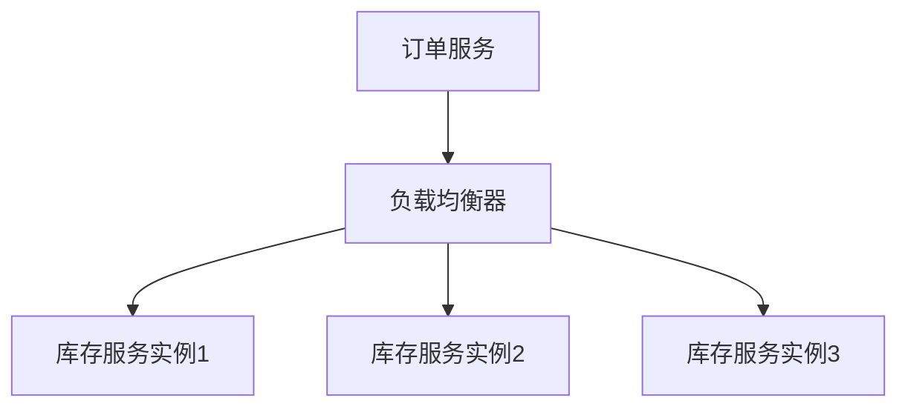

# Seata 负载均衡策略

在分布式事务管理框架Seata中，负载均衡策略是一个关键概念。它决定了如何在多个服务实例之间分配请求，以确保系统的高可用性和高性能。本文将详细介绍Seata中的负载均衡策略，并通过实际案例帮助你理解其应用场景。

## 什么是负载均衡策略？

负载均衡策略是指在分布式系统中，如何将请求合理地分配到多个服务实例上，以避免单个实例过载，同时提高系统的整体性能和可靠性。在Seata中，负载均衡策略主要用于协调事务管理器和资源管理器之间的通信。

## Seata 中的负载均衡策略

Seata支持多种负载均衡策略，以下是几种常见的策略：

### 1. 随机策略（Random）

随机策略是最简单的负载均衡策略，它随机选择一个服务实例来处理请求。这种策略适用于服务实例性能相近的场景。

```java
// 示例代码：随机策略
LoadBalance randomLoadBalance = new RandomLoadBalance();
ServiceInstance instance = randomLoadBalance.select(serviceInstances);
```

### 2. 轮询策略（Round Robin）

轮询策略按顺序依次选择服务实例，确保每个实例都能均匀地处理请求。这种策略适用于服务实例性能相近且请求量均匀的场景。

```java
// 示例代码：轮询策略
LoadBalance roundRobinLoadBalance = new RoundRobinLoadBalance();
ServiceInstance instance = roundRobinLoadBalance.select(serviceInstances);
```

### 3. 加权轮询策略（Weighted Round Robin）

加权轮询策略在轮询的基础上，为每个服务实例分配一个权重，权重高的实例会处理更多的请求。这种策略适用于服务实例性能不均衡的场景。

```java
// 示例代码：加权轮询策略
LoadBalance weightedRoundRobinLoadBalance = new WeightedRoundRobinLoadBalance();
ServiceInstance instance = weightedRoundRobinLoadBalance.select(serviceInstances);
```

### 4. 最少活跃调用策略（Least Active）

最少活跃调用策略会选择当前活跃调用数最少的服务实例来处理请求。这种策略适用于服务实例性能差异较大且请求处理时间不均衡的场景。

```java
// 示例代码：最少活跃调用策略
LoadBalance leastActiveLoadBalance = new LeastActiveLoadBalance();
ServiceInstance instance = leastActiveLoadBalance.select(serviceInstances);
```

## 实际应用场景

假设你有一个电商系统，其中订单服务和库存服务分别部署在多个实例上。在高并发场景下，如何确保订单服务和库存服务之间的通信高效且稳定？这时，你可以使用Seata的负载均衡策略来优化资源分配。



在上图中，负载均衡器根据配置的策略（如轮询策略）将订单服务的请求均匀地分配到多个库存服务实例上，从而避免单个实例过载。

## 总结

Seata的负载均衡策略在分布式事务管理中起着至关重要的作用。通过合理选择负载均衡策略，你可以优化资源分配，提升系统性能，并确保系统的高可用性。本文介绍了Seata中常见的负载均衡策略，并通过实际案例展示了其应用场景。

## 附加资源

- [Seata官方文档](https://seata.io/zh-cn/docs/)
- [分布式系统中的负载均衡策略](https://en.wikipedia.org/wiki/Load_balancing_(computing))

## 练习

1. 尝试在你的本地环境中配置Seata，并使用不同的负载均衡策略进行测试。
2. 思考在你的项目中，哪种负载均衡策略最适合你的应用场景，并解释原因。

:::tip
提示：在实际应用中，建议根据服务实例的性能和请求量动态调整负载均衡策略，以达到最佳效果。
:::