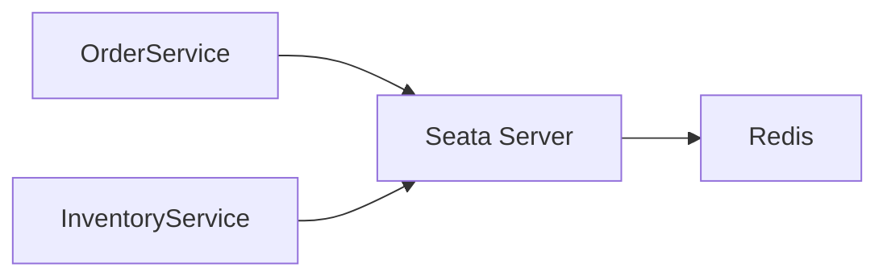
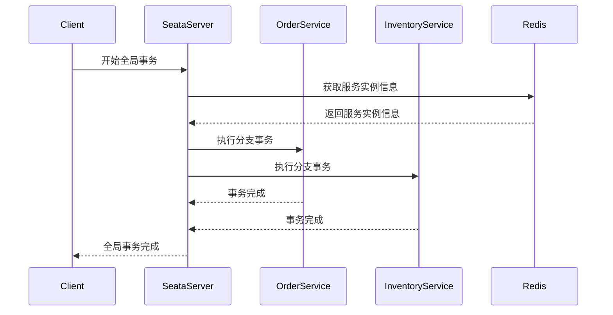
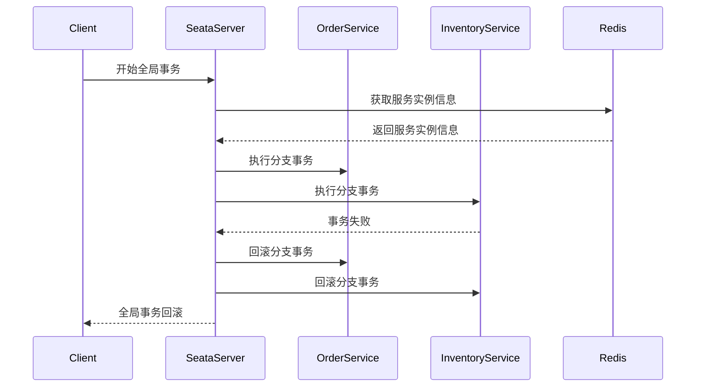

# Seata Redis注册中心

## 介绍

在分布式系统中，事务管理是一个复杂且关键的问题。Seata（Simple Extensible Autonomous Transaction Architecture）是一个开源的分布式事务解决方案，它通过全局事务管理器和分支事务管理器来协调分布式事务。为了实现事务的协调，Seata需要一个注册中心来管理各个服务的注册与发现。

Redis作为一个高性能的键值存储系统，常被用作缓存和消息队列。在Seata中，Redis也可以被用作注册中心，用于存储和发现事务参与者（如服务实例）的信息。

本文将详细介绍如何配置和使用Redis作为Seata的注册中心，并通过实际案例展示其应用场景。

## 配置Seata Redis注册中心

### 1. 安装Redis

首先，确保你已经安装并运行了Redis。你可以通过以下命令检查Redis是否已安装：

```bash
redis-cli ping
```

如果返回 `PONG`，则表示Redis已成功运行。

### 2. 配置Seata

在Seata的配置文件中，你需要指定使用Redis作为注册中心。以下是一个示例配置：

```properties
registry.type=redis
registry.redis.serverAddr=127.0.0.1:6379
registry.redis.db=0
registry.redis.password=
```

- `registry.type`：指定注册中心类型为 `redis`。
- `registry.redis.serverAddr`：指定Redis服务器的地址和端口。
- `registry.redis.db`：指定使用的Redis数据库编号。
- `registry.redis.password`：如果Redis需要密码认证，可以在此处指定。

### 3. 启动Seata Server

配置完成后，启动Seata Server。Seata Server会自动连接到Redis，并将服务实例信息注册到Redis中。

## 实际案例

假设我们有一个分布式系统，包含两个服务：`OrderService` 和 `InventoryService`。这两个服务都需要参与全局事务。

### 1. 服务注册

当 `OrderService` 和 `InventoryService` 启动时，它们会向Seata Server注册自己。Seata Server将这些信息存储在Redis中。



### 2. 事务协调

当一个全局事务开始时，Seata Server会从Redis中获取所有参与该事务的服务实例信息，并协调它们执行事务。



### 3. 事务回滚

如果某个分支事务失败，Seata Server会从Redis中获取所有参与事务的服务实例信息，并协调它们进行回滚操作。



## 总结

通过使用Redis作为Seata的注册中心，我们可以高效地管理和发现分布式事务中的服务实例。Redis的高性能和灵活性使得它成为Seata注册中心的理想选择。

在实际应用中，你可以根据业务需求调整Redis的配置，例如使用Redis集群来提高可用性和扩展性。

## 附加资源

- [Seata官方文档](https://seata.io/zh-cn/docs/overview/what-is-seata.html)
- [Redis官方文档](https://redis.io/documentation)

## 练习

1. 尝试在本地环境中配置Seata和Redis，并运行一个简单的分布式事务。
2. 修改Redis的配置，使用Redis集群作为Seata的注册中心，并观察其性能变化。
