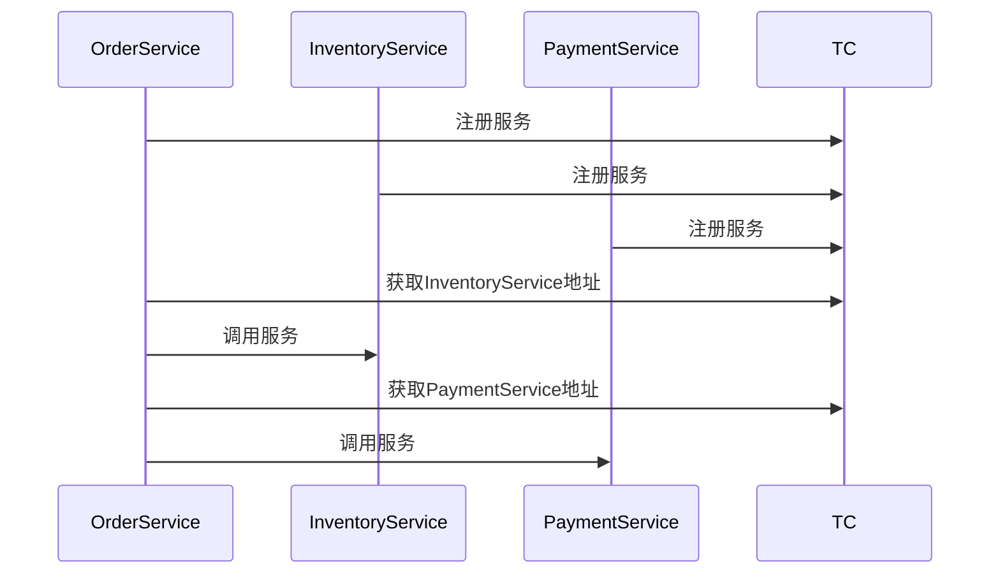

# Seata 服务注册流程

Seata（Simple Extensible Autonomous Transaction Architecture）是一款开源的分布式事务解决方案，旨在解决微服务架构下的分布式事务问题。在Seata中，服务注册是确保事务协调器（TC）、资源管理器（RM）和事务管理器（TM）能够相互发现和通信的关键步骤。本文将详细介绍Seata的服务注册流程，帮助初学者理解其工作原理。

## 什么是Seata服务注册？

在分布式系统中，服务注册是指将服务的元数据（如IP地址、端口号、服务名称等）注册到注册中心，以便其他服务能够发现并与之通信。Seata的服务注册流程主要包括以下几个步骤：

1. **服务启动**：当Seata的服务（如TC、RM、TM）启动时，会向注册中心注册自己的元数据。
2. **服务发现**：其他服务（如RM、TM）通过注册中心获取TC的地址，以便进行事务协调。
3. **心跳检测**：注册中心会定期检测服务的健康状态，确保服务的可用性。

## Seata 服务注册流程详解

### 1. 服务启动与注册

当Seata的服务启动时，它会向注册中心发送注册请求。注册中心可以是Nacos、Eureka、Zookeeper等常见的服务发现组件。以下是一个简单的代码示例，展示如何在Seata中配置Nacos作为注册中心：

```yaml
seata:
  registry:
    type: nacos
    nacos:
      server-addr: 127.0.0.1:8848
      namespace: seata
      cluster: default
```

在这个配置中，`type`指定了注册中心的类型为Nacos，`server-addr`是Nacos服务器的地址，`namespace`和`cluster`用于区分不同的环境和集群。

### 2. 服务发现

当RM或TM需要与TC通信时，它们会通过注册中心获取TC的地址。以下是一个简单的代码示例，展示如何从Nacos中获取TC的地址：

```java
NamingService namingService = NamingFactory.createNamingService("127.0.0.1:8848");
List<Instance> instances = namingService.getAllInstances("seata-server");
```

在这个示例中，`NamingService`是Nacos提供的服务发现接口，`getAllInstances`方法会返回所有注册的TC实例。

### 3. 心跳检测

注册中心会定期向注册的服务发送心跳请求，以检测服务的健康状态。如果某个服务长时间没有响应，注册中心会将其标记为不可用，并从服务列表中移除。以下是一个简单的代码示例，展示如何在Nacos中配置心跳检测：

```yaml
nacos:
  discovery:
    heartbeat-interval: 5000
    heartbeat-timeout: 15000
```

在这个配置中，`heartbeat-interval`指定了心跳检测的间隔时间，`heartbeat-timeout`指定了心跳超时时间。

## 实际应用场景

假设我们有一个电商系统，包含订单服务、库存服务和支付服务。当用户下单时，订单服务需要调用库存服务和支付服务来完成事务。在这种情况下，Seata的服务注册流程可以确保订单服务能够发现并调用库存服务和支付服务，从而保证事务的一致性。



在这个序列图中，`OrderService`首先向TC注册自己，然后通过TC获取`InventoryService`和`PaymentService`的地址，并调用它们来完成事务。

## 总结

Seata的服务注册流程是分布式事务解决方案中的重要组成部分，它确保了事务协调器、资源管理器和事务管理器能够相互发现和通信。通过本文的介绍，你应该对Seata的服务注册流程有了基本的了解。在实际应用中，选择合适的注册中心并正确配置服务注册和发现是确保系统稳定运行的关键。

## 附加资源

- [Seata官方文档](https://seata.io/zh-cn/docs/overview/what-is-seata.html)
- [Nacos官方文档](https://nacos.io/zh-cn/docs/what-is-nacos.html)
- [Eureka官方文档](https://github.com/Netflix/eureka/wiki)

## 练习

1. 尝试在本地环境中配置Seata并使用Nacos作为注册中心。
2. 编写一个简单的微服务应用，使用Seata进行分布式事务管理，并观察服务注册和发现的过程。
3. 研究其他注册中心（如Eureka、Zookeeper）与Seata的集成方式，并比较它们的优缺点。
