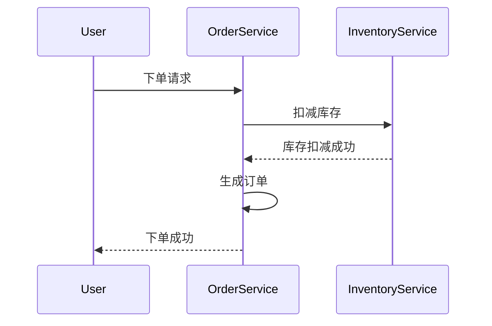

# Seata 存储监控

## 介绍

Seata（Simple Extensible Autonomous Transaction Architecture）是一款开源的分布式事务解决方案，旨在解决微服务架构中的分布式事务问题。在Seata中，存储模式（Storage Mode）是事务日志的存储方式，而存储监控则是确保这些事务日志能够被正确记录和管理的机制。

存储监控的主要目的是确保事务日志的完整性和一致性，同时提供对事务状态的实时监控。这对于分布式系统的稳定性和可靠性至关重要。

## Seata 存储模式概述

在Seata中，存储模式主要分为两种：

1. **文件存储模式**：事务日志存储在本地文件系统中。
2. **数据库存储模式**：事务日志存储在数据库中。

无论采用哪种存储模式，存储监控都是确保事务日志正确记录和管理的关键。

## 存储监控的实现

### 1. 文件存储模式的监控

在文件存储模式下，Seata会将事务日志存储在本地文件系统中。存储监控的主要任务是确保这些日志文件能够被正确写入、读取和删除。

```java
// 示例：文件存储模式下的日志写入
File logFile = new File("transaction.log");
try (FileWriter writer = new FileWriter(logFile, true)) {
    writer.write("Transaction log entry\n");
} catch (IOException e) {
    e.printStackTrace();
}
```

:::note
在文件存储模式下，存储监控需要定期检查日志文件的大小和完整性，确保没有损坏或丢失的日志。
:::

### 2. 数据库存储模式的监控

在数据库存储模式下，Seata会将事务日志存储在数据库中。存储监控的主要任务是确保数据库连接正常、日志表结构正确，并且日志记录能够被正确插入和查询。

```sql
-- 示例：数据库存储模式下的日志插入
INSERT INTO transaction_log (transaction_id, status, created_at)
VALUES ('12345', 'COMMITTED', NOW());
```

:::tip
在数据库存储模式下，存储监控需要定期检查数据库连接状态、日志表的大小和索引状态，确保日志记录的高效查询和管理。
:::

## 实际案例

假设我们有一个电商系统，用户下单后需要扣减库存并生成订单。这两个操作分别由库存服务和订单服务处理，属于分布式事务。



在这个案例中，Seata的存储监控确保事务日志能够被正确记录，即使某个服务出现故障，事务日志也能被恢复，从而保证事务的最终一致性。

## 总结

Seata存储监控是确保分布式事务日志正确记录和管理的关键机制。无论是文件存储模式还是数据库存储模式，存储监控都需要定期检查日志的完整性和一致性，确保系统的稳定性和可靠性。

## 附加资源

- [Seata官方文档](https://seata.io/zh-cn/docs/overview/what-is-seata.html)
- [分布式事务解决方案](https://microservices.io/patterns/data/distributed-transactions.html)

## 练习

1. 尝试在本地环境中配置Seata的文件存储模式，并编写一个简单的日志写入程序。
2. 在数据库中创建一个事务日志表，并编写SQL语句插入和查询日志记录。
3. 思考在实际项目中，如何结合Seata的存储监控机制来确保分布式事务的一致性。

:::caution
在实际生产环境中，存储监控的配置和优化需要根据具体业务需求和系统架构进行调整，建议在测试环境中充分验证后再上线。
:::