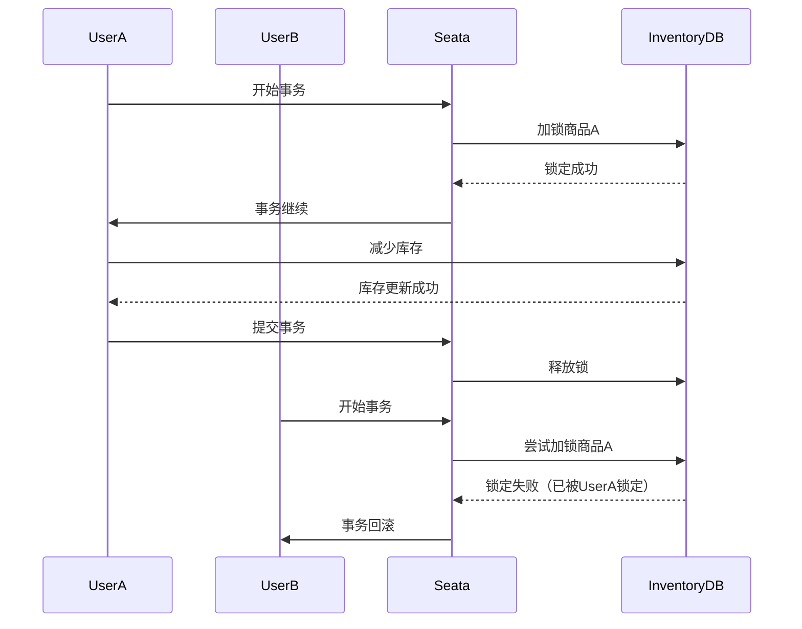

# Seata 全局锁存储

## 介绍

在分布式系统中，事务的一致性是一个重要的挑战。Seata（Simple Extensible Autonomous Transaction Architecture）是一个开源的分布式事务解决方案，旨在简化分布式事务的管理。Seata通过全局锁机制来确保事务的隔离性和一致性。本文将详细介绍Seata中的全局锁存储机制，帮助初学者理解其工作原理和应用场景。

## 什么是全局锁？

全局锁是Seata用来确保分布式事务中数据一致性的关键机制。当一个事务需要修改某个资源时，Seata会为该资源加锁，防止其他事务同时修改该资源，从而避免数据不一致的问题。

### 全局锁的作用

- **隔离性**：确保事务之间的操作不会相互干扰。
- **一致性**：保证事务提交后，数据的状态是一致的。

## 全局锁存储机制

Seata的全局锁存储机制主要依赖于以下几个组件：

1. **全局事务管理器（Global Transaction Manager, GTM）**：负责管理全局事务的生命周期。
2. **资源管理器（Resource Manager, RM）**：负责管理本地资源的事务操作。
3. **全局锁存储（Global Lock Storage）**：存储全局锁信息，确保锁的全局可见性。

### 全局锁存储的实现

Seata支持多种全局锁存储方式，包括：

- **数据库存储**：将全局锁信息存储在数据库中。
- **Redis存储**：将全局锁信息存储在Redis中，以提高性能。

#### 数据库存储示例

以下是一个使用数据库存储全局锁的示例：

```sql
CREATE TABLE global_lock (
    xid VARCHAR(128) NOT NULL,
    table_name VARCHAR(64) NOT NULL,
    pk VARCHAR(36) NOT NULL,
    gmt_create DATETIME NOT NULL,
    gmt_modified DATETIME NOT NULL,
    PRIMARY KEY (xid, table_name, pk)
);
```

在这个表中，`xid`是全局事务ID，`table_name`是表名，`pk`是主键，`gmt_create`和`gmt_modified`是时间戳。

#### Redis存储示例

以下是一个使用Redis存储全局锁的示例：

```java
String lockKey = "global_lock:" + xid + ":" + tableName + ":" + pk;
redisTemplate.opsForValue().set(lockKey, "locked", 30, TimeUnit.SECONDS);
```

在这个示例中，`lockKey`是全局锁的键，`xid`是全局事务ID，`tableName`是表名，`pk`是主键。

## 实际应用场景

### 电商系统中的库存管理

在电商系统中，库存管理是一个典型的分布式事务场景。假设有两个用户同时购买同一件商品，系统需要确保库存不会被超卖。

1. **用户A**：购买商品A，库存减少1。
2. **用户B**：同时购买商品A，库存减少1。

如果没有全局锁机制，可能会导致库存超卖的问题。通过Seata的全局锁机制，可以确保在同一时间只有一个事务能够修改库存，从而避免超卖。



## 总结

Seata的全局锁存储机制是确保分布式事务一致性的重要手段。通过全局锁，Seata能够有效地管理分布式事务中的资源竞争，避免数据不一致的问题。本文介绍了全局锁的基本概念、存储机制以及实际应用场景，希望能够帮助初学者更好地理解Seata的工作原理。

## 附加资源

- [Seata官方文档](https://seata.io/zh-cn/docs/overview/what-is-seata.html)
- [分布式事务与Seata](https://dubbo.apache.org/zh/docs/advanced/seata/)
- [Redis官方文档](https://redis.io/documentation)

## 练习

1. 尝试在本地环境中配置Seata，并使用数据库存储全局锁。
2. 编写一个简单的分布式事务示例，模拟库存管理的场景，并观察全局锁的作用。
3. 将全局锁存储方式从数据库切换到Redis，并比较两种方式的性能差异。
