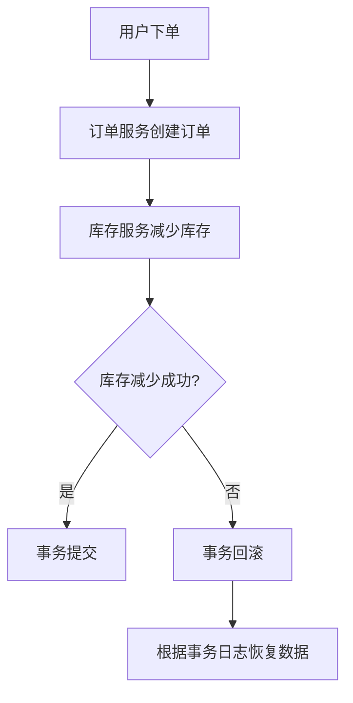

# Seata 数据恢复策略

在分布式系统中，事务管理是一个复杂且关键的任务。Seata 是一个开源的分布式事务解决方案，它提供了多种存储模式和恢复策略，以确保在分布式事务中数据的一致性和可靠性。本文将详细介绍 Seata 的数据恢复策略，帮助初学者理解其工作原理和应用场景。

## 什么是 Seata 数据恢复策略？

Seata 的数据恢复策略是指在分布式事务执行过程中，当出现异常（如网络故障、服务宕机等）时，如何恢复事务状态并确保数据一致性。Seata 通过记录事务日志和状态信息，结合其存储模式（如文件、数据库等），提供了多种恢复机制。

## Seata 数据恢复策略的核心组件

Seata 的数据恢复策略依赖于以下几个核心组件：

1. **事务日志（Transaction Log）**：记录事务的执行状态和操作信息。
2. **全局事务（Global Transaction）**：跨多个服务的分布式事务。
3. **分支事务（Branch Transaction）**：全局事务中的单个服务事务。
4. **存储模式（Storage Mode）**：事务日志的存储方式，如文件、数据库等。

## Seata 数据恢复策略的工作原理

Seata 的数据恢复策略主要分为以下几个步骤：

1. **事务日志记录**：在事务执行过程中，Seata 会记录每个分支事务的状态和操作信息。
2. **事务状态检查**：在事务提交或回滚时，Seata 会检查所有分支事务的状态。
3. **异常处理**：如果某个分支事务失败，Seata 会根据事务日志进行恢复操作。
4. **数据一致性保证**：通过事务日志和恢复机制，确保分布式事务的最终一致性。

## 实际案例：订单与库存服务的事务恢复

假设我们有一个电商系统，包含订单服务和库存服务。当用户下单时，订单服务会创建一个订单，同时库存服务会减少库存。这两个操作需要在一个分布式事务中完成。

### 代码示例

```java
// 订单服务
@GlobalTransactional
public void createOrder(Order order) {
    // 创建订单
    orderService.create(order);
    // 减少库存
    inventoryService.decrease(order.getProductId(), order.getQuantity());
}
```

在上述代码中，`@GlobalTransactional` 注解表示这是一个全局事务。如果库存服务在减少库存时发生异常，Seata 会根据事务日志进行恢复操作，确保订单和库存数据的一致性。

### 事务恢复流程



## 总结

Seata 的数据恢复策略是确保分布式事务数据一致性的关键机制。通过记录事务日志和状态信息，Seata 能够在出现异常时进行恢复操作，确保数据的最终一致性。对于初学者来说，理解 Seata 的数据恢复策略是掌握分布式事务管理的重要一步。

## 附加资源与练习

- **练习**：尝试在一个简单的分布式系统中实现 Seata 的事务管理，并模拟异常情况，观察 Seata 的恢复机制。
- **资源**：阅读 Seata 官方文档，了解更多关于存储模式和恢复策略的详细信息。

:::tip
在实际开发中，合理配置 Seata 的存储模式和恢复策略，可以大大提高系统的可靠性和稳定性。
:::