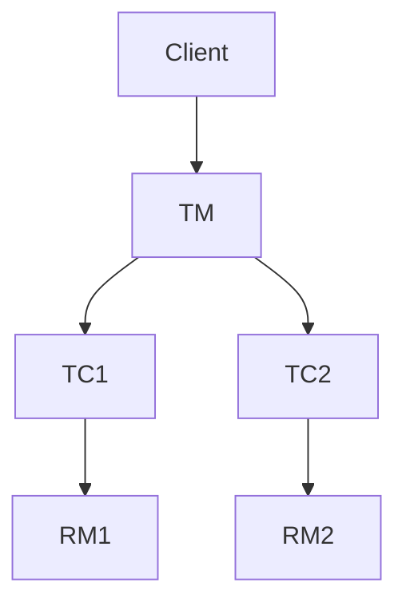

# Seata 运维最佳实践

## 介绍

Seata 是一款开源的分布式事务解决方案，旨在解决微服务架构下的分布式事务问题。在高可用部署中，Seata 的运维至关重要，确保系统的稳定性和可靠性。本文将介绍 Seata 运维的最佳实践，帮助初学者掌握如何高效地管理和维护 Seata 服务。

## Seata 高可用部署

### 1. 部署架构

Seata 的高可用部署通常包括以下几个组件：

- **TC (Transaction Coordinator)**: 事务协调器，负责全局事务的协调和管理。
- **TM (Transaction Manager)**: 事务管理器，负责开启、提交或回滚全局事务。
- **RM (Resource Manager)**: 资源管理器，负责分支事务的管理。

为了实现高可用，通常需要部署多个 TC 实例，并通过注册中心（如 Nacos、Eureka）进行服务发现和负载均衡。



### 2. 配置管理

Seata 的配置文件通常包括 `registry.conf` 和 `file.conf`。在高可用部署中，建议使用配置中心（如 Nacos、Apollo）来管理这些配置，以便动态更新和统一管理。

```plaintext
registry {
  type = "nacos"
  nacos {
    serverAddr = "127.0.0.1:8848"
    namespace = ""
    cluster = "default"
  }
}
```

### 3. 数据库配置

Seata 需要存储全局事务和分支事务的状态信息，因此需要配置数据库。建议使用高可用的数据库集群，并定期备份数据。

```plaintext
store {
  mode = "db"
  db {
    datasource = "druid"
    dbType = "mysql"
    url = "jdbc:mysql://127.0.0.1:3306/seata"
    user = "root"
    password = "password"
  }
}
```

### 4. 监控与告警

为了确保 Seata 服务的稳定性，建议部署监控系统（如 Prometheus、Grafana）来实时监控 Seata 的运行状态，并设置告警规则，及时发现和处理异常。

```plaintext
metrics {
  enabled = true
  registryType = "compact"
  exporterList = "prometheus"
  exporterPrometheusPort = 9898
}
```

## 实际案例

### 案例：电商平台的分布式事务处理

在一个电商平台中，用户下单后需要同时扣减库存、生成订单和扣减用户余额。这些操作涉及多个微服务，需要通过 Seata 来保证事务的一致性。

```java
@GlobalTransactional
public void placeOrder(Order order) {
    // 扣减库存
    inventoryService.reduceStock(order.getProductId(), order.getQuantity());
    // 生成订单
    orderService.createOrder(order);
    // 扣减用户余额
    accountService.deductBalance(order.getUserId(), order.getTotalAmount());
}
```

在上述代码中，`@GlobalTransactional` 注解确保了这三个操作要么全部成功，要么全部回滚，从而保证了数据的一致性。

## 总结

Seata 的高可用部署和运维是确保分布式事务处理稳定性的关键。通过合理的部署架构、配置管理、数据库配置和监控告警，可以有效提升 Seata 服务的可靠性和性能。希望本文的内容能帮助初学者更好地理解和应用 Seata 的运维最佳实践。

## 附加资源

- [Seata 官方文档](https://seata.io/zh-cn/docs/overview/what-is-seata.html)
- [Nacos 配置中心](https://nacos.io/zh-cn/docs/what-is-nacos.html)
- [Prometheus 监控系统](https://prometheus.io/docs/introduction/overview/)

## 练习

1. 尝试在本地环境中部署一个高可用的 Seata 服务，并使用 Nacos 作为注册中心。
2. 编写一个简单的分布式事务处理程序，并使用 Seata 进行事务管理。
3. 配置 Prometheus 和 Grafana，监控 Seata 服务的运行状态。

:::tip
在实际生产环境中，建议定期进行压力测试和故障演练，以确保 Seata 服务的高可用性和稳定性。
:::