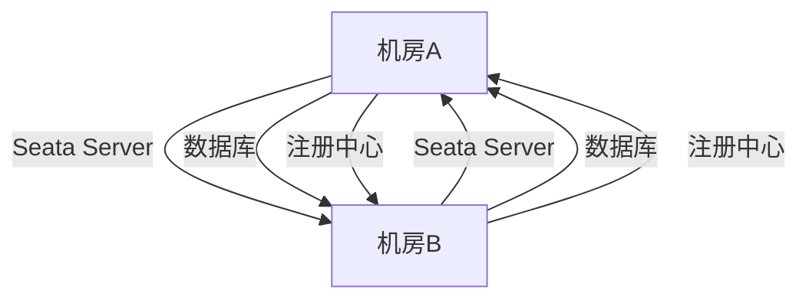

## 介绍

在现代分布式系统中，高可用性和容灾能力是至关重要的。Seata作为一款开源的分布式事务解决方案，支持多机房部署，以确保在单个机房发生故障时，系统仍能正常运行。多机房部署不仅提高了系统的可用性，还能有效应对机房级别的灾难。

本文将详细介绍如何在多机房环境中部署Seata，包括配置、部署步骤以及实际应用场景。

## 多机房部署的基本概念

多机房部署是指将系统的各个组件分布在不同的物理机房中，以实现高可用性和容灾能力。对于Seata来说，多机房部署通常涉及以下几个关键组件：

1. **Seata Server**：负责协调分布式事务的核心组件。
2. **数据库**：存储事务日志和状态信息。
3. **注册中心**：用于服务发现和负载均衡。

在多机房部署中，这些组件需要在不同的机房中进行冗余部署，以确保在某个机房发生故障时，其他机房可以接管服务。

## 多机房部署的配置

### 1. 配置Seata Server

在多机房部署中，每个机房都需要部署一个Seata Server实例。为了确保这些实例能够协同工作，需要进行以下配置：

```yaml
# seata-server.yml
server:
  port: 8091
  service:
    vgroupMapping:
      my_test_tx_group: default
    grouplist:
      default: 192.168.1.1:8091,192.168.2.1:8091
```

在上述配置中，`grouplist`指定了所有机房的Seata Server地址。每个Seata Server实例都需要配置相同的`grouplist`，以确保它们能够互相通信。

### 2. 配置数据库

在多机房部署中，数据库通常采用主从复制或分布式数据库方案。Seata的事务日志和状态信息需要存储在数据库中，因此数据库的高可用性至关重要。

```sql
-- 创建事务日志表
CREATE TABLE IF NOT EXISTS `global_table` (
  `xid` VARCHAR(128) NOT NULL,
  `transaction_id` BIGINT,
  `status` TINYINT NOT NULL,
  `application_id` VARCHAR(32),
  `transaction_service_group` VARCHAR(32),
  `transaction_name` VARCHAR(128),
  `timeout` INT,
  `begin_time` BIGINT,
  `application_data` VARCHAR(2000),
  `gmt_create` DATETIME,
  `gmt_modified` DATETIME,
  PRIMARY KEY (`xid`),
  KEY `idx_gmt_modified_status` (`gmt_modified`, `status`),
  KEY `idx_transaction_id` (`transaction_id`)
);
```

### 3. 配置注册中心

注册中心用于服务发现和负载均衡。在多机房部署中，注册中心需要支持跨机房的服务发现。常见的注册中心包括Nacos、Zookeeper和Eureka。

```yaml
# registry.conf
registry {
  type = "nacos"
  nacos {
    serverAddr = "192.168.1.1:8848,192.168.2.1:8848"
    namespace = ""
    cluster = "default"
  }
}
```

在上述配置中，`serverAddr`指定了所有机房的Nacos服务器地址。

## 多机房部署的步骤

### 1. 部署Seata Server

在每个机房中部署Seata Server实例，并确保它们使用相同的配置文件和数据库。

### 2. 配置数据库复制

如果使用主从复制方案，需要配置数据库的主从复制，以确保数据的一致性。

### 3. 配置注册中心

在每个机房中部署注册中心实例，并确保它们能够互相通信。

### 4. 测试跨机房通信

通过模拟机房故障，测试系统的容灾能力。确保在某个机房发生故障时，其他机房可以接管服务。

## 实际案例

假设我们有一个电商系统，部署在两个机房（机房A和机房B）中。每个机房都部署了Seata Server、数据库和注册中心。当机房A发生故障时，机房B可以接管所有服务，确保系统的正常运行。



在上述案例中，机房A和机房B通过Seata Server、数据库和注册中心进行通信，确保系统的高可用性。

## 总结

多机房部署是确保系统高可用性和容灾能力的重要手段。通过在多机房中部署Seata Server、数据库和注册中心，可以有效应对机房级别的故障。本文详细介绍了多机房部署的配置和步骤，并通过实际案例展示了其应用场景。

## 附加资源

- [Seata官方文档](https://seata.io/zh-cn/docs/overview/what-is-seata.html)
- [Nacos官方文档](https://nacos.io/zh-cn/docs/what-is-nacos.html)
- [分布式数据库设计指南](https://en.wikipedia.org/wiki/Distributed_database)

## 练习

1. 尝试在两个虚拟机中部署Seata Server，并配置多机房部署。
2. 模拟机房故障，测试系统的容灾能力。
3. 研究其他分布式事务解决方案，比较它们与Seata的异同。
