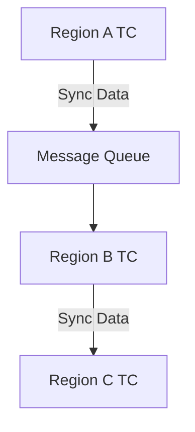

# Seata 异地多活

## 介绍

在分布式系统中，**异地多活**（Multi-Region Active-Active）是一种架构设计模式，旨在通过将系统部署在多个地理区域，确保系统的高可用性和容灾能力。对于分布式事务管理工具Seata来说，异地多活部署可以帮助企业在面对区域性故障时，依然能够保证事务的一致性和系统的正常运行。

本文将详细介绍如何在Seata中实现异地多活部署，并通过实际案例展示其应用场景。

## 什么是异地多活？

异地多活是指将系统的多个实例部署在不同的地理区域，每个区域的实例都能够独立处理请求，并且在必要时与其他区域的实例进行数据同步。这种架构设计可以有效地应对区域性故障，确保系统的高可用性。

在Seata中，异地多活部署主要涉及到以下几个方面：

1. **事务协调器（TC）的多活部署**：确保每个区域都有独立的事务协调器，能够处理本地的事务请求。
2. **全局事务ID（XID）的全局唯一性**：确保在不同区域生成的事务ID不会冲突。
3. **数据同步与一致性**：确保不同区域的事务数据能够及时同步，保持一致性。

## Seata 异地多活部署步骤

### 1. 部署多个事务协调器（TC）

在异地多活部署中，首先需要在每个区域部署独立的事务协调器（TC）。每个TC负责处理本区域的事务请求，并与其他区域的TC进行数据同步。

```yaml
# seata-server.yml (Region A)
server:
  port: 8091
service:
  vgroupMapping:
    my_test_tx_group: "default"
  default:
    grouplist: "127.0.0.1:8091"
```

```yaml
# seata-server.yml (Region B)
server:
  port: 8092
service:
  vgroupMapping:
    my_test_tx_group: "default"
  default:
    grouplist: "127.0.0.1:8092"
```

### 2. 配置全局事务ID（XID）生成策略

为了确保不同区域生成的事务ID不会冲突，需要配置全局事务ID（XID）的生成策略。通常可以使用基于区域前缀的ID生成策略。

```java
// XID生成策略示例
public class XIDGenerator {
    private static final String REGION_PREFIX = "REGION_A_"; // 根据区域设置不同的前缀

    public static String generateXID() {
        return REGION_PREFIX + UUID.randomUUID().toString();
    }
}
```

### 3. 数据同步与一致性

在异地多活部署中，数据同步是关键。可以通过消息队列（如Kafka、RocketMQ）或数据库同步工具（如Canal）来实现不同区域之间的数据同步。



## 实际案例

假设我们有一个电商系统，用户可以在不同区域（如北京、上海、广州）下单。为了确保系统的高可用性，我们在每个区域部署了独立的Seata事务协调器（TC）。

1. **用户在北京下单**：北京区域的TC处理该事务，并生成一个全局事务ID（XID）。
2. **数据同步**：通过消息队列，北京区域的TC将事务数据同步到上海和广州的TC。
3. **事务提交**：所有区域的TC确认事务提交后，订单状态更新为“已完成”。

通过这种方式，即使某个区域的TC出现故障，其他区域的TC仍然可以处理事务请求，确保系统的高可用性。

## 总结

Seata的异地多活部署是一种有效的架构设计，能够确保分布式系统在面对区域性故障时依然保持高可用性。通过部署多个事务协调器（TC）、配置全局事务ID（XID）生成策略以及实现数据同步，可以有效地实现异地多活部署。

## 附加资源与练习

- **练习**：尝试在本地环境中部署两个Seata TC实例，并配置它们之间的数据同步。
- **资源**：
  - [Seata官方文档](https://seata.io/zh-cn/docs/overview/what-is-seata.html)
  - [分布式事务与Seata实战](https://www.oreilly.com/library/view/distributed-transactions-and/9781492044784/)

通过本文的学习，你应该对Seata的异地多活部署有了初步的了解。希望你能在实际项目中应用这些知识，提升系统的可用性和容灾能力。