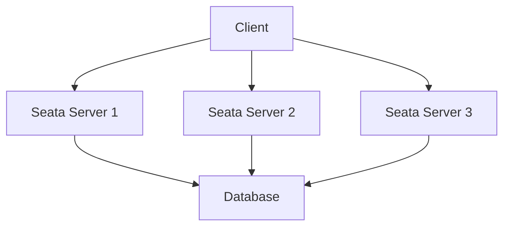

# Seata 灾备设计

## 介绍

在分布式系统中，灾备设计是确保系统在发生故障时能够继续运行的关键。Seata（Simple Extensible Autonomous Transaction Architecture）是一个开源的分布式事务解决方案，它通过AT（自动补偿事务）、TCC（Try-Confirm-Cancel）和Saga模式来管理分布式事务。为了确保Seata在高可用环境中的稳定性，灾备设计是必不可少的。

本文将详细介绍Seata的灾备设计，包括其核心概念、实现方式以及实际应用场景。

## Seata 灾备设计的核心概念

### 1. 高可用性

高可用性是指系统能够在面对硬件故障、网络中断或其他异常情况时，仍然保持正常运行。Seata通过多节点部署和故障转移机制来实现高可用性。

### 2. 数据一致性

在分布式事务中，数据一致性是至关重要的。Seata通过事务日志和状态机来确保在故障发生时，事务能够正确回滚或提交。

### 3. 故障恢复

故障恢复是指在系统发生故障后，能够快速恢复到正常状态。Seata通过持久化事务日志和状态信息来实现故障恢复。

## Seata 灾备设计的实现方式

### 1. 多节点部署

Seata支持多节点部署，通过部署多个Seata Server实例来提高系统的可用性。当其中一个节点发生故障时，其他节点可以接管其工作。



### 2. 故障转移

Seata通过Zookeeper或Nacos等注册中心来实现故障转移。当某个Seata Server节点不可用时，注册中心会自动将请求路由到其他可用节点。

```java
// 示例：使用Nacos作为注册中心
SeataServerBootstrap.start(new String[]{"-h", "127.0.0.1", "-p", "8091", "-m", "nacos"});
```

### 3. 事务日志持久化

Seata将事务日志持久化到数据库中，以确保在系统崩溃后能够恢复事务状态。

```sql
-- 示例：事务日志表结构
CREATE TABLE undo_log (
    id BIGINT PRIMARY KEY,
    branch_id BIGINT,
    xid VARCHAR(100),
    context VARCHAR(128),
    rollback_info LONGBLOB,
    log_status INT,
    log_created TIMESTAMP,
    log_modified TIMESTAMP
);
```

## 实际应用场景

### 场景：电商平台的订单系统

在一个电商平台的订单系统中，用户下单后需要扣减库存、生成订单、支付等多个步骤。如果在这个过程中某个服务发生故障，Seata的灾备设计可以确保事务的一致性。

1. **下单**：用户下单后，订单服务调用库存服务扣减库存。
2. **支付**：支付服务处理支付请求。
3. **故障恢复**：如果支付服务发生故障，Seata会自动回滚库存扣减操作，确保数据一致性。

## 总结

Seata的灾备设计通过多节点部署、故障转移和事务日志持久化等机制，确保了分布式事务系统的高可用性和数据一致性。对于初学者来说，理解这些概念并掌握其实现方式，是构建可靠分布式系统的关键。

## 附加资源

- [Seata官方文档](https://seata.io/zh-cn/docs/overview/what-is-seata.html)
- [分布式事务与Seata实战](https://time.geekbang.org/column/intro/100026001)

## 练习

1. 尝试在本地环境中部署多个Seata Server实例，并模拟故障转移。
2. 编写一个简单的分布式事务应用，使用Seata管理事务，并测试其灾备能力。
