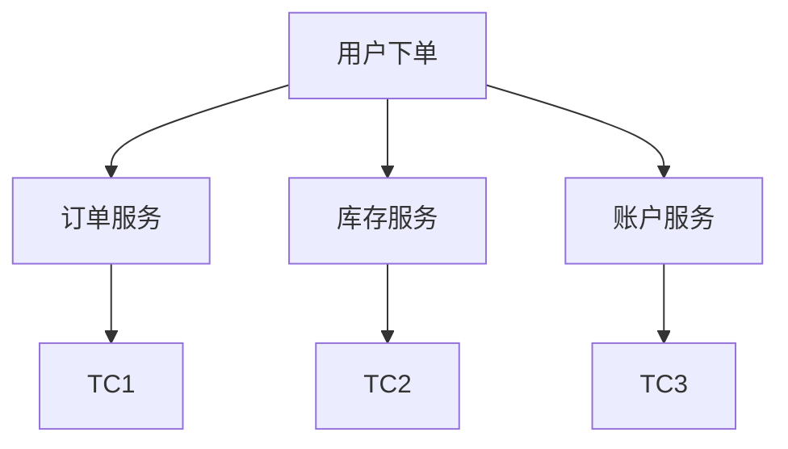

# Seata 负载均衡

在分布式系统中，负载均衡是确保系统高可用性和高性能的关键技术之一。Seata作为一个开源的分布式事务解决方案，也需要通过负载均衡来优化资源利用率和提高系统的稳定性。本文将详细介绍Seata负载均衡的概念、实现方式以及实际应用场景。

## 什么是负载均衡？

负载均衡（Load Balancing）是一种将工作负载分配到多个计算资源（如服务器、网络链接、CPU等）上的技术，目的是优化资源使用、最大化吞吐量、最小化响应时间，并避免任何单一资源的过载。

在Seata中，负载均衡主要用于将事务请求均匀地分配到多个事务协调器（TC）上，从而避免单个TC成为性能瓶颈。

## Seata 负载均衡的实现

Seata的负载均衡主要通过客户端（如Spring Cloud Alibaba）和服务端（如Nacos、Eureka）的配合来实现。以下是实现Seata负载均衡的步骤：

### 1. 服务注册与发现

Seata的客户端和服务端通常通过服务注册中心（如Nacos、Eureka）进行注册和发现。服务注册中心会维护所有可用的TC实例列表。

```java
// 示例：在Spring Cloud Alibaba中配置Nacos作为服务注册中心
spring:
  cloud:
    nacos:
      discovery:
        server-addr: 127.0.0.1:8848
```

### 2. 客户端负载均衡策略

Seata客户端在发起事务请求时，会根据配置的负载均衡策略选择一个TC实例。常见的负载均衡策略包括轮询（Round Robin）、随机（Random）和加权轮询（Weighted Round Robin）等。

```java
// 示例：在Spring Cloud Alibaba中配置负载均衡策略
seata:
  client:
    load-balance: round-robin
```

### 3. 服务端负载均衡

Seata服务端（TC）也可以通过配置实现负载均衡。例如，可以通过Nginx等反向代理工具将请求均匀地分配到多个TC实例上。

```nginx
# 示例：使用Nginx实现TC的负载均衡
upstream seata_tc {
    server 127.0.0.1:8091;
    server 127.0.0.1:8092;
}

server {
    listen 80;
    server_name seata.example.com;

    location / {
        proxy_pass http://seata_tc;
    }
}
```

## 实际应用场景

假设我们有一个电商系统，用户在下单时需要同时更新订单、库存和账户余额。这些操作涉及多个微服务，因此需要使用Seata来保证分布式事务的一致性。

在高并发场景下，单个TC实例可能无法处理所有的事务请求，导致系统性能下降。通过负载均衡，我们可以将事务请求均匀地分配到多个TC实例上，从而提高系统的吞吐量和响应速度。



:::tip
在实际生产环境中，建议结合监控工具（如Prometheus、Grafana）对TC实例的性能进行实时监控，以便及时调整负载均衡策略。
:::

## 总结

Seata负载均衡是确保分布式事务处理高效性和稳定性的重要手段。通过合理的负载均衡策略，可以有效避免单个TC实例成为性能瓶颈，从而提高系统的整体性能。

## 附加资源

- [Seata官方文档](https://seata.io/zh-cn/docs/overview/what-is-seata.html)
- [Spring Cloud Alibaba官方文档](https://spring.io/projects/spring-cloud-alibaba)
- [Nginx负载均衡配置指南](https://nginx.org/en/docs/http/load_balancing.html)

## 练习

1. 尝试在本地环境中配置Seata的负载均衡，并使用Nginx作为反向代理。
2. 编写一个简单的Spring Boot应用，模拟高并发场景下的分布式事务处理，并观察负载均衡的效果。
