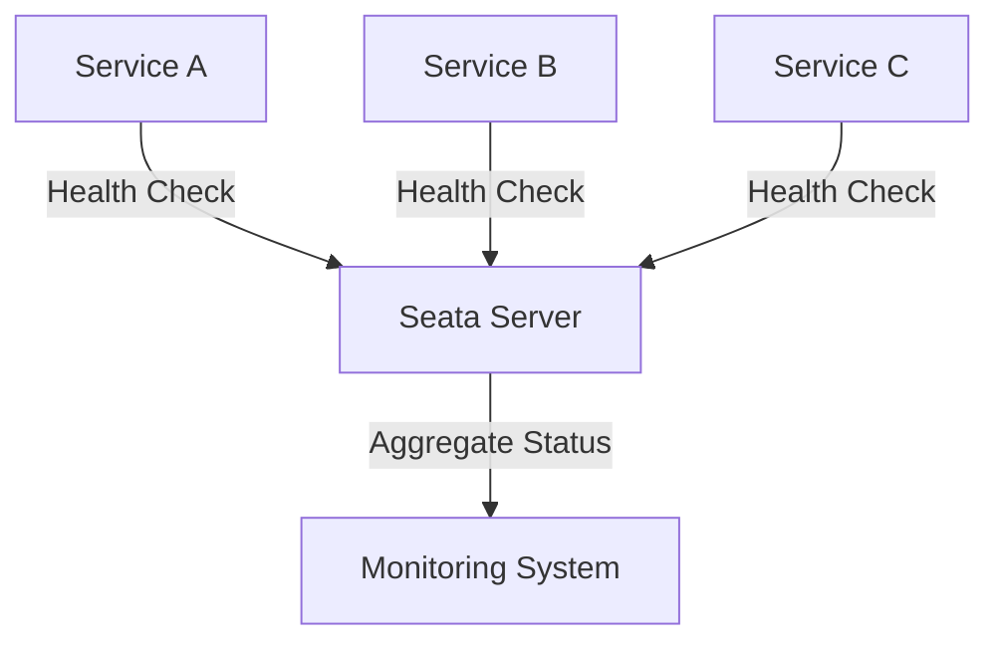

# Seata 健康检查

在分布式系统中，健康检查是确保服务正常运行的关键步骤。Seata作为一个分布式事务解决方案，其高可用部署的健康检查尤为重要。本文将详细介绍Seata健康检查的概念、实现方法以及实际应用场景。

## 什么是Seata健康检查？

Seata健康检查是指通过一系列机制来监控Seata服务的运行状态，确保其能够正常处理分布式事务。健康检查通常包括对Seata Server、数据库连接、网络状态等的监控。

## 为什么需要健康检查？

- **确保服务可用性**：通过健康检查，可以及时发现并处理服务故障，避免影响整个系统的正常运行。
- **提高系统稳定性**：定期健康检查可以帮助识别潜在问题，提前进行修复，从而提高系统的稳定性。
- **优化资源利用**：通过健康检查，可以合理分配资源，避免资源浪费。

## 如何进行Seata健康检查？

### 1. Seata Server健康检查

Seata Server的健康检查可以通过HTTP接口或TCP连接来实现。以下是一个简单的HTTP健康检查示例：

```bash
curl -X GET http://localhost:8091/health
```

如果Seata Server正常运行，将返回如下响应：

```json
{
  "status": "UP"
}
```

### 2. 数据库连接健康检查

Seata依赖于数据库来存储事务日志，因此数据库连接的稳定性至关重要。可以通过以下SQL语句检查数据库连接：

```sql
SELECT 1 FROM dual;
```

如果数据库连接正常，将返回结果 `1`。

### 3. 网络状态健康检查

网络状态的健康检查可以通过Ping命令或Telnet命令来实现。例如：

```bash
ping seata-server-host
```

或

```bash
telnet seata-server-host 8091
```

如果网络连接正常，Ping命令将返回响应时间，Telnet命令将成功连接到指定端口。

## 实际应用场景

### 场景一：自动化运维

在自动化运维系统中，可以通过脚本定期执行健康检查，并根据检查结果自动重启服务或发送告警。

```bash
#!/bin/bash
response=$(curl -s -o /dev/null -w "%{http_code}" http://localhost:8091/health)
if [ "$response" != "200" ]; then
  echo "Seata Server is down, restarting..."
  systemctl restart seata-server
fi
```

### 场景二：微服务架构中的健康检查

在微服务架构中，每个服务都可以通过健康检查接口上报自身状态，Seata Server可以汇总这些信息，确保整个系统的稳定性。



## 总结

Seata健康检查是确保分布式事务管理系统稳定运行的重要环节。通过定期检查Seata Server、数据库连接和网络状态，可以及时发现并解决问题，提高系统的可用性和稳定性。

## 附加资源

- [Seata官方文档](https://seata.io/zh-cn/docs/overview/what-is-seata.html)
- [微服务健康检查最佳实践](https://microservices.io/patterns/observability/health-check-api.html)

## 练习

1. 编写一个脚本，定期检查Seata Server的健康状态，并在服务不可用时发送告警邮件。
2. 在微服务架构中，设计一个健康检查机制，确保所有服务都能正常上报状态。

通过以上内容，你应该对Seata健康检查有了全面的了解。希望这些知识能帮助你在实际项目中更好地应用Seata。