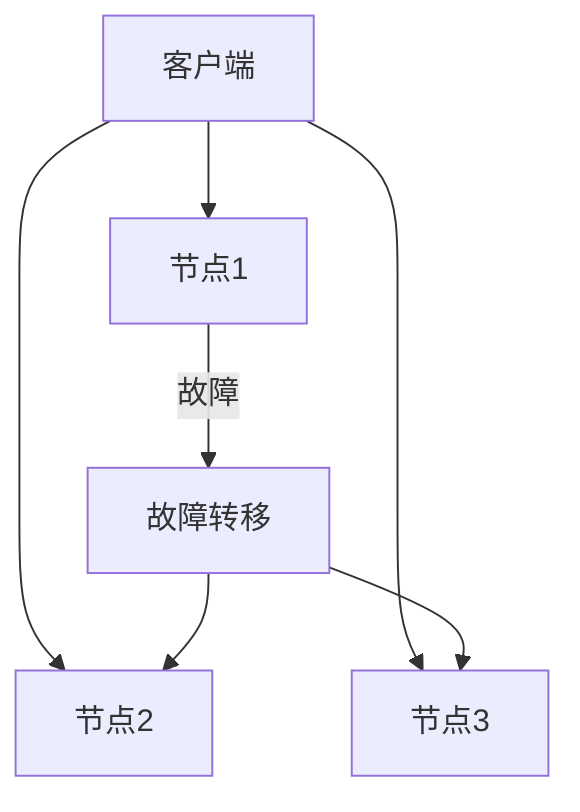

# Seata 故障检测

## 介绍

在分布式事务管理系统中，故障检测是一个至关重要的环节。Seata（Simple Extensible Autonomous Transaction Architecture）作为一个开源的分布式事务解决方案，提供了强大的故障检测机制，以确保系统在高可用部署中的稳定性。本文将详细介绍Seata的故障检测机制，并通过实际案例展示其应用场景。

## 什么是故障检测？

故障检测是指在分布式系统中，通过一系列机制来识别和响应系统中的故障。这些故障可能包括网络中断、服务宕机、数据不一致等。Seata通过心跳检测、超时重试等机制来实现故障检测，确保系统在出现故障时能够及时恢复。

## Seata 故障检测机制

### 心跳检测

Seata通过心跳检测来监控各个节点的健康状况。每个节点会定期向其他节点发送心跳信号，以确认其是否在线。如果某个节点在一定时间内没有收到心跳信号，则认为该节点可能出现了故障。

```java
// 示例：心跳检测
public void sendHeartbeat() {
    while (true) {
        try {
            // 发送心跳信号
            sendHeartbeatSignal();
            // 等待一段时间
            Thread.sleep(HEARTBEAT_INTERVAL);
        } catch (InterruptedException e) {
            // 处理中断异常
            e.printStackTrace();
        }
    }
}
```

### 超时重试

在分布式事务中，超时重试是一种常见的故障恢复机制。Seata通过设置超时时间，在事务执行过程中如果出现超时，则会自动进行重试，以确保事务的最终一致性。

```java
// 示例：超时重试
public void executeTransaction() {
    int retryCount = 0;
    while (retryCount < MAX_RETRY_COUNT) {
        try {
            // 执行事务
            execute();
            break;
        } catch (TimeoutException e) {
            // 超时重试
            retryCount++;
            if (retryCount >= MAX_RETRY_COUNT) {
                throw e;
            }
        }
    }
}
```

### 故障转移

当检测到某个节点出现故障时，Seata会自动将事务转移到其他健康的节点上继续执行。这种机制确保了系统的高可用性，即使在部分节点出现故障的情况下，系统仍然能够正常运行。



## 实际案例

### 案例：电商系统中的订单处理

在一个电商系统中，订单处理是一个典型的分布式事务场景。假设系统中有三个节点负责处理订单，当其中一个节点出现故障时，Seata的故障检测机制会自动将订单处理任务转移到其他节点上，确保订单能够正常处理。

:::note
**注意：** 在实际应用中，故障检测机制需要根据具体的业务场景进行配置和优化，以确保系统的高可用性和稳定性。
:::

## 总结

Seata的故障检测机制通过心跳检测、超时重试和故障转移等手段，确保了分布式事务系统的高可用性。通过本文的介绍和实际案例，相信你已经对Seata的故障检测有了更深入的理解。

## 附加资源

- [Seata官方文档](https://seata.io/zh-cn/docs/overview/what-is-seata.html)
- [分布式系统故障检测与恢复](https://en.wikipedia.org/wiki/Fault_detection_and_isolation)

## 练习

1. 尝试在你的本地环境中配置Seata，并模拟一个节点故障，观察Seata的故障检测机制如何工作。
2. 修改Seata的超时重试配置，观察其对系统性能的影响。

:::tip
**提示：** 在配置Seata时，建议使用Docker容器来模拟分布式环境，以便更好地理解和测试故障检测机制。
:::