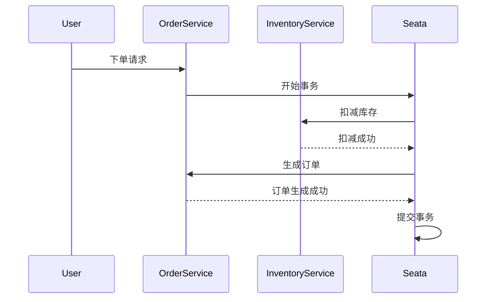

## 介绍

在分布式系统中，事务管理是一个复杂且关键的任务。Seata 是一个开源的分布式事务解决方案，提供了高性能和易用性。在高可用部署中，Seata 的自动恢复机制是确保系统稳定性的重要组成部分。本文将详细介绍 Seata 的自动恢复机制，帮助初学者理解其工作原理和实际应用。

## 什么是 Seata 自动恢复？

Seata 自动恢复是指在分布式事务执行过程中，当某个参与者（如数据库或服务）发生故障时，Seata 能够自动检测并恢复事务状态，确保事务的最终一致性。这种机制通过记录事务日志和状态来实现，能够在故障发生后自动重试或回滚事务。

## Seata 自动恢复的工作原理

Seata 的自动恢复机制主要依赖于以下几个组件：

1. **事务日志（Transaction Log）**：记录每个事务的执行状态和操作。
2. **状态管理器（State Manager）**：管理事务的状态，包括开始、提交、回滚等。
3. **恢复服务（Recovery Service）**：定期检查事务日志，发现未完成的事务并进行恢复。

### 事务日志

事务日志是 Seata 自动恢复的核心。每个事务在执行过程中都会生成一条日志，记录事务的 ID、状态、操作等信息。这些日志存储在可靠的存储系统中，如数据库或文件系统。

```sql
CREATE TABLE transaction_log (
    id BIGINT PRIMARY KEY,
    transaction_id VARCHAR(64),
    status VARCHAR(32),
    operation VARCHAR(255),
    created_at TIMESTAMP
);
```

### 状态管理器

状态管理器负责维护事务的状态。当一个事务开始时，状态管理器会将其状态设置为“进行中”；当事务提交或回滚时，状态管理器会更新事务的状态。

```java
public class StateManager {
    public void startTransaction(String transactionId) {
        // 将事务状态设置为“进行中”
    }

    public void commitTransaction(String transactionId) {
        // 将事务状态设置为“已提交”
    }

    public void rollbackTransaction(String transactionId) {
        // 将事务状态设置为“已回滚”
    }
}
```

### 恢复服务

恢复服务定期扫描事务日志，查找未完成的事务。如果发现未完成的事务，恢复服务会根据事务的状态决定是重试还是回滚。

```java
public class RecoveryService {
    public void recover() {
        // 扫描事务日志，查找未完成的事务
        // 根据事务状态决定重试或回滚
    }
}
```

## 实际案例

假设我们有一个电商系统，用户下单后需要扣减库存和生成订单。这两个操作分别由库存服务和订单服务处理，使用 Seata 来管理分布式事务。



在这个案例中，如果库存服务在扣减库存时发生故障，Seata 的自动恢复机制会检测到未完成的事务，并在库存服务恢复后自动重试扣减库存操作，确保事务的最终一致性。

## 总结

Seata 的自动恢复机制是分布式事务管理中的重要组成部分，能够有效提高系统的稳定性和可靠性。通过事务日志、状态管理器和恢复服务的协同工作，Seata 能够在故障发生后自动恢复事务状态，确保事务的最终一致性。

## 附加资源

- [Seata 官方文档](https://seata.io/zh-cn/docs/)
- [分布式事务原理与实践](https://example.com/distributed-transactions)

## 练习

1. 尝试在本地环境中部署 Seata，并模拟一个分布式事务场景，观察自动恢复机制的工作过程。
2. 修改 Seata 的配置，调整恢复服务的扫描频率，观察对系统性能的影响。
