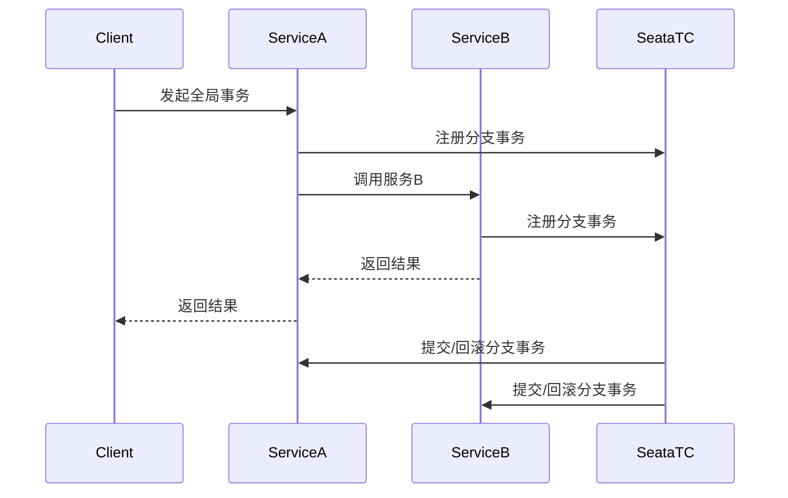

# Seata 微服务治理

## 介绍

在微服务架构中，服务之间的调用通常是分布式的，这意味着每个服务可能运行在不同的进程中，甚至在不同的服务器上。这种分布式特性带来了一个挑战：如何确保跨多个服务的事务一致性。Seata（Simple Extensible Autonomous Transaction Architecture）是一个开源的分布式事务解决方案，旨在简化微服务架构中的事务管理。

Seata通过提供全局事务管理、分支事务管理和事务日志记录等功能，帮助开发者在微服务架构中实现分布式事务的一致性。

## Seata 的核心概念

### 1. 全局事务（Global Transaction）
全局事务是指跨越多个微服务的事务操作。Seata通过全局事务ID（XID）来标识和管理这些事务。

### 2. 分支事务（Branch Transaction）
分支事务是全局事务的一部分，每个微服务中的本地事务就是一个分支事务。Seata通过分支事务ID来管理每个微服务的事务。

### 3. 事务协调器（Transaction Coordinator）
事务协调器负责协调全局事务和分支事务的执行，确保所有分支事务要么全部提交，要么全部回滚。

### 4. 事务日志（Transaction Log）
事务日志用于记录事务的状态和操作，以便在事务失败时进行恢复。

## Seata 的工作流程

Seata的工作流程可以分为以下几个步骤：

1. **事务发起**：全局事务由事务发起者（通常是业务服务）发起，生成全局事务ID（XID）。
2. **分支事务注册**：每个参与事务的微服务在本地事务开始时，向事务协调器注册分支事务。
3. **事务提交/回滚**：事务协调器根据全局事务的状态，决定是否提交或回滚所有分支事务。



## 实际案例

假设我们有一个电商系统，包含订单服务（Order Service）和库存服务（Inventory Service）。当用户下单时，订单服务需要调用库存服务来减少库存。如果库存不足，订单服务需要回滚事务。

### 代码示例

```java
// OrderService.java
@GlobalTransactional
public void createOrder(Order order) {
    // 创建订单
    orderRepository.save(order);
    
    // 调用库存服务
    inventoryService.decreaseStock(order.getProductId(), order.getQuantity());
}

// InventoryService.java
public void decreaseStock(String productId, int quantity) {
    // 减少库存
    inventoryRepository.decreaseStock(productId, quantity);
    
    // 如果库存不足，抛出异常
    if (inventoryRepository.getStock(productId) < 0) {
        throw new RuntimeException("库存不足");
    }
}
```

在这个例子中，`@GlobalTransactional`注解标识了一个全局事务。如果库存不足，`decreaseStock`方法会抛出异常，导致整个事务回滚。

## 总结

Seata是一个强大的分布式事务解决方案，特别适合在微服务架构中管理跨服务的事务。通过全局事务、分支事务和事务协调器的协同工作，Seata确保了数据的一致性和事务的原子性。

## 附加资源

- [Seata官方文档](https://seata.io/zh-cn/docs/overview/what-is-seata.html)
- [微服务架构中的分布式事务管理](https://microservices.io/patterns/data/distributed-transactions.html)

## 练习

1. 尝试在你的微服务项目中集成Seata，并实现一个简单的分布式事务。
2. 修改上面的代码示例，增加一个支付服务（Payment Service），并在订单创建成功后调用支付服务。如果支付失败，回滚整个事务。

:::tip
在集成Seata时，确保所有参与事务的服务都配置了正确的Seata客户端，并且事务协调器正常运行。
:::