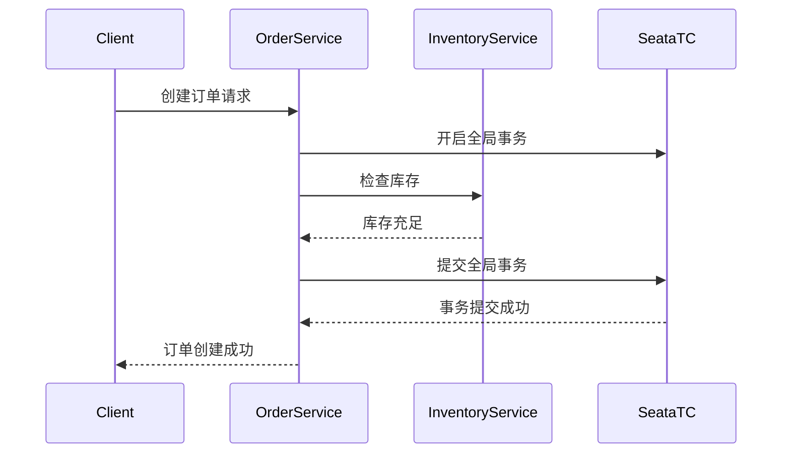

# Seata gRPC集成

## 介绍

在微服务架构中，分布式事务管理是一个常见的挑战。Seata 是一个开源的分布式事务解决方案，它通过提供全局事务管理、事务协调和资源管理来简化分布式事务的处理。gRPC 是一个高性能、开源的远程过程调用（RPC）框架，广泛用于微服务之间的通信。

本文将介绍如何将 Seata 与 gRPC 集成，以实现跨服务的分布式事务管理。我们将从基础概念入手，逐步讲解集成步骤，并提供实际案例和代码示例。

## Seata 与 gRPC 的基础概念

### Seata

Seata 提供了三种分布式事务模式：AT（自动补偿模式）、TCC（Try-Confirm-Cancel 模式）和 XA 模式。Seata 的核心组件包括：

- **Transaction Coordinator (TC)**: 事务协调器，负责全局事务的提交和回滚。
- **Transaction Manager (TM)**: 事务管理器，负责开启、提交或回滚全局事务。
- **Resource Manager (RM)**: 资源管理器，负责管理分支事务的资源。

### gRPC

gRPC 是一个基于 HTTP/2 的 RPC 框架，支持多种编程语言。它使用 Protocol Buffers（protobuf）作为接口定义语言（IDL），并提供了高效的序列化和反序列化机制。

## Seata 与 gRPC 的集成步骤

### 1. 配置 Seata

首先，确保你已经正确配置了 Seata 的 TC、TM 和 RM。你可以通过以下步骤来配置 Seata：

1. 下载并启动 Seata Server。
2. 在微服务项目中引入 Seata 的依赖。
3. 配置 `seata.conf` 文件，指定 TC 的地址和其他相关参数。

### 2. 定义 gRPC 服务

使用 protobuf 定义你的 gRPC 服务接口。例如：

```proto
syntax = "proto3";

package example;

service OrderService {
  rpc CreateOrder (CreateOrderRequest) returns (CreateOrderResponse);
}

message CreateOrderRequest {
  string userId = 1;
  string productId = 2;
  int32 quantity = 3;
}

message CreateOrderResponse {
  bool success = 1;
  string message = 2;
}
```

### 3. 实现 gRPC 服务

在实现 gRPC 服务时，确保在事务方法中正确使用 Seata 的注解。例如：

```java
import io.seata.spring.annotation.GlobalTransactional;
import io.grpc.stub.StreamObserver;

public class OrderServiceImpl extends OrderServiceGrpc.OrderServiceImplBase {

  @Override
  @GlobalTransactional
  public void createOrder(CreateOrderRequest request, StreamObserver<CreateOrderResponse> responseObserver) {
    // 业务逻辑
    boolean success = processOrder(request);

    CreateOrderResponse response = CreateOrderResponse.newBuilder()
        .setSuccess(success)
        .setMessage(success ? "Order created successfully" : "Failed to create order")
        .build();

    responseObserver.onNext(response);
    responseObserver.onCompleted();
  }

  private boolean processOrder(CreateOrderRequest request) {
    // 处理订单逻辑
    return true;
  }
}
```

### 4. 配置 gRPC 客户端

在调用 gRPC 服务的客户端中，确保使用 Seata 的 `GlobalTransactional` 注解来管理事务。例如：

```java
import io.seata.spring.annotation.GlobalTransactional;
import io.grpc.ManagedChannel;
import io.grpc.ManagedChannelBuilder;

public class OrderClient {

  @GlobalTransactional
  public void createOrder() {
    ManagedChannel channel = ManagedChannelBuilder.forAddress("localhost", 50051)
        .usePlaintext()
        .build();

    OrderServiceGrpc.OrderServiceBlockingStub stub = OrderServiceGrpc.newBlockingStub(channel);

    CreateOrderRequest request = CreateOrderRequest.newBuilder()
        .setUserId("user123")
        .setProductId("product456")
        .setQuantity(2)
        .build();

    CreateOrderResponse response = stub.createOrder(request);
    System.out.println("Response: " + response.getMessage());

    channel.shutdown();
  }
}
```

## 实际案例

假设我们有一个电商系统，包含订单服务和库存服务。订单服务通过 gRPC 调用库存服务来检查库存并创建订单。通过 Seata 的全局事务管理，我们可以确保订单创建和库存扣减操作要么全部成功，要么全部回滚。



## 总结

通过本文，我们了解了如何将 Seata 与 gRPC 集成，以实现跨服务的分布式事务管理。我们从基础概念入手，逐步讲解了集成步骤，并提供了一个实际案例来展示其应用场景。

:::tip
在实际项目中，确保充分测试 Seata 与 gRPC 的集成，以验证事务的一致性和可靠性。
:::

## 附加资源

- [Seata 官方文档](https://seata.io/zh-cn/docs/overview/what-is-seata.html)
- [gRPC 官方文档](https://grpc.io/docs/)
- [Protocol Buffers 官方文档](https://developers.google.com/protocol-buffers)

## 练习

1. 尝试在你的本地环境中配置 Seata 和 gRPC，并实现一个简单的分布式事务管理示例。
2. 修改上述案例，添加更多的微服务（如支付服务），并确保所有服务在事务中保持一致。