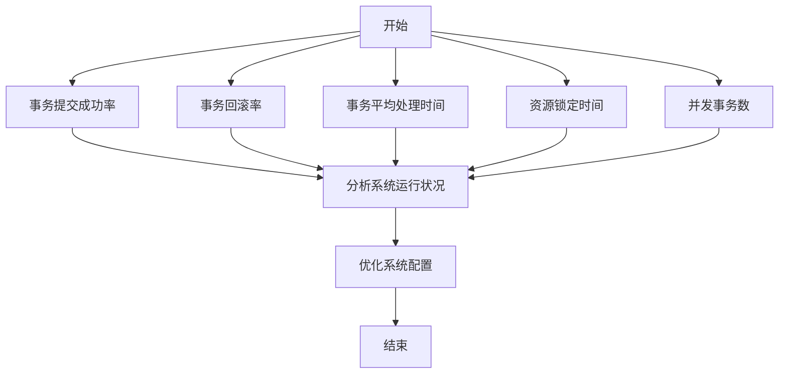

# Seata 监控指标分析

Seata 是一款开源的分布式事务解决方案，广泛应用于微服务架构中。为了确保Seata的高效运行，监控其性能指标是至关重要的。本文将详细介绍Seata的监控指标，并通过实际案例展示如何利用这些指标进行性能优化。

## 什么是Seata监控指标？

Seata监控指标是指通过收集和分析Seata运行时的各种数据，来评估其性能和健康状况的指标。这些指标可以帮助开发者识别潜在的性能瓶颈，优化系统配置，从而提高分布式事务的处理效率。

## 主要监控指标

Seata的监控指标主要包括以下几类：

1. **事务提交成功率**：衡量事务成功提交的比例。
2. **事务回滚率**：衡量事务回滚的比例。
3. **事务平均处理时间**：衡量事务从开始到结束的平均时间。
4. **资源锁定时间**：衡量资源被锁定的平均时间。
5. **并发事务数**：衡量同时进行的事务数量。

### 事务提交成功率

事务提交成功率是衡量Seata性能的重要指标之一。高提交成功率通常意味着系统运行良好，而低提交成功率可能表明存在性能瓶颈或配置问题。

```java
// 示例代码：计算事务提交成功率
int totalTransactions = 1000;
int successfulTransactions = 950;
double commitSuccessRate = (double) successfulTransactions / totalTransactions * 100;
System.out.println("事务提交成功率: " + commitSuccessRate + "%");
```

**输出：**
```
事务提交成功率: 95.0%
```

### 事务回滚率

事务回滚率是指事务因各种原因（如资源冲突、超时等）而回滚的比例。高回滚率可能意味着系统存在资源竞争或配置不当。

```java
// 示例代码：计算事务回滚率
int rolledBackTransactions = 50;
double rollbackRate = (double) rolledBackTransactions / totalTransactions * 100;
System.out.println("事务回滚率: " + rollbackRate + "%");
```

**输出：**
```
事务回滚率: 5.0%
```

### 事务平均处理时间

事务平均处理时间是指事务从开始到结束的平均时间。较长的处理时间可能表明系统存在性能瓶颈。

```java
// 示例代码：计算事务平均处理时间
long totalProcessingTime = 5000; // 总处理时间（毫秒）
double averageProcessingTime = (double) totalProcessingTime / totalTransactions;
System.out.println("事务平均处理时间: " + averageProcessingTime + "ms");
```

**输出：**
```
事务平均处理时间: 5.0ms
```

### 资源锁定时间

资源锁定时间是指资源被锁定的平均时间。较长的锁定时间可能导致其他事务等待，从而影响系统性能。

```java
// 示例代码：计算资源锁定时间
long totalLockTime = 2000; // 总锁定时间（毫秒）
double averageLockTime = (double) totalLockTime / totalTransactions;
System.out.println("资源平均锁定时间: " + averageLockTime + "ms");
```

**输出：**
```
资源平均锁定时间: 2.0ms
```

### 并发事务数

并发事务数是指同时进行的事务数量。高并发事务数可能导致资源竞争，从而影响系统性能。

```java
// 示例代码：计算并发事务数
int concurrentTransactions = 100;
System.out.println("并发事务数: " + concurrentTransactions);
```

**输出：**
```
并发事务数: 100
```

## 实际案例

假设我们有一个电商系统，使用Seata处理订单事务。通过监控Seata的指标，我们发现事务提交成功率为95%，事务回滚率为5%，事务平均处理时间为5ms，资源锁定时间为2ms，并发事务数为100。

:::note
**分析：**
- 事务提交成功率较高，表明系统运行良好。
- 事务回滚率为5%，可能由于资源竞争或配置不当。
- 事务平均处理时间和资源锁定时间较短，表明系统性能较好。
- 并发事务数为100，可能需要进一步优化以支持更高的并发量。
:::

## 总结

通过监控Seata的指标，我们可以全面了解系统的性能和健康状况。这些指标不仅帮助我们识别潜在的性能瓶颈，还为优化系统配置提供了依据。在实际应用中，定期监控和分析这些指标是确保Seata高效运行的关键。

## 附加资源

- [Seata官方文档](https://seata.io/zh-cn/docs/)
- [分布式事务处理最佳实践](https://example.com/distributed-transactions-best-practices)

## 练习

1. 编写一个程序，模拟计算事务提交成功率和事务回滚率。
2. 分析一个实际系统中的Seata监控指标，提出优化建议。
3. 研究如何通过调整Seata配置来降低事务回滚率。



通过以上内容，您应该对Seata监控指标分析有了全面的了解。希望这些知识能帮助您在分布式事务处理中取得更好的性能表现。