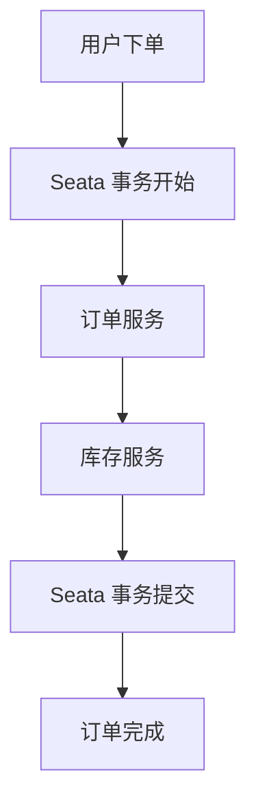

# Seata 性能瓶颈排查

Seata 是一款开源的分布式事务解决方案，广泛应用于微服务架构中。然而，随着业务规模的扩大，Seata 的性能问题可能会逐渐显现。本文将带你逐步排查 Seata 的性能瓶颈，并提供优化建议。

## 1. 什么是性能瓶颈？

性能瓶颈是指系统中某个组件或环节限制了整体性能的提升。在 Seata 中，性能瓶颈可能出现在网络通信、数据库操作、资源竞争等多个方面。排查性能瓶颈的目的是找到这些限制因素，并通过优化手段提升系统的整体性能。

## 2. 常见的性能瓶颈来源

在 Seata 中，常见的性能瓶颈来源包括：

- **网络延迟**：分布式事务涉及多个服务之间的通信，网络延迟可能导致事务处理时间增加。
- **数据库操作**：Seata 的事务管理依赖于数据库操作，频繁的数据库读写可能成为性能瓶颈。
- **资源竞争**：多个事务同时竞争同一资源（如数据库锁）可能导致性能下降。
- **配置不当**：Seata 的配置参数（如线程池大小、超时时间等）设置不当也可能影响性能。

## 3. 性能瓶颈排查步骤

### 3.1 监控系统性能

首先，我们需要对系统进行全面的性能监控。可以使用以下工具：

- **Prometheus + Grafana**：用于监控系统的各项指标，如 CPU 使用率、内存使用率、网络延迟等。
- **Seata 自带的监控**：Seata 提供了内置的监控功能，可以通过配置启用。

```yaml
# Seata 监控配置示例
seata:
  monitor:
    enabled: true
    interval: 10
```

### 3.2 分析日志

Seata 的日志是排查性能问题的重要依据。通过分析日志，可以找到事务处理的耗时点。

```bash
# 查看 Seata 日志
tail -f logs/seata-server.log
```

### 3.3 使用性能分析工具

可以使用性能分析工具（如 JProfiler、YourKit）对 Seata 进行深入分析，找出性能瓶颈所在。

```bash
# 使用 JProfiler 分析 Seata
jprofiler -attach <seata-pid>
```

### 3.4 优化数据库操作

数据库操作是 Seata 性能的关键点之一。可以通过以下方式优化：

- **索引优化**：确保数据库表的关键字段有适当的索引。
- **批量操作**：减少单次数据库操作的次数，尽量使用批量操作。

```sql
-- 示例：批量插入数据
INSERT INTO orders (order_id, user_id) VALUES (1, 100), (2, 101), (3, 102);
```

### 3.5 调整配置参数

Seata 的配置参数对性能有直接影响。可以根据实际业务需求调整以下参数：

- **线程池大小**：增加线程池大小可以提高并发处理能力。
- **超时时间**：合理设置事务超时时间，避免长时间占用资源。

```yaml
# Seata 配置示例
seata:
  thread:
    pool:
      core-size: 20
      max-size: 50
  timeout:
    global: 60000
    branch: 30000
```

## 4. 实际案例

假设我们有一个电商系统，使用 Seata 管理订单和库存的分布式事务。在高并发场景下，系统出现了性能问题。通过监控和日志分析，我们发现数据库操作是主要的性能瓶颈。于是，我们对数据库进行了索引优化，并调整了 Seata 的线程池大小和超时时间。优化后，系统的性能得到了显著提升。



## 5. 总结

排查 Seata 的性能瓶颈需要从多个方面入手，包括监控系统性能、分析日志、使用性能分析工具、优化数据库操作和调整配置参数。通过系统的排查和优化，可以有效提升 Seata 的性能。

## 6. 附加资源

- [Seata 官方文档](https://seata.io/zh-cn/docs/overview/what-is-seata.html)
- [Prometheus + Grafana 监控指南](https://prometheus.io/docs/introduction/overview/)
- [JProfiler 使用手册](https://www.ej-technologies.com/resources/jprofiler/help/doc/)

## 7. 练习

1. 在你的本地环境中部署 Seata，并尝试启用监控功能。
2. 使用 JProfiler 分析 Seata 的性能，找出可能的瓶颈。
3. 根据本文的优化建议，调整 Seata 的配置参数，观察性能变化。

通过以上步骤，你将能够更好地理解并优化 Seata 的性能问题。