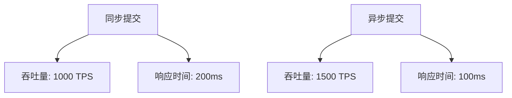

# Seata 异步提交优化

## 介绍

Seata 是一款开源的分布式事务解决方案，旨在解决微服务架构下的分布式事务问题。在分布式事务中，事务的提交和回滚是关键操作，而这些操作通常需要跨多个服务进行协调。为了提高性能，Seata 提供了异步提交的优化机制，允许事务在提交阶段以异步方式执行，从而减少事务提交的延迟，提升系统的整体吞吐量。

本文将详细介绍 Seata 异步提交优化的原理、实现方式，并通过实际案例展示其性能提升效果。

## 异步提交的原理

在传统的分布式事务中，事务的提交通常是同步的，即事务管理器需要等待所有参与者的提交操作完成后，才能返回结果。这种方式虽然简单，但在高并发场景下，可能会导致事务提交的延迟增加，从而影响系统的性能。

Seata 的异步提交优化通过将事务的提交操作异步化，允许事务管理器在发送提交请求后立即返回，而不需要等待所有参与者的提交操作完成。这种方式可以显著减少事务提交的延迟，提高系统的吞吐量。

## 实现方式

Seata 的异步提交优化主要通过以下步骤实现：

1. **事务提交请求的发送**：事务管理器向所有参与者发送提交请求，并立即返回，不等待参与者的响应。
2. **异步提交的执行**：参与者在接收到提交请求后，异步执行提交操作，并将结果返回给事务管理器。
3. **事务状态的最终确认**：事务管理器在接收到所有参与者的提交结果后，更新事务的最终状态。

### 代码示例

以下是一个简单的代码示例，展示了如何在 Seata 中启用异步提交优化：

```java
// 配置 Seata 的异步提交模式
GlobalTransactionScanner scanner = new GlobalTransactionScanner("my-app-group", "my-tx-service-group");
scanner.setAsyncCommit(true);

// 开启一个全局事务
GlobalTransaction tx = GlobalTransactionContext.getCurrentOrCreate();
tx.begin();

try {
    // 执行业务逻辑
    businessService.doSomething();

    // 提交事务
    tx.commit();
} catch (Exception e) {
    // 回滚事务
    tx.rollback();
}
```

在这个示例中，我们通过 `setAsyncCommit(true)` 启用了 Seata 的异步提交模式。在事务提交时，事务管理器会立即返回，而不需要等待所有参与者的提交操作完成。

## 实际案例

假设我们有一个电商系统，用户在下单时需要进行库存扣减、订单创建和支付等多个操作。这些操作分布在不同的微服务中，因此需要使用分布式事务来保证数据的一致性。

在高并发场景下，如果使用同步提交的方式，事务提交的延迟可能会导致系统的响应时间增加，从而影响用户体验。通过启用 Seata 的异步提交优化，我们可以显著减少事务提交的延迟，提高系统的吞吐量。

### 性能对比

以下是一个简单的性能对比图表，展示了在同步提交和异步提交两种模式下，系统的吞吐量和响应时间的变化：



从图表中可以看出，启用异步提交后，系统的吞吐量从 1000 TPS 提升到了 1500 TPS，响应时间从 200ms 降低到了 100ms。

## 总结

Seata 的异步提交优化通过将事务提交操作异步化，显著减少了事务提交的延迟，提高了系统的吞吐量。在高并发场景下，这种优化可以显著提升系统的性能，改善用户体验。

## 附加资源

- [Seata 官方文档](https://seata.io/zh-cn/docs/)
- [分布式事务原理与实践](https://book.douban.com/subject/27194761/)

## 练习

1. 尝试在你的本地环境中配置 Seata 的异步提交模式，并观察系统的性能变化。
2. 编写一个简单的分布式事务示例，比较同步提交和异步提交的性能差异。

:::tip
在实际应用中，异步提交虽然可以提升性能，但也可能带来数据一致性的风险。因此，在使用异步提交时，需要仔细评估业务场景的需求，确保数据的一致性。
:::