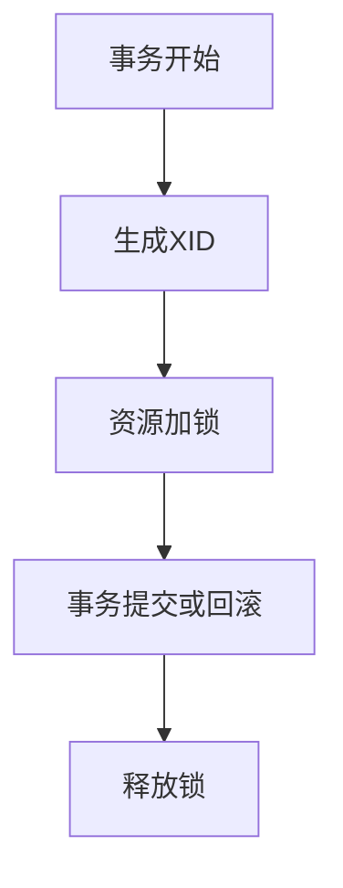

## 介绍

在分布式事务中，Seata（Simple Extensible Autonomous Transaction Architecture）是一个广泛使用的解决方案。它通过全局锁机制来确保事务的一致性。然而，全局锁在高并发场景下可能会成为性能瓶颈。本文将详细介绍Seata全局锁的工作原理，并探讨如何通过优化来提升性能。

## 什么是全局锁？

全局锁是Seata用来确保分布式事务一致性的机制。当一个事务需要修改某个资源时，Seata会为该资源加锁，防止其他事务同时修改该资源，从而避免数据不一致的问题。

:::note
全局锁的作用是确保在分布式事务中，同一资源不会被多个事务同时修改。
:::

## 全局锁的工作原理

在Seata中，全局锁的实现主要依赖于以下几个步骤：

1. **事务开始**：当一个分布式事务开始时，Seata会为该事务生成一个全局唯一的事务ID（XID）。
2. **资源加锁**：当事务需要修改某个资源时，Seata会为该资源加锁，并将锁信息存储在全局锁表中。
3. **事务提交或回滚**：当事务提交或回滚时，Seata会释放该事务持有的所有锁。



## 全局锁的性能问题

在高并发场景下，全局锁可能会成为性能瓶颈。主要原因包括：

1. **锁竞争**：多个事务同时竞争同一资源的锁，导致事务等待时间增加。
2. **锁粒度**：锁的粒度过大，导致不必要的资源被锁定，影响其他事务的执行。

## 全局锁优化策略

为了提升Seata的性能，可以采取以下几种优化策略：

### 1. 减少锁粒度

通过减少锁的粒度，可以降低锁竞争的概率。例如，可以将锁从表级别降低到行级别。

```java
// 示例：行级锁
@GlobalTransactional
public void updateOrder(Long orderId, String status) {
    // 加锁
    lockService.lockRow("order", orderId);
    // 更新订单状态
    orderService.updateStatus(orderId, status);
}
```

### 2. 使用乐观锁

乐观锁假设事务之间不会发生冲突，只有在提交时才会检查是否有冲突。如果发生冲突，事务会回滚并重试。

```java
// 示例：乐观锁
@GlobalTransactional
public void updateOrderWithOptimisticLock(Long orderId, String status) {
    // 获取当前版本号
    int version = orderService.getVersion(orderId);
    // 更新订单状态
    orderService.updateStatusWithVersion(orderId, status, version);
}
```

### 3. 锁超时机制

为锁设置超时时间，避免事务长时间等待锁。如果锁超时，事务可以回滚并重试。

```java
// 示例：锁超时
@GlobalTransactional(timeout = 5000) // 设置超时时间为5秒
public void updateOrderWithTimeout(Long orderId, String status) {
    // 加锁
    lockService.lockRowWithTimeout("order", orderId, 5000);
    // 更新订单状态
    orderService.updateStatus(orderId, status);
}
```

## 实际案例

假设我们有一个电商系统，用户在下单时需要同时更新库存和订单状态。在高并发场景下，库存和订单表的锁竞争可能会导致性能问题。通过优化全局锁，我们可以显著提升系统的性能。

```java
// 示例：优化后的下单逻辑
@GlobalTransactional
public void placeOrder(Long userId, Long productId, int quantity) {
    // 加锁库存
    lockService.lockRow("inventory", productId);
    // 检查库存
    if (inventoryService.checkInventory(productId, quantity)) {
        // 扣减库存
        inventoryService.reduceInventory(productId, quantity);
        // 创建订单
        orderService.createOrder(userId, productId, quantity);
    } else {
        throw new RuntimeException("库存不足");
    }
}
```

## 总结

全局锁是Seata中确保分布式事务一致性的重要机制，但在高并发场景下可能会成为性能瓶颈。通过减少锁粒度、使用乐观锁和设置锁超时机制，我们可以有效优化全局锁，提升系统性能。

## 附加资源

- [Seata官方文档](https://seata.io/zh-cn/docs/overview/what-is-seata.html)
- [分布式事务与Seata](https://dubbo.apache.org/zh/docs/advanced/seata/)
- [乐观锁与悲观锁](https://en.wikipedia.org/wiki/Optimistic_concurrency_control)

## 练习

1. 尝试在一个简单的Spring Boot项目中集成Seata，并实现一个分布式事务。
2. 在高并发场景下测试全局锁的性能，并尝试使用本文提到的优化策略进行优化。
3. 阅读Seata的源码，深入了解全局锁的实现细节。

:::tip
在优化全局锁时，务必结合实际业务场景，选择合适的优化策略。
:::