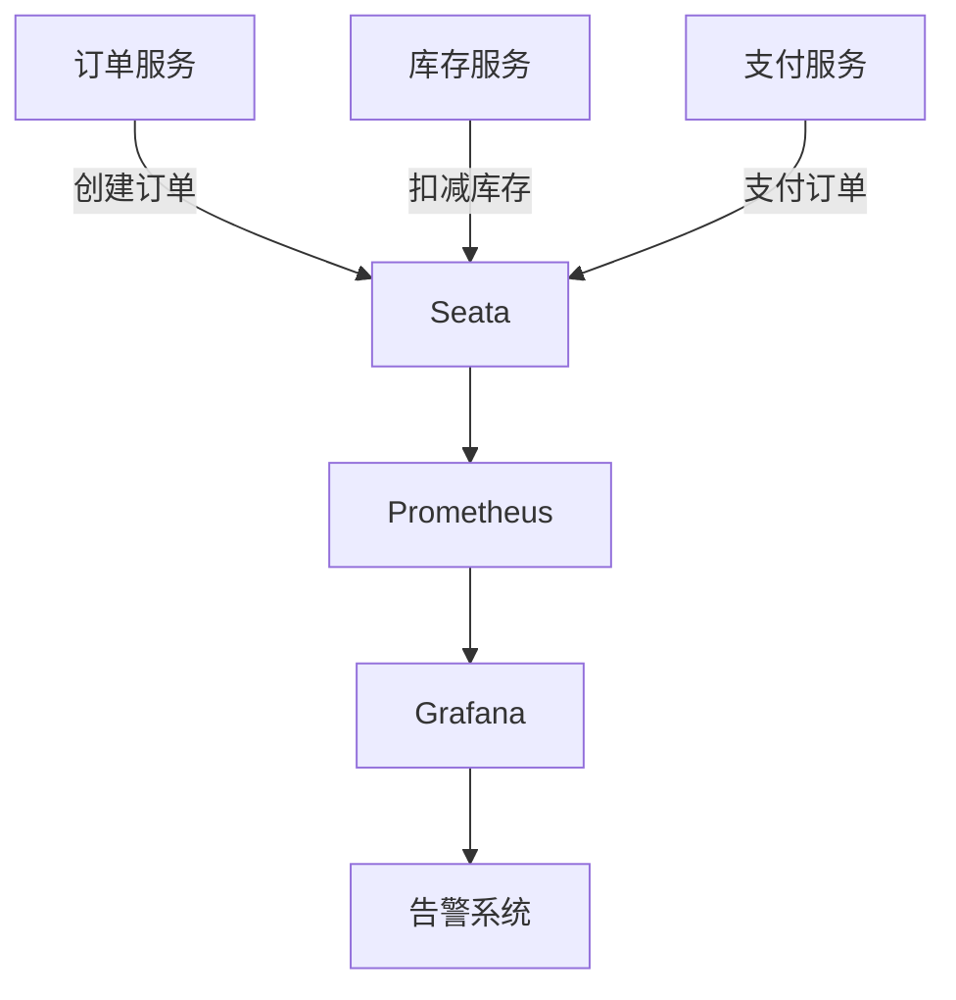

# Seata 指标采集

## 介绍

Seata 是一款开源的分布式事务解决方案，旨在简化微服务架构下的分布式事务管理。为了确保分布式事务的稳定性和性能，Seata 提供了丰富的指标采集功能，帮助开发者监控和分析事务的执行情况。本文将详细介绍 Seata 的指标采集机制，并通过实际案例展示如何应用这些指标来优化系统。

## 什么是Seata指标采集？

Seata 指标采集是指通过 Seata 提供的监控接口，收集分布式事务执行过程中的关键数据，如事务成功率、事务耗时、事务回滚率等。这些指标可以帮助开发者了解系统的运行状态，及时发现和解决问题。

## Seata 指标采集的核心概念

### 1. 事务指标

Seata 采集的事务指标主要包括：

- **事务成功率**：成功完成的事务占总事务数的比例。
- **事务耗时**：事务从开始到结束所花费的时间。
- **事务回滚率**：事务回滚的次数占总事务数的比例。
- **事务并发数**：同时进行的事务数量。

### 2. 指标采集方式

Seata 提供了多种指标采集方式，包括：

- **Prometheus**：通过 Prometheus 采集 Seata 的指标数据。
- **Grafana**：使用 Grafana 可视化展示采集到的指标数据。
- **自定义采集**：开发者可以根据需求自定义采集指标。

## 如何配置Seata指标采集

### 1. 使用Prometheus采集指标

首先，确保你的项目中已经集成了 Prometheus。然后，在 Seata 的配置文件中启用 Prometheus 采集功能：

```yaml
metrics:
  enabled: true
  registry-type: prometheus
  exporter:
    enabled: true
    port: 9898
```

### 2. 使用Grafana可视化指标

在 Prometheus 采集到指标数据后，可以通过 Grafana 进行可视化展示。首先，在 Grafana 中添加 Prometheus 数据源，然后导入 Seata 提供的默认仪表盘模板。

### 3. 自定义采集指标

如果你需要采集自定义的指标，可以通过 Seata 提供的 API 进行扩展。例如，采集某个特定业务的事务成功率：

```java
MetricsManager.get().register("custom_transaction_success_rate", new GaugeMetric() {
    @Override
    public Number getValue() {
        return calculateSuccessRate();
    }
});
```

## 实际案例

### 案例：监控电商系统的分布式事务

假设我们有一个电商系统，使用了 Seata 来管理订单、库存和支付服务之间的分布式事务。为了确保系统的稳定性，我们需要监控以下指标：

- **订单事务成功率**：确保订单创建的成功率在 99% 以上。
- **库存事务耗时**：确保库存扣减的平均耗时在 100ms 以内。
- **支付事务回滚率**：确保支付事务的回滚率低于 1%。

通过配置 Prometheus 和 Grafana，我们可以实时监控这些指标，并在指标异常时及时发出告警。



## 总结

Seata 的指标采集功能为分布式事务的监控和优化提供了强大的支持。通过采集和分析事务指标，开发者可以及时发现系统中的性能瓶颈和潜在问题，从而提升系统的稳定性和性能。

## 附加资源

- [Seata 官方文档](https://seata.io/zh-cn/docs/)
- [Prometheus 官方文档](https://prometheus.io/docs/)
- [Grafana 官方文档](https://grafana.com/docs/)

## 练习

1. 在你的项目中集成 Seata 并启用 Prometheus 采集功能。
2. 使用 Grafana 创建一个仪表盘，展示事务成功率和事务耗时。
3. 尝试自定义采集一个业务指标，并在 Grafana 中展示。

通过以上步骤，你将能够更好地理解和应用 Seata 的指标采集功能。