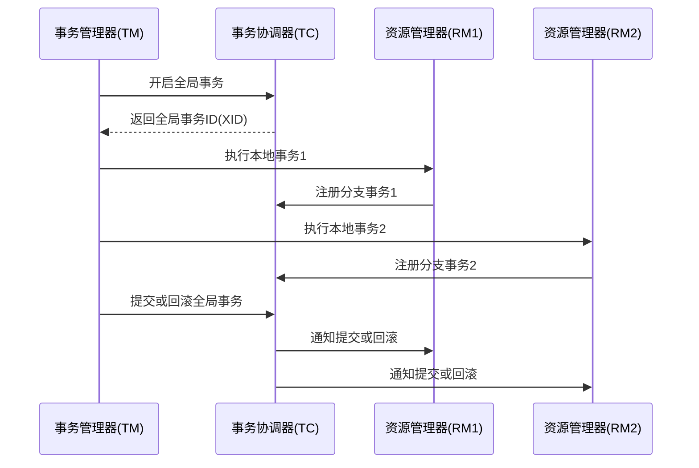

# Seata 事务管理

## 介绍

Seata（Simple Extensible Autonomous Transaction Architecture）是一款开源的分布式事务解决方案，旨在简化微服务架构中的事务管理。它提供了高性能、易用的事务管理能力，支持多种事务模式，如AT（自动补偿事务）、TCC（Try-Confirm-Cancel）、Saga等。

在微服务架构中，事务管理变得复杂，因为每个服务可能都有自己的数据库。Seata通过全局事务管理器和本地事务管理器的协作，确保跨多个服务的事务一致性。

## Seata 事务管理的工作原理

Seata的事务管理分为三个主要角色：

1. **事务协调器（TC）**：负责全局事务的协调和管理。
2. **事务管理器（TM）**：负责全局事务的开启、提交或回滚。
3. **资源管理器（RM）**：负责本地事务的管理，如数据库操作。

### 事务流程

1. **事务开启**：TM向TC发起全局事务的开启请求，TC生成全局事务ID（XID）。
2. **分支事务注册**：每个服务在执行本地事务时，会向TC注册分支事务。
3. **事务提交或回滚**：TM根据业务逻辑决定提交或回滚全局事务，TC通知所有分支事务执行相应的操作。



## 代码示例

以下是一个简单的Seata事务管理示例，使用AT模式。

```java
// 全局事务开启
@GlobalTransactional
public void purchase(String userId, String commodityCode, int orderCount) {
    // 扣减库存
    storageService.deduct(commodityCode, orderCount);
    // 创建订单
    orderService.create(userId, commodityCode, orderCount);
}
```

在这个示例中，`@GlobalTransactional`注解用于标记一个全局事务。当`purchase`方法被调用时，Seata会自动管理事务的开启、提交或回滚。

:::note
确保在项目中正确配置Seata的依赖和配置文件，以便Seata能够正常工作。
:::

## 实际应用场景

### 电商系统中的订单创建

在电商系统中，用户下单时通常需要执行多个操作，如扣减库存、创建订单、更新用户积分等。这些操作可能分布在不同的微服务中，使用Seata可以确保这些操作要么全部成功，要么全部回滚。

```java
@GlobalTransactional
public void createOrder(String userId, String productId, int quantity) {
    // 扣减库存
    inventoryService.deduct(productId, quantity);
    // 创建订单
    orderService.create(userId, productId, quantity);
    // 更新用户积分
    userService.updatePoints(userId, quantity * 10);
}
```

在这个场景中，如果任何一个操作失败，Seata会自动回滚所有操作，确保数据的一致性。

## 总结

Seata事务管理为微服务架构中的分布式事务提供了强大的支持。通过全局事务管理器和本地事务管理器的协作，Seata能够确保跨多个服务的事务一致性。本文介绍了Seata的基本概念、工作原理、代码示例以及实际应用场景，帮助初学者理解并掌握Seata事务管理。

## 附加资源

- [Seata官方文档](https://seata.io/zh-cn/docs/overview/what-is-seata.html)
- [Seata GitHub仓库](https://github.com/seata/seata)

## 练习

1. 尝试在本地环境中配置Seata，并运行一个简单的分布式事务示例。
2. 修改上述电商系统的示例代码，添加一个新的服务（如物流服务），并确保事务的一致性。
