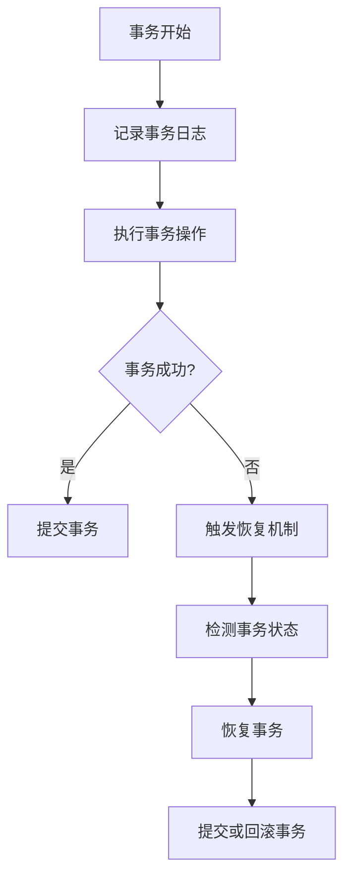

# Seata 事务恢复

## 介绍

在分布式系统中，事务管理是一个复杂且关键的问题。Seata（Simple Extensible Autonomous Transaction Architecture）是一个开源的分布式事务解决方案，旨在简化分布式事务的管理。Seata事务恢复是Seata框架中的一个重要功能，用于在分布式事务失败时恢复事务状态，确保数据的一致性。

## 什么是Seata事务恢复？

Seata事务恢复是指在分布式事务执行过程中，如果某个参与者（如数据库或服务）发生故障，Seata能够自动检测并恢复事务状态，确保事务最终能够成功提交或回滚。这一过程包括事务日志的记录、状态检测和恢复操作。

## 事务恢复的工作原理

Seata事务恢复的核心在于事务日志的记录和状态检测。以下是事务恢复的基本步骤：

1. **事务日志记录**：在事务执行过程中，Seata会记录每个参与者的事务状态和操作日志。
2. **状态检测**：Seata会定期检测事务的状态，如果发现某个事务未完成，则会触发恢复机制。
3. **恢复操作**：根据事务日志，Seata会尝试重新执行未完成的操作，或者回滚已执行的操作，以确保事务的一致性。



## 代码示例

以下是一个简单的Seata事务恢复的代码示例，展示了如何在Java中使用Seata进行事务管理。

```java
import io.seata.spring.annotation.GlobalTransactional;
import org.springframework.stereotype.Service;

@Service
public class OrderService {

    @GlobalTransactional
    public void createOrder(Order order) {
        // 1. 创建订单
        orderRepository.save(order);

        // 2. 扣减库存
        inventoryService.deduct(order.getProductId(), order.getQuantity());

        // 3. 扣减账户余额
        accountService.deduct(order.getUserId(), order.getAmount());
    }
}
```

在这个示例中，`@GlobalTransactional`注解用于标记一个全局事务。如果在执行过程中任何一个步骤失败，Seata会自动触发事务恢复机制，确保事务的一致性。

:::note
**注意**：在实际应用中，确保每个参与者的操作都是幂等的，以避免在恢复过程中重复执行操作导致数据不一致。
:::

## 实际案例

假设我们有一个电商系统，用户下单时需要同时创建订单、扣减库存和扣减账户余额。如果在这个过程中，扣减库存的服务发生故障，Seata事务恢复机制会检测到这一故障，并尝试重新执行扣减库存的操作，或者回滚已创建的订单和扣减的账户余额，确保数据的一致性。

## 总结

Seata事务恢复是分布式事务管理中的一个重要功能，它通过记录事务日志、检测事务状态和执行恢复操作，确保在分布式系统中事务的最终一致性。对于初学者来说，理解Seata事务恢复的工作原理和实现方式，是掌握分布式事务管理的关键。

## 附加资源

- [Seata官方文档](https://seata.io/zh-cn/docs/overview/what-is-seata.html)
- [分布式事务理论与实践](https://www.oreilly.com/library/view/distributed-systems-principles/9781492043015/)

## 练习

1. 尝试在本地环境中搭建一个简单的Seata事务管理示例，模拟事务失败并观察Seata的事务恢复机制。
2. 阅读Seata的源码，深入了解事务恢复的实现细节。
