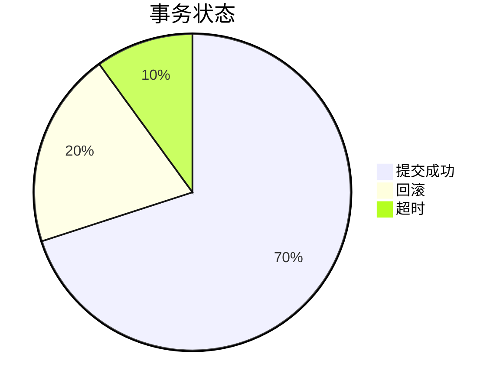

# Seata Grafana面板

## 介绍

Seata 是一个开源的分布式事务解决方案，旨在简化微服务架构中的事务管理。为了帮助开发者更好地监控和管理 Seata 的性能和状态，Seata 提供了与 Grafana 的集成。Grafana 是一个强大的开源监控和可视化工具，能够将 Seata 的监控数据以图表的形式展示出来，帮助开发者快速定位问题并优化系统性能。

在本教程中，我们将逐步介绍如何配置和使用 Seata Grafana 面板，并通过实际案例展示其应用场景。

## 配置 Seata Grafana 面板

### 1. 安装 Grafana 和 Prometheus

首先，你需要安装 Grafana 和 Prometheus。Prometheus 是一个开源的监控系统，用于收集和存储 Seata 的监控数据。Grafana 则用于可视化这些数据。

```bash
# 安装 Prometheus
wget https://github.com/prometheus/prometheus/releases/download/v2.30.3/prometheus-2.30.3.linux-amd64.tar.gz
tar -xzf prometheus-2.30.3.linux-amd64.tar.gz
cd prometheus-2.30.3.linux-amd64
./prometheus --config.file=prometheus.yml

# 安装 Grafana
wget https://dl.grafana.com/oss/release/grafana-8.1.5.linux-amd64.tar.gz
tar -xzf grafana-8.1.5.linux-amd64.tar.gz
cd grafana-8.1.5
./bin/grafana-server
```

### 2. 配置 Prometheus 收集 Seata 数据

在 Prometheus 的配置文件 `prometheus.yml` 中，添加 Seata 的监控端点：

```yaml
scrape_configs:
  - job_name: 'seata'
    static_configs:
      - targets: ['localhost:9898']  # Seata 监控端点
```

### 3. 导入 Seata Grafana 面板

在 Grafana 中，你可以通过导入预定义的 Seata 面板来快速开始监控。以下是导入步骤：

1. 打开 Grafana 的 Web 界面（通常位于 `http://localhost:3000`）。
2. 点击左侧菜单中的 `+` 号，选择 `Import`。
3. 在 `Import via grafana.com` 输入框中，输入 Seata 面板的 ID（例如 `12345`），然后点击 `Load`。
4. 选择 Prometheus 作为数据源，然后点击 `Import`。

## 使用 Seata Grafana 面板

### 1. 查看事务状态

在 Seata Grafana 面板中，你可以查看分布式事务的状态，包括事务的提交、回滚和超时情况。这些信息可以帮助你快速定位事务问题。



### 2. 监控事务性能

Seata Grafana 面板还提供了事务性能的监控，包括事务的响应时间、吞吐量等。这些指标可以帮助你优化系统性能。


### 3. 实际案例

假设你正在开发一个电商系统，用户下单后需要调用多个微服务来完成订单处理。通过 Seata Grafana 面板，你可以实时监控订单事务的状态和性能，确保系统的高可用性和稳定性。

:::tip
在实际应用中，建议定期检查 Seata Grafana 面板，及时发现并解决潜在的问题。
:::

## 总结

通过本教程，你已经学会了如何配置和使用 Seata Grafana 面板来监控和管理分布式事务。Grafana 的强大可视化功能能够帮助你快速定位问题并优化系统性能。

## 附加资源

- [Seata 官方文档](https://seata.io/zh-cn/docs/)
- [Grafana 官方文档](https://grafana.com/docs/)
- [Prometheus 官方文档](https://prometheus.io/docs/)

## 练习

1. 尝试在你的本地环境中安装并配置 Seata Grafana 面板。
2. 使用 Seata Grafana 面板监控一个简单的分布式事务应用，并记录事务的状态和性能指标。
3. 根据监控数据，提出优化建议并实施。

通过以上练习，你将更深入地理解 Seata Grafana 面板的使用方法和实际应用场景。