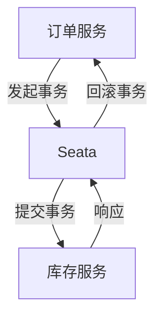

# Seata JMX监控

Seata 是一个开源的分布式事务解决方案，旨在简化微服务架构下的分布式事务管理。为了确保Seata在生产环境中的稳定运行，监控其运行状态至关重要。JMX（Java Management Extensions）是Java平台提供的一种管理和监控工具，Seata通过JMX暴露了其内部的关键指标，方便开发者实时监控和诊断问题。

## 什么是JMX？

JMX（Java Management Extensions）是Java平台提供的一种管理和监控工具。它允许开发者通过MBean（Managed Bean）暴露应用程序的内部状态和操作，从而实现对应用程序的监控和管理。JMX广泛应用于Java应用程序的性能监控、配置管理和故障排查。

## Seata 中的JMX监控

Seata通过JMX暴露了多个关键指标，包括事务的提交、回滚、超时等状态。通过这些指标，开发者可以实时监控Seata的运行状态，及时发现和解决问题。

### 启用Seata的JMX监控

要启用Seata的JMX监控，需要在Seata的配置文件中进行相应的配置。以下是一个简单的配置示例：

```properties
# 启用JMX监控
seata.monitor.jmx.enabled=true
```

### 关键监控指标

Seata通过JMX暴露了多个关键指标，以下是一些常见的指标：

- **事务提交次数**：记录成功提交的事务数量。
- **事务回滚次数**：记录回滚的事务数量。
- **事务超时次数**：记录因超时而失败的事务数量。
- **事务平均耗时**：记录事务的平均处理时间。

### 使用JConsole监控Seata

JConsole是Java自带的一个JMX监控工具，可以通过它连接到Seata的JMX服务，实时查看这些指标。

1. 启动Seata服务。
2. 打开JConsole，选择Seata的进程。
3. 在MBeans选项卡中，找到`seata`相关的MBean，即可查看各项指标。

### 实际案例

假设我们有一个电商系统，使用Seata管理订单和库存的分布式事务。在高并发场景下，我们发现部分订单事务失败。通过JMX监控，我们发现事务超时次数显著增加，进一步分析发现是库存服务响应时间过长导致的。通过优化库存服务的性能，我们成功降低了事务超时率。



:::tip
在实际生产环境中，建议将JMX监控与告警系统结合，当关键指标超过阈值时，及时通知相关人员进行处理。
:::

## 总结

通过JMX监控，开发者可以实时掌握Seata的运行状态，及时发现和解决问题。本文介绍了如何启用Seata的JMX监控，并通过实际案例展示了其应用场景。希望本文能帮助你更好地理解和使用Seata的JMX监控功能。

## 附加资源

- [Seata官方文档](https://seata.io/zh-cn/docs/)
- [JMX官方文档](https://docs.oracle.com/javase/8/docs/technotes/guides/jmx/)

## 练习

1. 在你的本地环境中配置并启用Seata的JMX监控。
2. 使用JConsole连接到Seata，查看并记录各项关键指标。
3. 模拟一个高并发场景，观察事务超时次数的变化，并分析原因。
