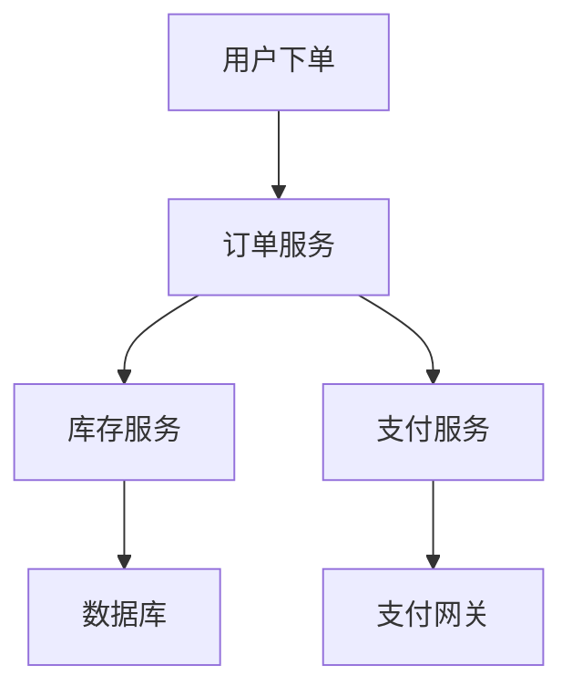

# Seata 性能监控

## 介绍

Seata 是一款开源的分布式事务解决方案，旨在解决微服务架构下的分布式事务问题。随着系统规模的扩大，分布式事务的性能监控变得尤为重要。通过性能监控，我们可以及时发现系统中的瓶颈，优化事务处理流程，从而提升系统的整体性能。

本文将介绍如何使用Seata进行性能监控，包括监控的关键指标、工具的使用以及实际案例。

## 关键性能指标

在Seata中，性能监控主要关注以下几个关键指标：

1. **事务提交成功率**：衡量事务提交的成功率，反映系统的稳定性。
2. **事务回滚率**：事务回滚的比例，过高可能意味着系统存在异常或资源竞争。
3. **事务响应时间**：事务从开始到结束的时间，直接影响用户体验。
4. **资源锁定时间**：事务对资源的锁定时间，过长可能导致资源争用。
5. **事务并发数**：同时进行的事务数量，反映系统的并发处理能力。

## 监控工具

Seata 提供了多种监控工具，帮助开发者实时监控分布式事务的性能。

### Seata Dashboard

Seata Dashboard 是Seata官方提供的监控工具，可以实时查看事务的运行状态、性能指标等。通过Dashboard，开发者可以快速定位问题，优化系统性能。

```bash
# 启动Seata Dashboard
./seata-dashboard.sh
```

启动后，访问 `http://localhost:7091` 即可进入Seata Dashboard。

### Prometheus + Grafana

Seata 支持与 Prometheus 和 Grafana 集成，提供更强大的监控能力。通过Prometheus收集Seata的性能指标，并使用Grafana进行可视化展示。

```yaml
# Seata 配置文件中启用Prometheus监控
metrics:
  enabled: true
  registry-type: prometheus
  exporter:
    enabled: true
    port: 9898
```

配置完成后，启动Prometheus和Grafana，即可在Grafana中查看Seata的性能指标。

## 实际案例

### 案例：电商订单系统

假设我们有一个电商订单系统，用户下单后需要进行库存扣减、订单创建、支付等多个操作。这些操作分布在不同的微服务中，使用Seata进行分布式事务管理。

通过Seata Dashboard，我们发现订单创建服务的响应时间较长，进一步分析发现是由于库存服务的事务锁定时间过长导致的。通过优化库存服务的数据库索引，我们成功减少了事务锁定时间，提升了系统的整体性能。



## 总结

Seata性能监控是确保分布式事务系统稳定运行的重要手段。通过监控关键指标、使用Seata Dashboard和Prometheus+Grafana等工具，我们可以及时发现并解决系统中的性能问题，提升系统的整体性能。

## 附加资源

- [Seata官方文档](https://seata.io/zh-cn/docs/overview/what-is-seata.html)
- [Prometheus官方文档](https://prometheus.io/docs/)
- [Grafana官方文档](https://grafana.com/docs/)

## 练习

1. 在你的本地环境中启动Seata Dashboard，并观察事务的运行状态。
2. 配置Prometheus和Grafana，集成Seata的性能监控，并尝试创建一个自定义的监控面板。
3. 分析一个实际的分布式事务系统，找出性能瓶颈并提出优化方案。

通过以上练习，你将更深入地理解Seata性能监控的实际应用。