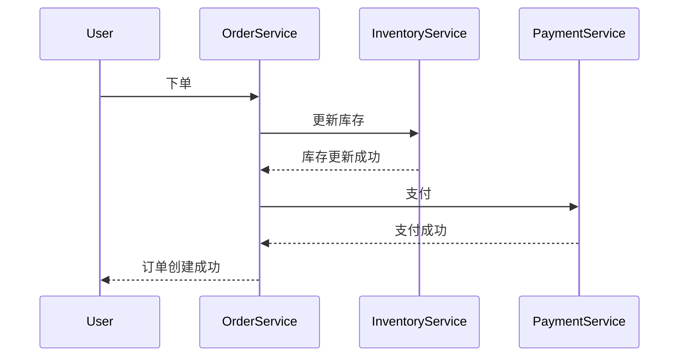

# Seata 链路追踪

## 介绍

在分布式系统中，事务管理是一个复杂且关键的问题。Seata 是一款开源的分布式事务解决方案，它通过全局事务管理、分支事务协调和资源锁定等机制，确保分布式事务的一致性。而 **链路追踪** 则是 Seata 中用于监控和调试分布式事务的重要功能。

链路追踪可以帮助开发者追踪事务的执行路径，了解每个分支事务的状态和执行时间，从而快速定位问题并优化性能。本文将详细介绍 Seata 链路追踪的核心概念、实现方式以及实际应用场景。

---

## 什么是链路追踪？

链路追踪（Tracing）是一种用于监控分布式系统中请求路径的技术。它通过记录请求在不同服务之间的传递过程，帮助开发者了解系统的调用链和性能瓶颈。

在 Seata 中，链路追踪主要用于追踪全局事务（Global Transaction）和分支事务（Branch Transaction）的执行过程。通过链路追踪，开发者可以清晰地看到事务的发起、提交、回滚等操作，以及每个分支事务的执行状态。

---

## Seata 链路追踪的核心概念

### 1. 全局事务（Global Transaction）
全局事务是 Seata 中用于管理分布式事务的核心概念。它由多个分支事务组成，每个分支事务对应一个本地事务。

### 2. 分支事务（Branch Transaction）
分支事务是全局事务的一部分，每个分支事务对应一个本地事务。Seata 通过协调分支事务的提交或回滚，确保全局事务的一致性。

### 3. 事务日志（Transaction Log）
Seata 会记录每个全局事务和分支事务的执行日志，包括事务的发起时间、提交时间、回滚时间等信息。这些日志是链路追踪的基础。

### 4. 事务上下文（Transaction Context）
事务上下文是 Seata 中用于传递事务信息的载体。它包含了全局事务 ID、分支事务 ID 等信息，用于在服务之间传递事务状态。

---

## 如何实现Seata链路追踪？

Seata 的链路追踪功能依赖于事务日志和事务上下文。以下是实现链路追踪的关键步骤：

### 1. 启用事务日志
在 Seata 中，事务日志默认是启用的。你可以通过配置 `seata.log.exception-rate` 参数来控制日志的记录频率。

```properties
seata.log.exception-rate=100
```

### 2. 传递事务上下文
在分布式系统中，事务上下文需要通过 RPC 调用在服务之间传递。Seata 提供了多种方式来实现事务上下文的传递，例如通过 HTTP Header 或 RPC 框架的扩展。

以下是一个通过 HTTP Header 传递事务上下文的示例：

```java
// 在服务A中设置事务上下文
HttpServletRequest request = ...;
request.setHeader("TX_XID", RootContext.getXID());

// 在服务B中获取事务上下文
HttpServletRequest request = ...;
String xid = request.getHeader("TX_XID");
RootContext.bind(xid);
```

### 3. 查看链路追踪日志
Seata 会将事务日志输出到控制台或日志文件中。你可以通过日志查看每个事务的执行路径和状态。

以下是一个事务日志的示例：

```
2023-10-01 12:00:00 INFO  [Seata] Begin global transaction, xid = 192.168.1.1:8091:123456
2023-10-01 12:00:01 INFO  [Seata] Begin branch transaction, xid = 192.168.1.1:8091:123456, branchId = 1
2023-10-01 12:00:02 INFO  [Seata] Commit branch transaction, xid = 192.168.1.1:8091:123456, branchId = 1
2023-10-01 12:00:03 INFO  [Seata] Commit global transaction, xid = 192.168.1.1:8091:123456
```

---

## 实际应用场景

### 场景：电商订单系统
假设我们有一个电商系统，用户下单时需要同时更新订单服务、库存服务和支付服务。以下是 Seata 链路追踪在该场景中的应用：

1. **用户下单**：订单服务发起全局事务。
2. **更新库存**：库存服务作为分支事务，更新库存信息。
3. **支付**：支付服务作为分支事务，处理支付逻辑。
4. **提交事务**：如果所有分支事务成功，提交全局事务；否则回滚。

通过 Seata 的链路追踪功能，我们可以清晰地看到每个服务的执行路径和状态，从而快速定位问题。



---

## 总结

Seata 链路追踪是分布式事务管理中的重要功能，它通过记录事务日志和传递事务上下文，帮助开发者监控和调试分布式事务。通过本文的学习，你应该已经掌握了 Seata 链路追踪的核心概念、实现方式以及实际应用场景。

:::tip 提示
如果你希望进一步深入学习 Seata，可以参考以下资源：
- [Seata 官方文档](https://seata.io/zh-cn/docs/overview/what-is-seata.html)
- 分布式事务设计与实践相关书籍
:::

:::caution 注意
在实际生产环境中，链路追踪可能会产生大量的日志数据。建议合理配置日志级别和存储策略，以避免影响系统性能。
:::

---

## 练习

1. 尝试在你的本地环境中配置 Seata，并启用链路追踪功能。
2. 编写一个简单的分布式事务示例，观察事务日志的输出。
3. 思考如何优化链路追踪的性能，例如通过异步日志记录或采样策略。

祝你学习愉快！