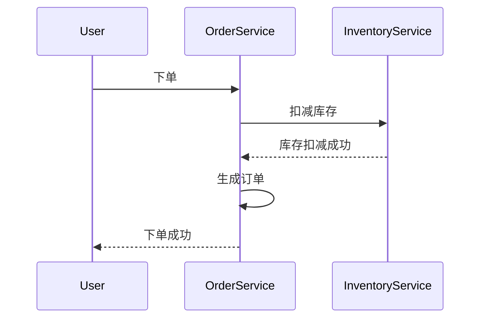

# Seata 安全概述

Seata（Simple Extensible Autonomous Transaction Architecture）是一款开源的分布式事务解决方案，旨在解决微服务架构下的数据一致性问题。在分布式系统中，事务的安全性至关重要，Seata通过一系列安全机制来确保事务的可靠性和数据的一致性。本文将详细介绍Seata的安全机制，帮助初学者理解如何在分布式事务中保障安全性。

## 什么是Seata安全机制？

Seata的安全机制主要涉及以下几个方面：

1. **事务隔离**：确保事务在执行过程中不会相互干扰。
2. **事务恢复**：在系统故障或网络异常时，能够自动恢复事务状态。
3. **数据一致性**：通过分布式锁、幂等性等手段，确保数据的一致性。
4. **权限控制**：限制对事务管理接口的访问，防止未授权的操作。

## 事务隔离

在分布式事务中，多个事务可能同时操作同一资源，因此需要确保事务之间的隔离性。Seata通过以下方式实现事务隔离：

- **全局锁**：在事务提交前，Seata会获取全局锁，确保同一资源不会被其他事务修改。
- **本地锁**：在本地事务中，Seata会使用本地锁来防止并发冲突。

```java
// 示例：全局锁的使用
GlobalLock globalLock = new GlobalLock();
globalLock.acquire();
try {
    // 执行业务逻辑
} finally {
    globalLock.release();
}
```

## 事务恢复

在分布式系统中，网络故障或系统崩溃可能导致事务中断。Seata通过以下机制来确保事务的恢复：

- **事务日志**：Seata会记录事务的每一步操作，以便在系统恢复后能够继续执行未完成的事务。
- **定时任务**：Seata会定期检查未完成的事务，并尝试重新执行。

```java
// 示例：事务日志记录
TransactionLog log = new TransactionLog();
log.record("begin transaction");
// 执行业务逻辑
log.record("commit transaction");
```

## 数据一致性

数据一致性是分布式事务中的核心问题。Seata通过以下方式确保数据一致性：

- **分布式锁**：在事务提交前，Seata会获取分布式锁，确保同一资源不会被其他事务修改。
- **幂等性**：Seata通过幂等性设计，确保同一操作多次执行不会产生副作用。

```java
// 示例：幂等性设计
public void executeTransaction(String transactionId) {
    if (isExecuted(transactionId)) {
        return; // 如果事务已执行，则直接返回
    }
    // 执行业务逻辑
    markAsExecuted(transactionId);
}
```

## 权限控制

为了防止未授权的操作，Seata提供了权限控制机制：

- **接口鉴权**：Seata的管理接口需要通过鉴权才能访问。
- **角色管理**：不同的角色拥有不同的操作权限。

```java
// 示例：接口鉴权
@PreAuthorize("hasRole('ADMIN')")
public void manageTransaction(String transactionId) {
    // 管理事务逻辑
}
```

## 实际案例

假设我们有一个电商系统，用户下单后需要扣减库存并生成订单。在分布式事务中，这两个操作需要保证一致性。使用Seata的安全机制，我们可以确保在扣减库存和生成订单的过程中，数据不会被其他事务干扰，并且在系统故障时能够自动恢复。



## 总结

Seata通过事务隔离、事务恢复、数据一致性和权限控制等安全机制，确保了分布式事务的可靠性和数据的一致性。对于初学者来说，理解这些机制是掌握分布式事务的关键。

## 附加资源

- [Seata官方文档](https://seata.io/zh-cn/docs/overview/what-is-seata.html)
- [分布式事务实战](https://example.com/distributed-transaction-practice)

## 练习

1. 尝试在本地环境中配置Seata，并模拟一个分布式事务场景。
2. 编写一个简单的Java程序，使用Seata的全局锁机制来确保事务的隔离性。
