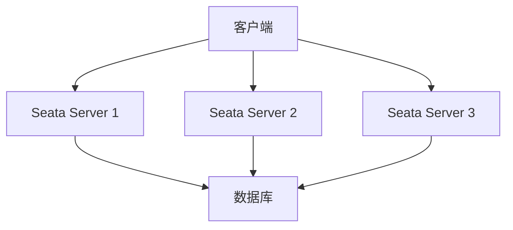

# Seata 灾难恢复

## 介绍

在分布式系统中，事务管理是一个复杂且关键的任务。Seata（Simple Extensible Autonomous Transaction Architecture）是一个开源的分布式事务解决方案，旨在简化分布式事务的管理。然而，在分布式环境中，系统可能会遇到各种故障，如网络中断、服务器宕机等。因此，灾难恢复机制是确保系统高可用性和数据一致性的重要组成部分。

本文将详细介绍Seata的灾难恢复机制，帮助初学者理解如何在分布式事务中实现高可用性和数据一致性。

## Seata 灾难恢复机制

### 1. 事务日志

Seata通过事务日志来记录事务的状态和操作。事务日志是灾难恢复的基础，它确保了即使在系统崩溃的情况下，事务的状态也能被恢复。

```java
// 示例：Seata事务日志记录
public void saveTransactionLog(TransactionLog log) {
    // 将事务日志保存到持久化存储中
}
```

### 2. 事务恢复

当系统发生故障时，Seata会通过事务日志来恢复未完成的事务。事务恢复的过程包括以下几个步骤：

1. **检测未完成的事务**：Seata会定期检查事务日志，找出未完成的事务。
2. **重试事务**：对于未完成的事务，Seata会尝试重新执行事务操作，直到事务完成或达到重试次数上限。
3. **清理事务日志**：一旦事务完成，Seata会清理对应的事务日志，释放资源。

```java
// 示例：Seata事务恢复
public void recoverTransactions() {
    List<TransactionLog> unfinishedLogs = findUnfinishedLogs();
    for (TransactionLog log : unfinishedLogs) {
        retryTransaction(log);
        cleanLog(log);
    }
}
```

### 3. 高可用性

Seata通过集群部署和负载均衡来实现高可用性。当某个节点发生故障时，其他节点可以接管其工作，确保系统继续运行。



### 4. 数据一致性

Seata通过两阶段提交（2PC）协议来确保数据一致性。在事务提交阶段，Seata会先预提交事务，确保所有参与者都准备好提交事务，然后再进行最终提交。

```java
// 示例：Seata两阶段提交
public void commitTransaction(Transaction transaction) {
    prepareTransaction(transaction);
    commitTransaction(transaction);
}
```

## 实际案例

假设我们有一个电商系统，用户下单后需要扣减库存和生成订单。这两个操作分别由库存服务和订单服务处理。如果在这个过程中发生系统故障，Seata的灾难恢复机制可以确保事务的完整性和数据的一致性。

```java
// 示例：电商系统事务
public void placeOrder(Order order) {
    try {
        // 开始分布式事务
        GlobalTransaction tx = GlobalTransactionContext.getCurrentOrCreate();
        tx.begin();

        // 扣减库存
        inventoryService.deductStock(order.getProductId(), order.getQuantity());

        // 生成订单
        orderService.createOrder(order);

        // 提交事务
        tx.commit();
    } catch (Exception e) {
        // 回滚事务
        GlobalTransactionContext.reload(tx.getXid()).rollback();
        throw e;
    }
}
```

## 总结

Seata的灾难恢复机制通过事务日志、事务恢复、高可用性和数据一致性保障，确保了分布式事务的可靠性和稳定性。对于初学者来说，理解这些机制是掌握分布式事务管理的关键。

## 附加资源

- [Seata官方文档](https://seata.io/zh-cn/docs/overview/what-is-seata.html)
- [分布式事务理论与实践](https://www.oreilly.com/library/view/distributed-systems-principles/9781492043012/)

## 练习

1. 尝试在本地环境中部署Seata，并模拟系统故障，观察Seata的灾难恢复机制。
2. 编写一个简单的分布式事务应用，使用Seata进行事务管理，并测试其灾难恢复能力。
