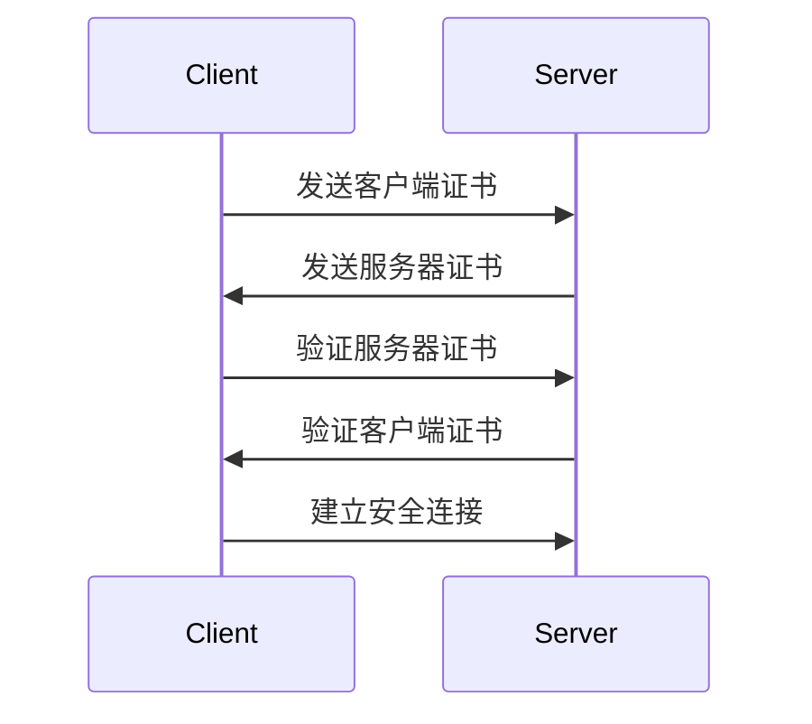

# Seata 安全通信

在分布式系统中，数据的安全性和一致性是至关重要的。Seata（Simple Extensible Autonomous Transaction Architecture）作为一个开源的分布式事务解决方案，提供了强大的安全通信机制，确保事务数据在传输过程中不被篡改或泄露。本文将详细介绍Seata的安全通信机制，并通过实际案例帮助初学者理解其工作原理。

## 什么是Seata安全通信？

Seata的安全通信机制主要通过加密和认证来保护事务数据在传输过程中的安全性。具体来说，Seata支持以下两种安全通信方式：

1. **SSL/TLS加密**：通过SSL/TLS协议对通信数据进行加密，防止数据在传输过程中被窃听或篡改。
2. **认证机制**：通过客户端和服务端的双向认证，确保通信双方的身份合法性，防止中间人攻击。

## Seata 安全通信的工作原理

### 1. SSL/TLS加密

SSL/TLS是一种广泛使用的加密协议，用于在客户端和服务器之间建立安全的通信通道。Seata通过配置SSL/TLS证书，确保事务数据在传输过程中是加密的。

#### 配置示例

以下是一个简单的Seata SSL/TLS配置示例：

```properties
# 启用SSL/TLS
transport.enableClientBatchSendRequest=true
transport.ssl.enable=true
transport.ssl.clientKeyFile=/path/to/client-key.pem
transport.ssl.clientCertFile=/path/to/client-cert.pem
transport.ssl.serverKeyFile=/path/to/server-key.pem
transport.ssl.serverCertFile=/path/to/server-cert.pem
```

在这个配置中，`transport.ssl.enable`设置为`true`，表示启用SSL/TLS加密。`clientKeyFile`和`clientCertFile`是客户端的私钥和证书文件，`serverKeyFile`和`serverCertFile`是服务器的私钥和证书文件。

### 2. 认证机制

Seata的认证机制通过双向认证（Mutual TLS）来确保客户端和服务器的身份合法性。双向认证要求客户端和服务器都提供证书，并在握手过程中验证对方的证书。

#### 双向认证流程



在这个流程中，客户端和服务器首先交换各自的证书，然后分别验证对方的证书。只有在双方证书都验证通过的情况下，才会建立安全连接。

## 实际案例

假设我们有一个电商系统，用户在下单时需要调用多个微服务来完成订单处理。为了保证订单数据的安全性，我们可以使用Seata的安全通信机制来保护这些微服务之间的通信。

### 场景描述

1. **用户服务**：负责用户身份验证。
2. **订单服务**：负责创建订单。
3. **库存服务**：负责扣减库存。

### 配置步骤

1. **生成证书**：为每个服务生成SSL/TLS证书。
2. **配置Seata**：在每个服务的Seata配置文件中启用SSL/TLS，并指定证书路径。
3. **部署服务**：将配置好的服务部署到生产环境。

### 代码示例

以下是一个简单的订单服务配置示例：

```properties
# 订单服务的Seata配置
transport.enableClientBatchSendRequest=true
transport.ssl.enable=true
transport.ssl.clientKeyFile=/path/to/order-service-key.pem
transport.ssl.clientCertFile=/path/to/order-service-cert.pem
transport.ssl.serverKeyFile=/path/to/order-service-key.pem
transport.ssl.serverCertFile=/path/to/order-service-cert.pem
```

## 总结

Seata的安全通信机制通过SSL/TLS加密和双向认证，确保了分布式事务中数据的安全性和一致性。对于初学者来说，理解这些机制并正确配置Seata是保护分布式系统安全的重要一步。

## 附加资源

- [Seata官方文档](https://seata.io/zh-cn/docs/overview/what-is-seata.html)
- [SSL/TLS协议详解](https://zh.wikipedia.org/wiki/TLS)
- [双向认证的工作原理](https://www.cloudflare.com/learning/ssl/what-is-mutual-tls/)

## 练习

1. 尝试在自己的开发环境中配置Seata的SSL/TLS加密。
2. 编写一个简单的微服务应用，并使用Seata的安全通信机制保护服务之间的通信。
