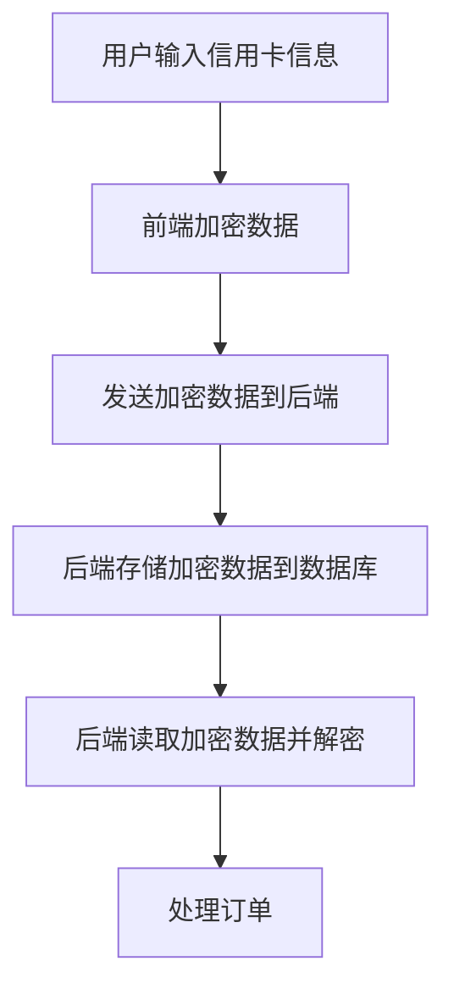

## 介绍

在分布式系统中，数据的安全性至关重要。Seata 作为一个开源的分布式事务解决方案，提供了数据加密功能，以确保敏感信息在传输和存储过程中不被泄露。本文将详细介绍 Seata 中的数据加密机制，并通过实际案例展示其应用。

## 数据加密的基本概念

数据加密是指将原始数据（明文）通过特定的算法转换为不可读的形式（密文），以防止未经授权的访问。Seata 中的数据加密主要应用于以下几个方面：

1. **传输加密**：在客户端与服务器之间传输数据时，确保数据的安全性。
2. **存储加密**：在数据库中存储敏感数据时，确保数据的安全性。

## Seata 中的数据加密机制

Seata 通过集成加密算法库（如 AES、RSA 等）来实现数据加密。以下是 Seata 数据加密的基本流程：

1. **密钥管理**：Seata 使用密钥管理系统（KMS）来生成和管理加密密钥。
2. **数据加密**：在数据传输或存储之前，使用密钥对数据进行加密。
3. **数据解密**：在数据接收或读取时，使用相同的密钥对数据进行解密。

### 代码示例

以下是一个简单的示例，展示如何在 Seata 中使用 AES 加密算法对数据进行加密和解密。

```java
import javax.crypto.Cipher;
import javax.crypto.KeyGenerator;
import javax.crypto.SecretKey;
import java.util.Base64;

public class SeataEncryptionExample {

    public static void main(String[] args) throws Exception {
        // 生成 AES 密钥
        KeyGenerator keyGen = KeyGenerator.getInstance("AES");
        keyGen.init(128);
        SecretKey secretKey = keyGen.generateKey();

        // 加密数据
        String originalData = "Sensitive Data";
        Cipher cipher = Cipher.getInstance("AES");
        cipher.init(Cipher.ENCRYPT_MODE, secretKey);
        byte[] encryptedData = cipher.doFinal(originalData.getBytes());
        String encryptedDataBase64 = Base64.getEncoder().encodeToString(encryptedData);
        System.out.println("Encrypted Data: " + encryptedDataBase64);

        // 解密数据
        cipher.init(Cipher.DECRYPT_MODE, secretKey);
        byte[] decryptedData = cipher.doFinal(Base64.getDecoder().decode(encryptedDataBase64));
        String decryptedDataString = new String(decryptedData);
        System.out.println("Decrypted Data: " + decryptedDataString);
    }
}
```

### 输入与输出

- **输入**：`Sensitive Data`
- **输出**：
  - **加密后的数据**：`Encrypted Data: <Base64 encoded string>`
  - **解密后的数据**：`Decrypted Data: Sensitive Data`

## 实际应用场景

假设我们有一个电商系统，用户在下单时需要输入信用卡信息。为了保护用户的敏感数据，我们可以使用 Seata 的数据加密功能对信用卡信息进行加密存储和传输。

### 场景描述

1. **用户下单**：用户在前端页面输入信用卡信息并提交订单。
2. **数据加密**：前端将信用卡信息加密后发送到后端。
3. **数据存储**：后端将加密后的信用卡信息存储到数据库中。
4. **数据解密**：在需要处理订单时，后端从数据库中读取加密的信用卡信息并解密。

### 流程图



## 总结

Seata 的数据加密机制为分布式事务中的敏感数据提供了强有力的保护。通过密钥管理、数据加密和数据解密的流程，Seata 确保了数据在传输和存储过程中的安全性。在实际应用中，数据加密是保护用户隐私和防止数据泄露的重要手段。

## 附加资源与练习

- **资源**：
  - [Seata 官方文档](https://seata.io/zh-cn/docs/)
  - [Java 加密与解密](https://docs.oracle.com/javase/8/docs/technotes/guides/security/crypto/CryptoSpec.html)

- **练习**：
  1. 尝试在 Seata 中集成 RSA 加密算法，并比较其与 AES 加密的性能差异。
  2. 设计一个简单的分布式事务场景，使用 Seata 的数据加密功能保护敏感数据。

:::tip
在实际开发中，选择合适的加密算法和密钥管理策略是确保数据安全的关键。建议定期更新密钥，并使用安全的密钥存储方案。
:::