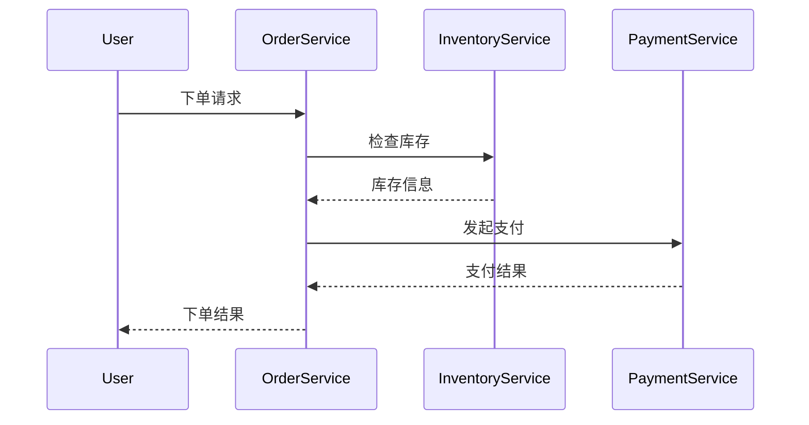

## 介绍

在分布式系统中，跨域调用是一个常见的场景。由于不同服务可能部署在不同的域中，跨域调用会带来一系列安全问题，例如数据泄露、请求伪造等。Seata作为一个分布式事务解决方案，提供了跨域安全机制，以确保在分布式事务中的数据一致性和安全性。

本文将详细介绍Seata的跨域安全机制，包括其工作原理、实现方式以及实际应用场景。

## Seata 跨域安全机制

### 1. 跨域调用的挑战

在分布式系统中，跨域调用可能会面临以下挑战：

- **数据泄露**：跨域调用可能会暴露敏感数据。
- **请求伪造**：恶意用户可能会伪造请求，导致系统安全问题。
- **数据一致性**：跨域调用可能会导致数据不一致，尤其是在分布式事务中。

### 2. Seata的跨域安全机制

Seata通过以下方式确保跨域调用的安全性：

- **身份验证**：Seata支持通过Token或OAuth2等方式进行身份验证，确保只有合法的请求才能访问服务。
- **数据加密**：Seata支持对跨域调用的数据进行加密，防止数据泄露。
- **请求签名**：Seata支持对请求进行签名，防止请求被篡改或伪造。
- **事务一致性**：Seata通过全局事务管理机制，确保跨域调用的事务一致性。

### 3. 代码示例

以下是一个简单的Seata跨域调用示例，展示了如何使用Seata进行安全的跨域调用：

```java
// 服务A调用服务B
@GlobalTransactional
public void serviceA() {
    // 调用服务B
    String result = restTemplate.postForObject("http://service-b/api/resource", request, String.class);
    // 处理结果
    System.out.println(result);
}
```

在这个示例中，`@GlobalTransactional`注解确保了服务A和服务B之间的调用在一个全局事务中，Seata会自动处理跨域调用的安全性和一致性。

### 4. 实际应用场景

假设我们有一个电商系统，用户在下单时需要调用库存服务和支付服务。这两个服务可能部署在不同的域中，因此需要确保跨域调用的安全性。



在这个场景中，Seata的跨域安全机制确保了订单服务、库存服务和支付服务之间的调用是安全的，并且数据是一致的。

## 总结

Seata的跨域安全机制为分布式系统中的跨域调用提供了强大的安全保障。通过身份验证、数据加密、请求签名和事务一致性管理，Seata确保了跨域调用的安全性和数据一致性。

## 附加资源

- [Seata官方文档](https://seata.io/zh-cn/docs/)
- [分布式事务与Seata](https://seata.io/zh-cn/blog/)
- [OAuth2身份验证](https://oauth.net/2/)

## 练习

1. 尝试在你的项目中集成Seata，并实现一个跨域调用的示例。
2. 研究Seata的源码，了解其跨域安全机制的具体实现。
3. 思考在你的项目中，如何利用Seata的跨域安全机制解决现有的安全问题。
