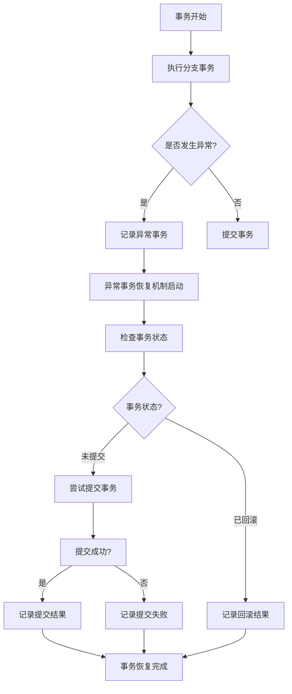

# Seata 异常事务恢复

在分布式系统中，事务管理是一个复杂且关键的任务。Seata（Simple Extensible Autonomous Transaction Architecture）是一个开源的分布式事务解决方案，它帮助开发者在微服务架构中实现事务的一致性。然而，在实际应用中，可能会遇到事务异常的情况，例如网络抖动、服务宕机等，这些异常可能导致事务无法正常提交或回滚。本文将详细介绍如何在Seata中处理异常事务恢复，确保系统的数据一致性和可靠性。

## 什么是Seata异常事务恢复？

Seata异常事务恢复是指在分布式事务执行过程中，由于某些异常情况（如网络故障、服务宕机等）导致事务未能正常完成时，Seata提供的一种机制，用于恢复这些异常事务，确保事务的最终一致性。

## Seata 异常事务恢复的工作原理

Seata的异常事务恢复机制主要依赖于以下几个组件：

1. **TC（Transaction Coordinator）**：事务协调器，负责全局事务的提交和回滚。
2. **TM（Transaction Manager）**：事务管理器，负责开启、提交或回滚全局事务。
3. **RM（Resource Manager）**：资源管理器，负责管理分支事务的资源。

当发生异常时，Seata会通过TC与RM的交互，检查未完成的事务，并根据事务的状态决定是提交还是回滚。

### 异常事务恢复的流程



## 实际案例

假设我们有一个电商系统，用户下单后需要扣减库存并生成订单。这两个操作分别由库存服务和订单服务处理，且这两个服务分布在不同的微服务中。

### 代码示例

```java
// 库存服务
@GlobalTransactional
public void reduceStock(String productId, int quantity) {
    // 扣减库存
    stockService.reduce(productId, quantity);
    // 生成订单
    orderService.createOrder(productId, quantity);
}
```

在这个例子中，如果库存服务成功扣减了库存，但订单服务在生成订单时发生了异常，那么整个事务将无法正常提交。此时，Seata的异常事务恢复机制将启动，检查事务状态并尝试恢复。

### 异常事务恢复的步骤

1. **记录异常事务**：当订单服务发生异常时，Seata会记录该异常事务的状态。
2. **检查事务状态**：Seata会定期检查未完成的事务，确定其当前状态。
3. **尝试提交或回滚**：根据事务的状态，Seata会尝试提交或回滚事务。
4. **记录结果**：无论事务最终是提交还是回滚，Seata都会记录结果，确保事务的最终一致性。

## 总结

Seata的异常事务恢复机制是确保分布式事务一致性的重要手段。通过理解其工作原理和实际应用场景，开发者可以更好地处理分布式系统中的事务异常，确保系统的可靠性和数据的一致性。

## 附加资源

- [Seata官方文档](https://seata.io/zh-cn/docs/overview/what-is-seata.html)
- [分布式事务处理的最佳实践](https://dzone.com/articles/distributed-transaction-management-best-practices)

## 练习

1. 尝试在一个简单的微服务项目中集成Seata，并模拟一个事务异常的场景，观察Seata的异常事务恢复机制是如何工作的。
2. 阅读Seata的源码，深入了解其异常事务恢复的实现细节。

通过以上内容，你应该对Seata的异常事务恢复有了更深入的理解。希望这些知识能帮助你在实际项目中更好地处理分布式事务的异常情况。