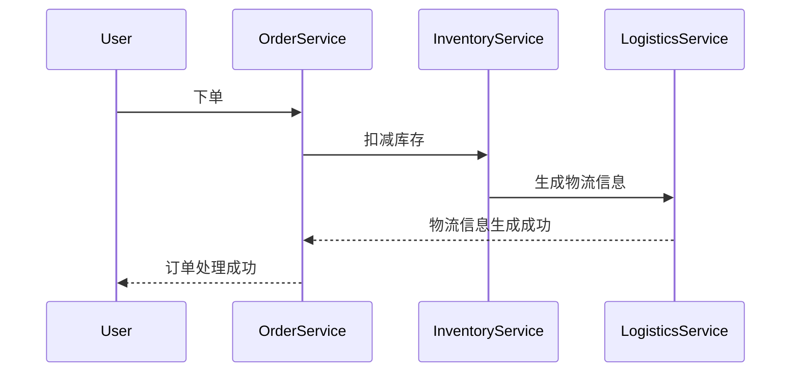

# Seata 分布式事务ID

## 介绍

在分布式系统中，事务管理是一个复杂的问题。Seata（Simple Extensible Autonomous Transaction Architecture）是一个开源的分布式事务解决方案，它通过全局事务ID（Global Transaction ID, XID）来管理分布式事务。本文将详细介绍Seata分布式事务ID的概念、工作原理以及如何在实际应用中使用它。

## 什么是Seata分布式事务ID？

Seata分布式事务ID（XID）是一个全局唯一的标识符，用于标识一个分布式事务。在分布式系统中，多个服务可能参与同一个事务，XID用于将这些服务的事务操作关联起来，确保它们要么全部成功，要么全部失败。

## 工作原理

Seata通过以下步骤来管理分布式事务ID：

1. **事务发起**：当一个分布式事务开始时，事务管理器（TM）会生成一个全局唯一的XID。
2. **事务传播**：XID会随着事务的传播被传递到各个参与事务的服务中。
3. **事务提交/回滚**：事务管理器根据XID来协调各个服务的事务操作，确保它们的一致性。

## 代码示例

以下是一个简单的代码示例，展示如何在Seata中使用分布式事务ID。

```java
// 事务发起方
@GlobalTransactional
public void startTransaction() {
    // 生成XID
    String xid = RootContext.getXID();
    System.out.println("Generated XID: " + xid);

    // 调用其他服务
    serviceA.doSomething();
    serviceB.doSomething();
}

// 服务A
public void doSomething() {
    // 获取当前事务的XID
    String xid = RootContext.getXID();
    System.out.println("Service A XID: " + xid);

    // 执行业务逻辑
}

// 服务B
public void doSomething() {
    // 获取当前事务的XID
    String xid = RootContext.getXID();
    System.out.println("Service B XID: " + xid);

    // 执行业务逻辑
}
```

### 输入与输出

假设事务发起方生成的XID为 `123456789`，那么输出将会是：

```
Generated XID: 123456789
Service A XID: 123456789
Service B XID: 123456789
```

## 实际应用场景

### 电商系统中的订单处理

在一个电商系统中，用户下单后，系统需要处理订单、扣减库存、生成物流信息等多个操作。这些操作可能分布在不同的服务中，使用Seata的分布式事务ID可以确保这些操作要么全部成功，要么全部失败，从而保证数据的一致性。



## 总结

Seata分布式事务ID（XID）是管理分布式事务的关键。通过全局唯一的XID，Seata能够协调多个服务的事务操作，确保它们的一致性。本文介绍了XID的概念、工作原理，并通过代码示例和实际应用场景展示了如何使用Seata分布式事务ID。

## 附加资源

- [Seata官方文档](https://seata.io/zh-cn/docs/overview/what-is-seata.html)
- [分布式事务解决方案比较](https://dzone.com/articles/distributed-transaction-solutions-comparison)

## 练习

1. 尝试在一个简单的Spring Boot项目中集成Seata，并使用分布式事务ID管理事务。
2. 修改上述电商系统的示例代码，添加更多的服务（如支付服务），并确保所有服务的事务操作都能正确回滚。

:::tip
在集成Seata时，确保所有参与事务的服务都正确配置了Seata的依赖和配置文件。
:::