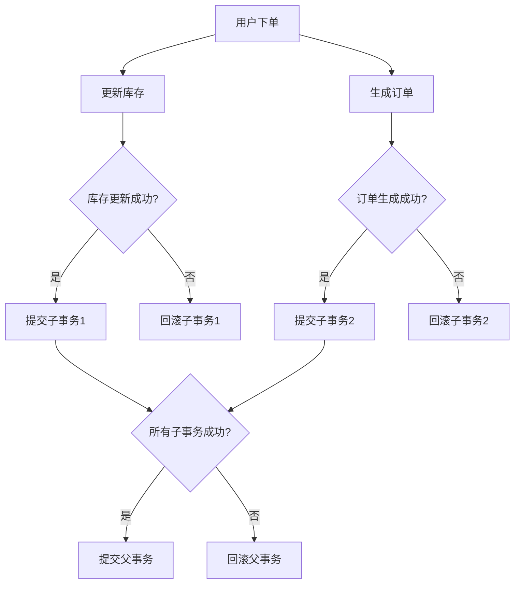

# Seata 嵌套事务支持

在分布式系统中，事务管理是一个复杂且关键的问题。Seata（Simple Extensible Autonomous Transaction Architecture）是一个开源的分布式事务解决方案，它提供了多种事务模式来满足不同的业务需求。其中，**嵌套事务支持**是Seata的一个重要特性，它允许在一个事务中嵌套另一个事务，从而更好地管理复杂的业务逻辑。

## 什么是嵌套事务？

嵌套事务是指在一个事务内部启动另一个事务。外层事务称为**父事务**，内层事务称为**子事务**。子事务可以独立提交或回滚，但其最终结果仍然受父事务的控制。如果父事务回滚，所有子事务也会被回滚，即使子事务已经提交。

在分布式系统中，嵌套事务可以帮助我们更好地组织和管理复杂的业务逻辑，尤其是在需要处理多个微服务之间的调用时。

## Seata 中的嵌套事务支持

Seata通过`GlobalTransaction`和`BranchTransaction`来支持嵌套事务。`GlobalTransaction`代表全局事务，而`BranchTransaction`代表分支事务。在嵌套事务中，每个子事务都是一个分支事务，它们共同组成了一个全局事务。

### 嵌套事务的工作原理

1. **父事务启动**：首先，父事务启动并创建一个全局事务上下文。
2. **子事务启动**：在父事务内部，子事务启动并注册到全局事务上下文中。
3. **子事务提交或回滚**：子事务可以独立提交或回滚，但其结果会被记录在全局事务上下文中。
4. **父事务提交或回滚**：最终，父事务会根据所有子事务的结果来决定是否提交或回滚整个全局事务。

### 代码示例

以下是一个简单的代码示例，展示了如何在Seata中使用嵌套事务：

```java
// 启动父事务
GlobalTransaction parentTx = GlobalTransactionContext.getCurrentOrCreate();
parentTx.begin();

try {
    // 业务逻辑1
    serviceA.doSomething();

    // 启动子事务
    GlobalTransaction childTx = GlobalTransactionContext.getCurrentOrCreate();
    childTx.begin();

    try {
        // 业务逻辑2
        serviceB.doSomethingElse();

        // 提交子事务
        childTx.commit();
    } catch (Exception e) {
        // 回滚子事务
        childTx.rollback();
        throw e;
    }

    // 提交父事务
    parentTx.commit();
} catch (Exception e) {
    // 回滚父事务
    parentTx.rollback();
}
```

在这个示例中，`serviceA.doSomething()`和`serviceB.doSomethingElse()`分别代表两个不同的业务逻辑。`serviceB.doSomethingElse()`在一个子事务中执行，如果子事务失败，父事务也会回滚。

### 实际应用场景

假设我们有一个电商系统，用户下单时需要同时更新库存和生成订单。这两个操作分别由不同的微服务处理。我们可以使用嵌套事务来确保这两个操作要么同时成功，要么同时失败。

1. **父事务**：用户下单事务。
2. **子事务1**：更新库存事务。
3. **子事务2**：生成订单事务。

如果更新库存失败，整个下单事务应该回滚，即使生成订单事务已经成功提交。



## 总结

Seata的嵌套事务支持为分布式系统中的复杂业务逻辑提供了强大的事务管理能力。通过嵌套事务，我们可以更好地组织和管理多个微服务之间的调用，确保数据的一致性和完整性。

### 附加资源

- [Seata官方文档](https://seata.io/zh-cn/docs/overview/what-is-seata.html)
- [分布式事务模式详解](https://dzone.com/articles/distributed-transaction-patterns)

### 练习

1. 尝试在一个简单的Spring Boot项目中集成Seata，并使用嵌套事务管理多个微服务之间的调用。
2. 修改上面的代码示例，使其包含第三个子事务，并测试其行为。

通过实践，你将更深入地理解Seata的嵌套事务支持及其在分布式系统中的应用。