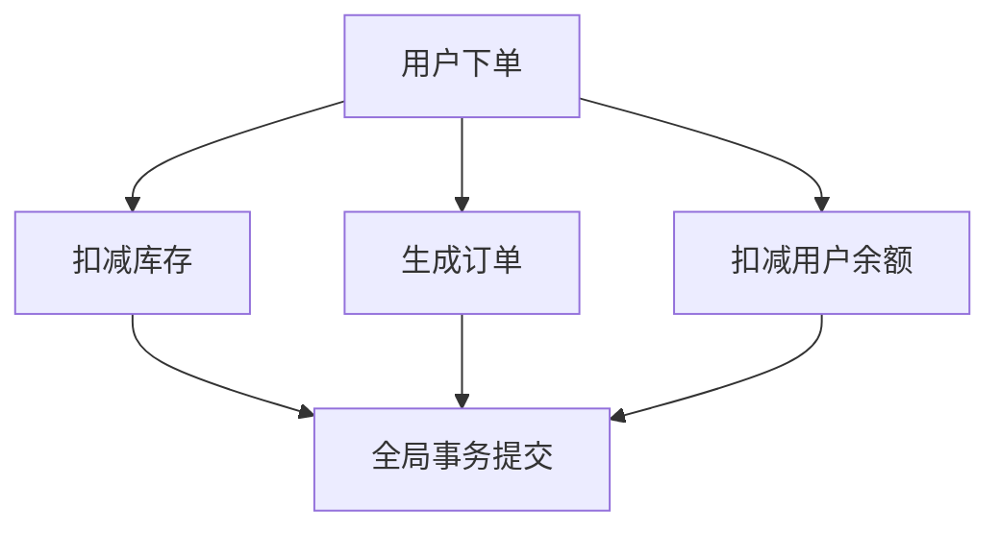

# Seata 分支事务并行化

## 介绍

在分布式事务处理中，Seata（Simple Extensible Autonomous Transaction Architecture）是一个开源的分布式事务解决方案。它通过全局事务和分支事务的机制来保证数据的一致性。**分支事务并行化**是Seata中的一个高级特性，它允许多个分支事务在同一全局事务中并行执行，从而提升事务处理的效率。

本文将详细介绍Seata分支事务并行化的概念、实现方式以及实际应用场景，帮助初学者更好地理解这一特性。

## 什么是分支事务并行化？

在Seata中，一个全局事务通常由多个分支事务组成。每个分支事务对应一个本地事务，这些本地事务可能分布在不同的服务或数据库中。默认情况下，Seata会按照顺序执行这些分支事务，即一个分支事务完成后，才会开始执行下一个分支事务。

**分支事务并行化**则是指在同一全局事务中，多个分支事务可以并行执行。这种方式可以显著减少事务的整体执行时间，尤其是在分支事务之间没有依赖关系的情况下。

## 如何实现分支事务并行化？

Seata通过以下方式实现分支事务并行化：

1. **全局事务协调器（TC）**：TC负责协调全局事务的提交或回滚。在并行化模式下，TC会同时向多个分支事务发送提交或回滚的指令。

2. **分支事务管理器（RM）**：RM负责管理本地事务的执行。在并行化模式下，RM会同时处理多个分支事务的提交或回滚请求。

3. **事务上下文传递**：Seata通过事务上下文（Transaction Context）来传递全局事务的状态信息，确保各个分支事务能够正确地参与到全局事务中。

### 代码示例

以下是一个简单的代码示例，展示如何在Seata中启用分支事务并行化：

```java
@GlobalTransactional
public void executeParallelTransactions() {
    // 分支事务1
    CompletableFuture<Void> branch1 = CompletableFuture.runAsync(() -> {
        branchTransaction1();
    });

    // 分支事务2
    CompletableFuture<Void> branch2 = CompletableFuture.runAsync(() -> {
        branchTransaction2();
    });

    // 等待所有分支事务完成
    CompletableFuture.allOf(branch1, branch2).join();
}

private void branchTransaction1() {
    // 分支事务1的逻辑
}

private void branchTransaction2() {
    // 分支事务2的逻辑
}
```

在这个示例中，`branchTransaction1`和`branchTransaction2`是两个独立的分支事务，它们通过`CompletableFuture`并行执行。

## 实际应用场景

### 电商订单系统

假设我们有一个电商订单系统，用户下单后需要执行以下操作：

1. 扣减库存
2. 生成订单
3. 扣减用户余额

这些操作可以分别对应三个分支事务。在传统的顺序执行模式下，这些操作会依次执行，导致整体事务时间较长。通过分支事务并行化，这三个操作可以同时执行，从而显著减少事务的执行时间。



在这个场景中，扣减库存、生成订单和扣减用户余额这三个分支事务可以并行执行，最终由全局事务协调器统一提交。

## 总结

Seata的分支事务并行化特性能够显著提升分布式事务的执行效率，尤其是在分支事务之间没有依赖关系的情况下。通过并行执行多个分支事务，可以减少事务的整体执行时间，提升系统的吞吐量。

:::tip
在实际应用中，使用分支事务并行化时需要注意以下几点：
1. 确保分支事务之间没有依赖关系，否则可能导致数据不一致。
2. 合理设置线程池大小，避免资源竞争和线程饥饿问题。
3. 监控并行事务的执行情况，及时发现和解决潜在问题。
:::

## 附加资源

- [Seata官方文档](https://seata.io/zh-cn/docs/overview/what-is-seata.html)
- [分布式事务处理的最佳实践](https://dzone.com/articles/distributed-transactions-best-practices)

## 练习

1. 尝试在本地环境中配置Seata，并实现一个简单的分支事务并行化示例。
2. 思考在哪些业务场景中可以使用分支事务并行化，并设计相应的实现方案。
