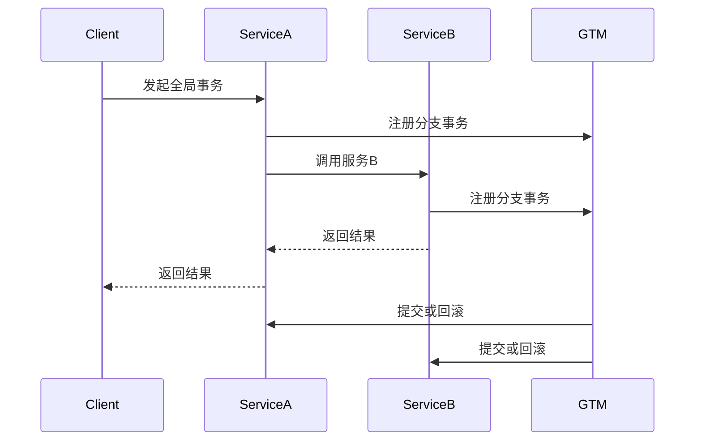

# Seata 跨服务事务

在现代分布式系统中，跨服务事务管理是一个复杂但至关重要的任务。Seata（Simple Extensible Autonomous Transaction Architecture）是一个开源的分布式事务解决方案，它通过提供全局事务管理能力，帮助开发者在微服务架构中实现跨服务的事务一致性。

## 什么是跨服务事务？

跨服务事务指的是在多个独立的服务之间执行的事务操作，这些服务可能运行在不同的服务器或容器中。在分布式系统中，由于网络延迟、服务故障等因素，跨服务事务的管理变得异常复杂。Seata通过其全局事务管理机制，确保了这些事务的原子性、一致性、隔离性和持久性（ACID）。

## Seata 的跨服务事务机制

Seata的跨服务事务机制主要依赖于以下几个核心组件：

1. **全局事务管理器（Global Transaction Manager, GTM）**：负责协调所有参与事务的服务。
2. **分支事务（Branch Transaction）**：每个服务内部的事务操作。
3. **全局事务ID（Global Transaction ID, XID）**：唯一标识一个全局事务。

### 工作原理

1. **事务发起**：当一个服务发起一个全局事务时，Seata会生成一个唯一的XID，并将其传播到所有参与事务的服务中。
2. **分支事务注册**：每个参与事务的服务在本地执行事务操作，并将分支事务注册到GTM中。
3. **事务提交或回滚**：GTM根据所有分支事务的执行情况，决定是提交还是回滚整个全局事务。



## 代码示例

以下是一个简单的Seata跨服务事务的代码示例：

```java
// 服务A
@GlobalTransactional
public void serviceA() {
    // 本地事务操作
    localTransactionA();
    // 调用服务B
    serviceB();
}

// 服务B
@GlobalTransactional
public void serviceB() {
    // 本地事务操作
    localTransactionB();
}
```

在这个示例中，`@GlobalTransactional`注解用于标记一个全局事务。当`serviceA`方法被调用时，Seata会生成一个XID，并将其传播到`serviceB`中。如果`serviceB`中的事务操作失败，整个全局事务将被回滚。

## 实际应用场景

假设我们有一个电商系统，用户下单时需要同时更新库存和订单服务。这两个服务分别运行在不同的服务器上。使用Seata的跨服务事务管理，可以确保在库存更新失败时，订单服务的事务也会被回滚，从而保证数据的一致性。

## 总结

Seata的跨服务事务管理为分布式系统提供了一种简单而强大的解决方案，确保了数据的一致性和系统的可靠性。通过理解Seata的工作原理和实际应用场景，开发者可以更好地设计和实现分布式系统中的事务管理。

## 附加资源

- [Seata官方文档](https://seata.io/zh-cn/docs/overview/what-is-seata.html)
- [分布式事务解决方案比较](https://dzone.com/articles/distributed-transaction-solutions-comparison)

## 练习

1. 尝试在一个简单的微服务项目中集成Seata，并实现一个跨服务事务。
2. 修改代码，模拟一个分支事务失败的情况，观察整个全局事务的回滚行为。

通过以上内容，你应该对Seata的跨服务事务有了一个全面的了解。继续深入学习并实践，你将能够更好地掌握分布式系统中的事务管理。