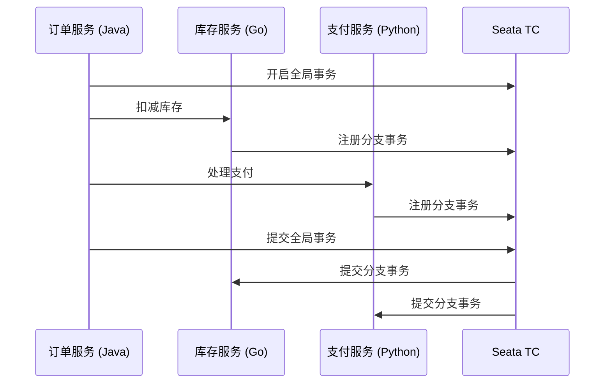

# Seata 跨语言支持

## 介绍

Seata 是一款开源的分布式事务解决方案，旨在简化微服务架构中的事务管理。随着微服务架构的普及，服务之间的通信往往涉及多种编程语言。Seata 提供了跨语言支持，使得不同语言编写的服务能够无缝参与到同一个分布式事务中。

在本节中，我们将探讨 Seata 如何实现跨语言支持，并通过实际案例展示其应用场景。

## Seata 跨语言支持的实现

Seata 的跨语言支持主要依赖于其 **Transaction Coordinator (TC)** 和 **Transaction Manager (TM)** 的设计。TC 负责协调全局事务，而 TM 则负责管理本地事务。通过统一的协议和接口，Seata 允许不同语言的服务与 TC 和 TM 进行通信。

### 通信协议

Seata 使用 **RPC (Remote Procedure Call)** 协议来实现跨语言通信。具体来说，Seata 支持以下协议：

- **HTTP**: 通过 RESTful API 进行通信。
- **gRPC**: 使用 gRPC 协议进行高效通信。

### 客户端 SDK

为了简化跨语言集成，Seata 提供了多种语言的客户端 SDK，包括：

- Java
- Go
- Python
- Node.js
- PHP

这些 SDK 封装了与 TC 和 TM 的通信细节，使得开发者可以专注于业务逻辑。

## 代码示例

以下是一个使用 Seata 的 Python 客户端 SDK 参与分布式事务的示例：

```python
from seata_python import SeataClient

# 初始化 Seata 客户端
client = SeataClient(server_address="http://localhost:8091")

# 开启全局事务
client.begin_global_transaction()

try:
    # 执行业务逻辑
    client.execute_local_transaction("service_a", "method_a")
    client.execute_local_transaction("service_b", "method_b")

    # 提交全局事务
    client.commit_global_transaction()
except Exception as e:
    # 回滚全局事务
    client.rollback_global_transaction()
    print(f"Transaction failed: {e}")
```

在这个示例中，我们使用 Python 客户端 SDK 开启了一个全局事务，并调用了两个不同服务的本地事务。如果任何一个本地事务失败，全局事务将被回滚。

## 实际案例

假设我们有一个电商系统，其中订单服务使用 Java 编写，库存服务使用 Go 编写，支付服务使用 Python 编写。当用户下单时，这三个服务需要协同工作，确保订单、库存和支付的一致性。

通过 Seata 的跨语言支持，我们可以轻松实现这一需求：

1. 订单服务（Java）开启全局事务。
2. 库存服务（Go）参与全局事务，扣减库存。
3. 支付服务（Python）参与全局事务，处理支付。
4. 如果所有服务都成功，全局事务提交；否则，全局事务回滚。



## 总结

Seata 的跨语言支持使得不同语言编写的服务能够无缝参与到同一个分布式事务中，极大地简化了微服务架构中的事务管理。通过统一的通信协议和客户端 SDK，Seata 为开发者提供了强大的工具，确保事务的一致性和可靠性。

## 附加资源

- [Seata 官方文档](https://seata.io/zh-cn/docs/overview/what-is-seata.html)
- [Seata Python 客户端 SDK](https://github.com/seata/seata-python)
- [Seata Go 客户端 SDK](https://github.com/seata/seata-go)

## 练习

1. 尝试使用 Seata 的 Go 客户端 SDK 实现一个简单的分布式事务。
2. 修改上述 Python 示例，使其在支付失败时回滚库存扣减操作。
3. 研究 Seata 的 HTTP 和 gRPC 协议，比较它们的优缺点。
